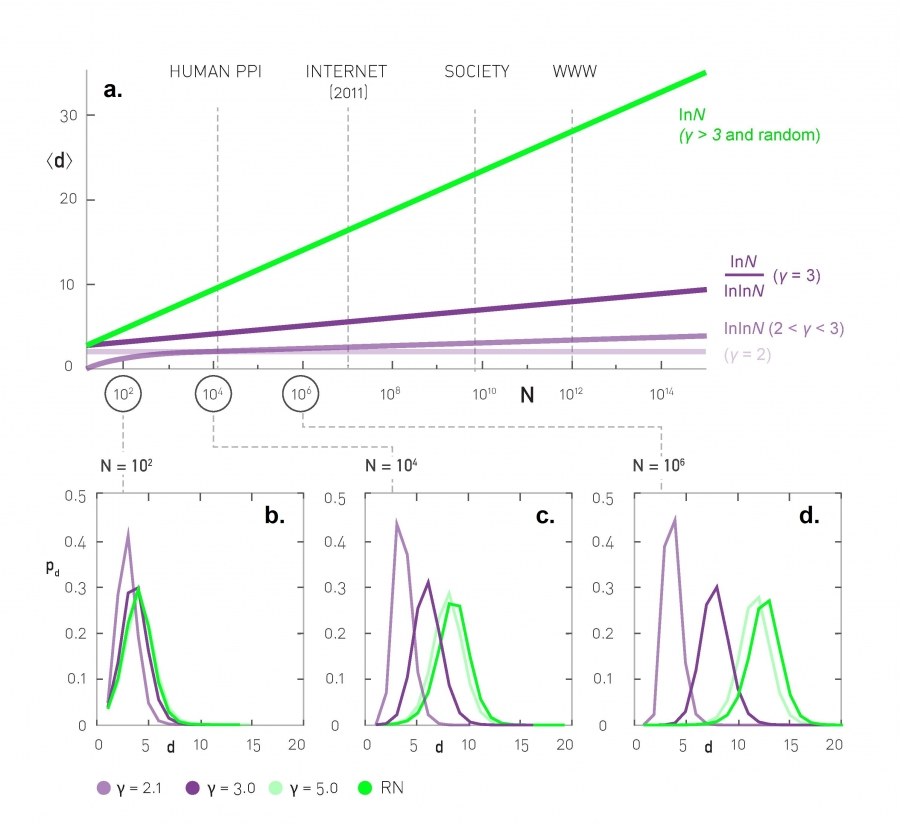

[Ciência de Redes](../../index.md) · [Redes Livres de Escala](../index.md)

<!-- wiki:original:inicio -->

# Propriedade *Ultra Small*

Essa propriedade dos centros faz levantar uma pergunta: Será que os centros afetam a propriedade dos minimundos? (Distância média). Se formos parar para tentar ter uma visão intuitiva, faz sentido dizer que elas afetam. Se eu tenho nós que se ligam em **MUITOS** outros nós (Os centros), então faz sentido dizer que a probabilidade de a distância entre dois outros nós quaisquer ser pequena é bem alta. Na verdade essa visão intuitiva está **correta**. As distâncias em uma rede **livre de escala** são menores do que em redes aleatórias equivalentes. Nós temos a seguinte relação: Seja D a variável aleatória que representa a distância entre dois nós aleatórios na rede $${\mathbb{E}}\lbrack D\rbrack = \begin{cases} \text{ const }\text{\quad\quad} & \gamma = 2 \\ \ln(\ln(N))\text{\quad\quad} & 2 < \gamma < 3 \\ \frac{\ln(N)}{\ln(\ln(N))}\text{\quad\quad} & \gamma = 3 \\ \ln(N)\text{\quad\quad} & \gamma > 3 \end{cases}$$

Vamos falar um pouco sobre cada um desses *regimes*

## Regime Anômalo ($\gamma = 2$)

De acordo com a equação [\[biggest-hub-relation\]](../centros/index.md#biggest-hub-relation), quando $\gamma = 2$, o maior hub (Maior centro) vai crescer linearmente com relação a $N$, ou seja, o tamanho do caminho entre dois nós aleatórios não depende de $N$ já que essa relação linear indica que todos os nós vão estar conectados ao mesmo hub central

## Super minimundo ($2 < \gamma < 3$)

Nesse regmie, como previsto pela relação [\[average-path-distance-ultra-small-networks\]](#average-path-distance-ultra-small-networks), a dsitância fica em relação a $\ln(\ln(N))$, que é um crescimento absurdamente lento comparado a $\ln(N)$ obtido em redes aleatórias. Essas redes são chamadas de **Ultra Small** por que os hubs reduzem o tamanho dos caminhos **muito**, já que eles se ligam com milhares de nós com baixo grau

## Ponto Crítico ($\gamma = 3$)

Aqui o segundo momento já não diverge mais, então é um ponto teórico de bastante interesse. Aqui o termo $\ln(N)$ encontrado nas redes aleatórias volta, mas tem uma correção com $\ln(\ln(N))$ ainda

## Minimundo ($\gamma > 3$)

Aqui o termo $\ln(N)$ volta! Isso mostra um indicativo que para essas redes, mesmo a presença de hubs ainda existindo, eles não são grandes o suficiente para influenciar na distância entre os nós, sendo desprezíveis praticamente ao afetarem a distância

*Figura 9. Distância média em função da quantidade de nós e distribuição das distâncias para $N = 10^{2}$, $N = 10^{4}$ e $N = 10^{6}$*

Essa imagem presente no livro do barabasi mostra a prograssão das distâncias médias conforme aumentamos a quantidade de nós. Perceba que, para $N$ não muito grandes, como $N = 10^{4}$, as distribuições (E a distância média) não tem tanta diferença assim, porém com $N = 10^{6}$, ja da para notar diferenças atenuadas. Isso também é um indicativo de que, quanto maior o expoente da rede livre de escala, maior é a distância média entre dois nós

<!-- wiki:original:fim -->

## Percurso de estudo

[Trilha: A1](../../../../trilhas/ciencia-de-redes/a1.md) · [Apresentação e contexto da fonte](../../../../trilhas/ciencia-de-redes/a1.md#apresentacao-original)

- Anterior: [Significado de Livre de Escala](../significado-de-livre-de-escala/index.md)
- Próximo: [O Papél do Expoente do Grau](../o-papel-do-expoente-do-grau/index.md)
