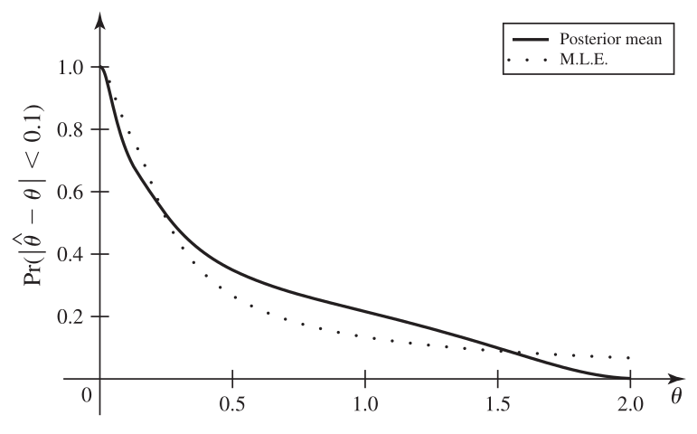

[Inferência Estatística](../index.md)

<!-- wiki:original:inicio -->

# Distribuição Amostral de Estimadores

------------------------------------------------------------------------

Quando temos um estimador $\delta$, e note que estamos falando de um **estimador** e não de uma **estimativa**, temos que, como ele é função de variáveis aleatórias, ele próprio é uma variável aleatória, que possui sua própria distribuição, seus próprios parâmetros, média, variância, etc. Essa distribuição própria da estimativa é o que chamamos de **Distribuição Amostral do Estimador**

**Definição: Distribuição Amostral do Estimador**

Dadas as variáveis aleatórias $\underline{X} = \left( X_{1},\ldots,X_{n} \right)$ e $T = r\left( \underline{X} \right)$ um estimador, onde $\underline{X}$ tem uma distribuição indexada pelo parâmetro $\theta$, então a distribuição de $T\vert \theta$ chamada de Distribuição Amostral de $T$. (${\mathbb{E}}_{\theta}\lbrack T\rbrack$ é a média de $T$ na distribuição amostral)

O nome vem do fato que $T$ depende da amostra $\underline{X}$. Na maioria das vezes, $T$ não depende de $\theta$. Mas por que essa distribuição me é interessante?

Vamos supor que eu tenho um estimador $\hat{\theta}$ de $\theta$, pode me ocorrer de eu querer saber a chance de o meu estimador estar próximo do meu $\theta$ de verdade, por exemplo, qual a chance de a distância entre meu estimador e meu $\theta$ ser de só $0.1$ medidas? Então podemos querer calcular: $${\mathbb{P}}(\vert \hat{\theta} - \theta\vert  < 0.1)$$ Pela lei da probabilidade total, temos também: $${\mathbb{P}}(\vert \hat{\theta} - \theta\vert  < 0.1) = {\mathbb{E}}\left\lbrack {\mathbb{P}}(\vert \hat{\theta} - \theta\vert  < 0.1\vert \theta) \right\rbrack$$

Outro uso que podemos derivar para a distribuição amostral é escolher entre vários experimentos qual será performado para obter o melhor estimador de $\theta$. Por exemplo, podemos querer saber qual a quantidade de amostras necessárias para atingir um objetivo em específico

*Figura 1. Imagem que representa ${\mathbb{P}}(\vert \hat{\theta} - \theta)\vert  < 0.1)$ em função da quantidade de amostras em um dos exemplos do livro, mostrando que dependendo da nossa situação, podemos quere escolher estimadores diferentes*

Uma outra medida interessante que foi apresentada em um dos exemplos do livro é uma distância relativa: $${\mathbb{P}}(\vert \frac{\hat{\theta}}{\theta} - 1\vert  < 0.1)$$

Ou seja, a probabilidade de que meu estimador esteja a pelo menos $10\%$ de $\theta$ de distância de $\theta$

**Exemplo**

Vamos tentar condensar tudo o que vimos em um exemplo. Vamos supor que temos uma clínica que está a fim de identificar ou prever pacientes candidatos a um remédio específico para tratamento da depressão. Então podemos modelar a variável aleatória de um paciente usar ou não esse remédio como uma Bernoulli com $\theta$ de chance de utilizar o remédio (${\mathbb{P}}(X = 1) = \theta$). Sabemos por capítulos anteriores que $T = \frac{1}{n}\sum_{i = 1}^{n}X_{i}$ (A proporção de pacientes que vão utilizar o remédio) é uma estatística suficiente e também é o EVM (Estimador de Máxima Verossimilhança) de $\theta$

Porém, $T$ também é uma variável aleatória com distribuição própria, então ela pode assumir vários valores, mas queremos que ela seja o mais próximo possível de $\theta$. Então, que tal calcularmos: $${\mathbb{P}}(\vert T - \theta\vert  < 0.1)$$

Para isso temos que saber exatamente a distribuição de $T$. Não é muito dificil, na verdade! Sabemos que $T = \frac{1}{n}Y$ com $Y = \sum_{i = 1}^{n}X_{i}$ e $Y\vert \theta \sim \text{ Bin}(n,\theta)$. Então sabemos que: $$\begin{array}{r} {\mathbb{P}}(T = t\vert \theta) = {\mathbb{P}}(\frac{1}{n}Y = t\vert \theta) = {\mathbb{P}}(Y = nt\vert \theta) \\ = \begin{pmatrix} n \\ nt \end{pmatrix}\theta^{nt}(1 - \theta)^{n - nt} \end{array}$$

Assim, encontramos a nossa Distribuição Amostral do estimador $T$. Então agora poderíamos calcular a equação mencionada anteriormente $${\mathbb{P}}(\vert T - \theta\vert  < 0.1) = {\mathbb{P}}( - 0.1 < T - \theta < 0.1) = {\mathbb{P}}(\theta - 0.1 < T < \theta + 0.1)$$

Podemos utilizar a distribuição amostral de $T$ que encontramos anteriormente, porém, por questões de praticidade, vou fazer um pouco diferente: $${\mathbb{P}}(\theta - 0.1 < T < \theta + 0.1) = {\mathbb{P}}(\left\lceil {(\theta - 0.1)n} \right\rceil \leq Y \leq \left\lfloor {(\theta + 0.1)n} \right\rfloor)$$ Eu adicionei o piso e o teto por conta que $Y$ assume apenas valores inteiros. Então temos que: $${\mathbb{P}}(\vert T - \theta\vert  < 0.1) = \sum_{k = \left\lceil {(\theta - 0.1)n} \right\rceil}^{\left\lfloor {(\theta + 0.1)n} \right\rfloor}\begin{pmatrix} n \\ k \end{pmatrix}\theta^{k}(1 - \theta)^{n - k}$$

------------------------------------------------------------------------

<!-- wiki:original:fim -->

## Percurso de estudo

[Trilha: A2](../../../trilhas/inferencia-estatistica/a2.md) · [Apresentação e contexto da fonte](../../../trilhas/inferencia-estatistica/a2.md#apresentacao-original)

- Próximo: [Distribuição Chi-Quadrado](../distribuicao-chi-quadrado/index.md)
