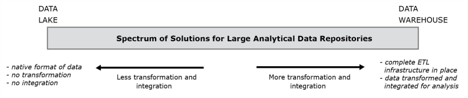

[Modelagem Informacional](../../index.md) · [Big Data](../index.md)

<!-- wiki:original:inicio -->

# Data Lake

Certo, então como que deve ser o processo de tratamento de um problema envolvendo Big Data? Algo muito errado, mas comum, que acontece, é tratar o problema de Big Data como algo separado e distinto, mas ele ta incluso em todo um contexto de problema de dados, na verdade, o mesmo vale para os bancos operacionais e data warehouses! A empresa sempre deve analisar quais tipos de dados são adequados para cada conjunto de dados e fazer sua estruturação e planejamento tendo isso em mente

Certo, dito isso, uma dúvida vem na mente. Os dados operacionais tem seus bancos de dados próprios, os analíticos são extraídos dos data warehouses, e o big data, onde fica?

**Definição: Data Lake**

Grande pool de dados não-estruturados (Até o momento da consulta). Dados brutos em seu formato nativo até necessário

- Esquema sob-demanda

- Usuários devem transformar os dados antes da análise

*Figura 2. Estrutura e fluxo dos dados em um ecossistema Data Warehouse*

*Figura 3. Estrutura e fluxo dos dados em um ecossistema Data Lake*

Como falamos, Big Data não é estruturado, então não há transformação dos dados ao serem colocados no Data Lake

*Figura 4. Descrição da melhor solução de repositório de dados para seu problema baseado em características do mesmo*

<!-- wiki:original:fim -->

## Percurso de estudo

[Trilha: A2](../../../../trilhas/modelagem-informacional/a2.md) · [Apresentação e contexto da fonte](../../../../trilhas/modelagem-informacional/a2.md#apresentacao-original)

- Anterior: [MapReduce e Hadoop](../mapreduce-e-hadoop/index.md)
- Próximo: [Caracterização](../caracterizacao/index.md)
