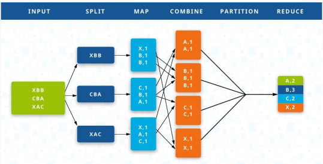

[Modelagem Informacional](../../index.md) · [Big Data](../index.md)

<!-- wiki:original:inicio -->

# MapReduce e Hadoop

Certo, mas se Big Data são dados não-estruturados, o que podemos fazer para lidar com eles? É uma selva sem lei? Na verdade não, existem algumas alternativas! É aí que entram abordagens como **MapReduce**, que se divide em duas etapas:

1.  **Map** $\rightarrow$ Mapeia cada registro em um par chave-valor

2.  **Reduce** $\rightarrow$ Reúne todos os registros com a mesma chave e gera uma única para cada chave

E o Hadoop é uma implementação OpenSource do MapReduce. O melhor meio de entender o MapReduce é com um exemplo:

**Exemplo: Contagem de Palavras**

Vamos imaginar que temos um repositório com milhares de documentos e queremos contar a quantidade de palavras de cada um, será que há um meio de agilizar esse processo? Ou eu vou ter que passar os documentos 1 por 1? Com o MapReduce, esse problema fica computacionalmente viável e eficiente!

*Figura 1. MapReduce no contexto de contagem de palavras*

Nós passamos um ou mais documentos para nosso MapReduce, então ele divide (Seja por linha, parágrafo, etc., na nossa imagem de exemplificação, está separando por linha), e cada divisão é enviada para um node (Fase Split), onde cada node está fazendo o mapeamento das palavras em pares de chave e valor independentemente (Como se cada node fosse um computador separado), então pegamos aqueles valores que possuem chaves iguais (No nosso caso, todas as contagens de cada palavra), e então fazemos o processo de combinar todas em um único par chave-valor de acordo com o contexto. No nosso caso, vamos somar todos os valores para obter todas as quantidades de repetição daquela palavra, obtendo no final, a contagem total de todas as palavras

<!-- wiki:original:fim -->

## Percurso de estudo

[Trilha: A2](../../../../trilhas/modelagem-informacional/a2.md) · [Apresentação e contexto da fonte](../../../../trilhas/modelagem-informacional/a2.md#apresentacao-original)

- Anterior: [Introdução](../introducao/index.md)
- Próximo: [Data Lake](../data-lake/index.md)
