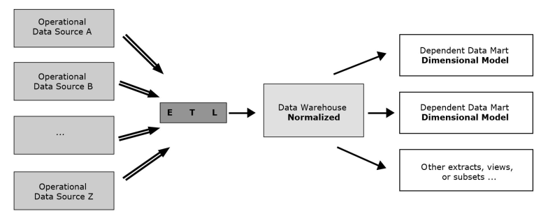

[Modelagem Informacional](../../index.md) · [Data Warehouses](../index.md)

<!-- wiki:original:inicio -->

# Abordagens de Datawarehouses

Vimos esse meio de se criar o Data Warehouse utilizando dos modelos estrela e floco de neve, porém, existem alguns métodos para abordar os Data Warehouses de formas diferentes. Porém, quando falamos de formas diferentes, não estamos dizendo que, por exemplo, se escolhermos uma dessas formas, automaticamente não podemos usar um modelo estrela, mas são algumas abordagens extras que podemos integrar dependendo do contexto

## Data Warehouses Normalizados

Data warehouses utilizando de práticas-padrão de modelagem ER, de forma que ele mesmo serve como fonte para outros Data Warehouses que utilizam da modelagem dimensional e Data Marts dentro da empresa

*Figura 16. Data Warehouse Normalizado*

## Data Warehouse em Modelo Dimensional

Foi o que vimos na criação de Data Warehouses até esse momento, dividido em tabelas de dimensões e tabelas de fatos, onde um fato representa um acontecimento de interesse dentro do contexto do negócio e as dimensões são informações externas ao fato, mas que tem participação interna à ele

## Data Marts Independentes

É quando vários **Data Marts** são criados em instâncias e setores diferentes da empresa, todos independentes um do outro. Consequentemente, isso faz com que **vários ETL’s** sejam criados

*Figura 17. Data Marts Independentes*

Essa abordagem é considerada inferior, já que inviabiliza uma análise **direto-ao-ponto** de toda a empresa e a existência de **vários** ETL’s **não relacionados**

------------------------------------------------------------------------

<!-- wiki:original:fim -->

## Percurso de estudo

[Trilha: A1](../../../../trilhas/modelagem-informacional/a1.md) · [Apresentação e contexto da fonte](../../../../trilhas/modelagem-informacional/a1.md#apresentacao-original)

- Anterior: [Modelo Floco de Neve (Snowflake)](../modelo-floco-de-neve-snowflake/index.md)
- Próximo: [ETL e OLAP](../../etl-e-olap/index.md)
