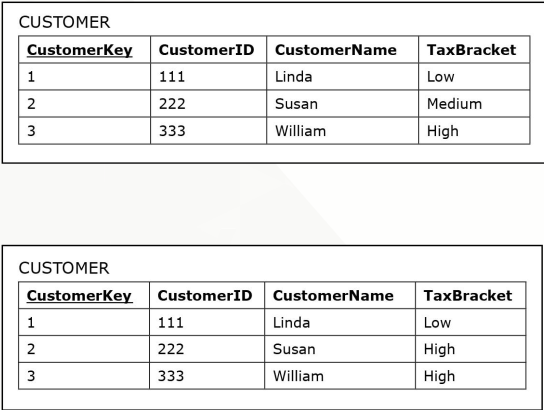

[Modelagem Informacional](../../index.md) · [Data Warehouses](../index.md)

<!-- wiki:original:inicio -->

# Dimensões Lentamente Alteráveis

Normalmente as dimensões não conseguem mudar, porém, alguns casos elas podem. Por exemplo, o preço de um produto pode variar. O que fazemos nesses casos? Essas dimensões são chamadas de **dimensões lentamente alteráveis**. Então vamos temos 3 abordagens diferentes:

## Tipo 1

Eu vou mudar o valor na própria tabela de dimensão, ou seja, o novo valor substitui o antigo. Não preserva uma história dessa dimensão

*Figura 12. Exemplo onde o Imposto de Susan é alterado para **Alto***

## Tipo 2

Cria uma nova entrada na dimensão usando uma nova **surrogate key** toda vez que o valor muda. Usado em casos que eu quero preservar a história do meu sistema. Porém eu preciso de um método para indicar qual entrada está **vigente**, então utilizamos atributos como **timestamps**

*Figura 13. Exemplo criando uma nova linha de Susan. Dependendo da situação que você se encontra, pode ser plausível **não utilizar** colunas de identificação temporal*

## Tipo 3

Agora adicionamos uma nova coluna de “anterior” e de “atual” para cada coluna que pode ser alterada. Aplicável quando há uma quantidade limitada de alterações possíveis em uma coluna (Por exemplo, se eu tenho uma única coluna de “anterior” e uma única coluna de “novo”, então sempre que eu atualizo a minha dimensão, eu eu vou perder a informação anterior à anterior da que eu atualizei agora, ou seja, se eu tinha que `anterior=1` e `atual=2` e eu atualizo novamente, então vou obter `anterior=2` e `atual=3`, de forma que eu perco o $1$)

*Figura 14. Exemplo registrando apenas duas mudanças. Dependendo da situação, você também pode **não fazer** colunas de **identificação temporal***

<!-- wiki:original:fim -->

## Percurso de estudo

[Trilha: A1](../../../../trilhas/modelagem-informacional/a1.md) · [Apresentação e contexto da fonte](../../../../trilhas/modelagem-informacional/a1.md#apresentacao-original)

- Anterior: [Detalhamento de Fatos](../detalhamento-de-fatos/index.md)
- Próximo: [Modelo Floco de Neve (Snowflake)](../modelo-floco-de-neve-snowflake/index.md)
