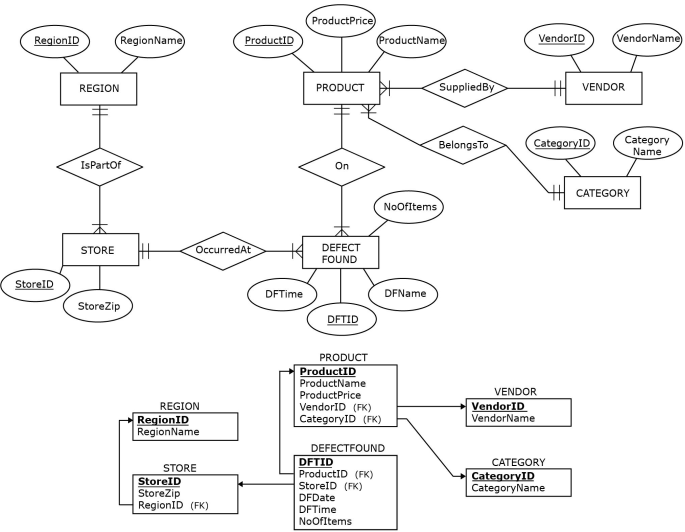
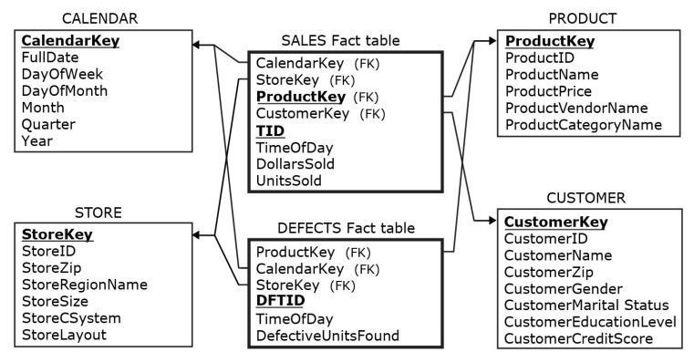

[Modelagem Informacional](../../index.md) · [Data Warehouses](../index.md)

<!-- wiki:original:inicio -->

# Galáxia de Estrelas

É um modelo que contém **vários fatos** que compartilham **dimensões** entre si

*Figura 10. Modelo ZAGI adaptado*

*Figura 11. Galáxia ZAGI*

<!-- wiki:original:fim -->

## Percurso de estudo

[Trilha: A1](../../../../trilhas/modelagem-informacional/a1.md) · [Apresentação e contexto da fonte](../../../../trilhas/modelagem-informacional/a1.md#apresentacao-original)

- Anterior: [Como um fato se organiza?](../como-um-fato-se-organiza/index.md)
- Próximo: [Detalhamento de Fatos](../detalhamento-de-fatos/index.md)
