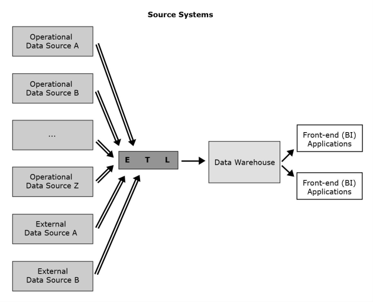

[Modelagem Informacional](../../index.md) · [Data Warehouses](../index.md)

<!-- wiki:original:inicio -->

# O que é?

Antes de adentrar no conceito de um Data Warehouse, vamos ter algumas definições antes

**Definição: Dado Operacional**

Informações com pouco tempo de vida, utilizados essencialmente para o dia a dia e funcionamento do sistema, tem alta frequência e vão se atualizando conforme o tempo passa. Usado por diversos funcionários em setores diferentes e é orientado à aplicação

**Definição: Dado Analítico**

Informações duradouras, que não se atualizam frequentemente e nem tem alta frequência de acesso. Redundância não é um problema, utilizado por um grupo ninchado de pessoas. Orientado ao assunto/contexto

A definição pode não ser muito clara, mas podemos imaginar um comparativo. Pense nos dados operacionais como um registro de diário, enquanto os dados analíticos são um livro de história. Os dados operacionais são frequentes, e não representam uma importância a longo prazo, por exemplo, o preço de um produto que está sendo passado no caixa, enquanto os dados analíticos representam um marco da empresa, como por exemplo, o lucro total da empresa na semana $x$.

Vamos também definir melhor:

**Definição: Orientado à Aplicação/Application Oriented**

Dados projetados para suportar processos do dia a dia da organização. Estrutura de dados otimizada para inserções, atualizações e consultas rápidas de informações atuais com foco em transações (OLTP – Online Transaction Processing).

**Exemplo**

Sistema bancário para processar depósitos/saques, sistema hospitalar para registrar consultas.

**Definição: Orientado ao Assunto/Subject Oriented**

Dados projetados para analisar informações de um assunto de negócio específico (clientes, vendas, faturamento, estoque, etc.). Dados integrados e organizados de forma a responder perguntas estratégicas. Foco em análise histórica e tendências (OLAP – Online Analytical Processing). Normalmente são read-only (só leitura, não ficam sendo atualizados a todo instante).

**Exemplo**

DW que reúne anos de dados de vendas para gerar relatórios, dashboards ou prever demanda.

Imagine que você está fazendo o sistema, você sabe que seus dados precisam ser bem estruturados, o foco do seu sistema é ser duradouro e bem manutenível além de promover uma segurança boa, então seus dados vão ser **application-oriented**, de forma que você faz questão de deixar tudo muito bem-estruturado e separado. Porém imagine que o foco do seu sistema é responder perguntas de negócio de forma rápida e eficiente, por exemplo: “Quanto minha empresa faturou nos últimos 3 meses?”, dificilmente você vai se importar que as informações do banco que você está consultando estejam todas na norma 3, ou separadas direitinho com as chaves-estrangeiras bem definidas e organizadas, o importante é você responder a pergunta de forma rápida e eficiente, então você vai estruturar esse banco de forma a atingir esse objetivo, então seus dados são **subject-oriented**

Com isso em mente, agora podemos entender o que são Data Warehouses

**Definição: Data Warehouse**

Um Data Warehouse é um **repositório estruturado** de dados **integrados**, **orientados ao assunto**, **com informações sobre toda a empresa**, **históricos** e **variantes com o tempo**. O propósito de um Data Warehouse é a extração de **dados analíticos**. Pode armazenar dados detalhados e/ou resumidos

De forma resumida, um Data Warehouse também é um banco de dados, porém, estruturado e com um objetivo totalmente diferente dos bancos convencionais que estudamos na disciplina de **banco de dados**. Mas o que compõe um Data Warehouse? No núcleo, ele em si é apenas esse banco de dados diferenciado, porém, como funciona o sistema? Como é estruturado um projeto/sistema em que um Data Warehouse é incluído?

*Figura 5. Ecossistema Data Warehouse*

Todas as definições abaixo são referentes a elementos apresentados na imagem como componentes de um ecossistema de Data Warehouse

**Definição: Sistemas de Origem**

Sob o contexto de DW, os sistemas de origem são bases de dados operacionais e outros repositórios de dados (qualquer conjunto de dados usado para proposta operacional) que provê informação analítica útil para assuntos de análise. Cada unidade de armazenamento de dados operacionais que é usada como sistema de origem tem duas finalidades:

- A própria finalidade operacional

- Ser a fonte do DW

Sistemas de origem podem incluir fontes internas e externas

**Definição: Infraestrutura de ETL**

Facilita a leitura dos dados dos sistemas de origem para o Data Warehouse. O ETL (Extract, Transform, Load) tem as seguintes tarefas:

- Extrair dados analiticamente úteis das origens operacionais

- Transformar tais dados de forma aderente a estrutura de “orientação-ao-assunto” do modelo do DW (ao mesmo tempo que assegura a qualidade dessa transformação)

- Carregar os dados transformados e com qualidade assegurada para o destino “target” data warehouse

**Definição: Data Warehouse**

As vezes referenciado como “target system”. Um DW típico lê as informações analiticamente úteis dos sistemas de origem de forma periódica ou contínua ,provendo sempre dados atualizados para análise

**Definição: Aplicações Front-end**

De forma similar aos bancos operacionais, as aplicações “front-end” permitem o acesso indireto dos usuários aos dados

Como vimos, um data warehouse tem informações sobre **toda** uma empresa, podendo gerar análises sobre todos os seus departamentos. Mas e se isso for um comportamento indesejado? Eu quero ter uma análise detalhada, mas focar apenas no meu departamento e evitar que os outros vejam informações que não deveriam ou informações que possam atrapalhar nas suas análises, então aí entram os Data Marts

**Definição: Data Mart**

Os Data Marts Seguem os mesmos princípios de um DW ,mas possuem um escopo mais limitado, geralmente ligado a um uso mais departamental, e não de forma abrangente à empresa conforme um DW.

- **Data Mart independente**: Lobo solitário, criado como se fosse um DW. Um DM independente tem os próprios sistemas de origem e infraestrutura de ETL

- **Data Mart dependente**: Não possui os próprios sistemas de origem. Os dados são lidos de um DW

<!-- wiki:original:fim -->

## Percurso de estudo

[Trilha: A1](../../../../trilhas/modelagem-informacional/a1.md) · [Apresentação e contexto da fonte](../../../../trilhas/modelagem-informacional/a1.md#apresentacao-original)

- Anterior: [Data Warehouses](../index.md)
- Próximo: [Como um Data Warehouse é estruturado?](../como-um-data-warehouse-e-estruturado/index.md)
