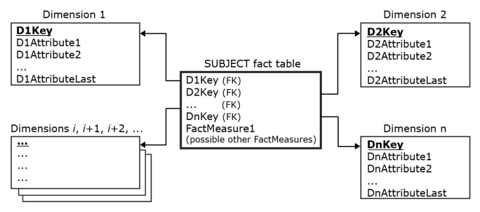

[Modelagem Informacional](../../index.md) · [Data Warehouses](../index.md)

<!-- wiki:original:inicio -->

# Star Schema

*Figura 7. Exemplo de estruturação em **Esquema Estrela***

Os **Fact Measures** são informações dentro do fato que **não se aplicam em nenhuma dimensão**

**Exemplo**

Queremos criar o fato **venda**, ele engloba as dimensões de **produto**, **cliente**, **loja**, **calendário** e **vendedor**. Porém, não faz sentido, por exemplo, colocar a quantidade de produtos comprados em **nenhuma dimensão**, ou o **valor total da compra**, de forma que essas informações são localizadas única e exclusivamente no fato

Vale ressaltar que, dado a dimensão $i$, a sua chave-primária **não é a mesma chave-primária do modelo relacional**, pois a repetição dos registros pode ocorrer sem problema nenhum. Como aplicar chaves-primária nas dimensões e nos fatos será visto posteriormente

<!-- wiki:original:fim -->

## Percurso de estudo

[Trilha: A1](../../../../trilhas/modelagem-informacional/a1.md) · [Apresentação e contexto da fonte](../../../../trilhas/modelagem-informacional/a1.md#apresentacao-original)

- Anterior: [Modelo Dimensional](../modelo-dimensional/index.md)
- Próximo: [Como um fato se organiza?](../como-um-fato-se-organiza/index.md)
