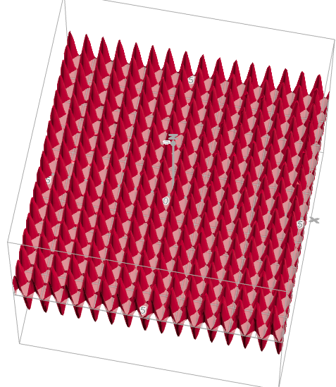

[Otimização para Ciência de Dados](../../index.md) · [Método do Gradiente](../index.md)

<!-- wiki:original:inicio -->

# Caso Global

É o método de otimização mais clássico que existe! Vamos supor que queremos resolver o problema: $$\min\limits_{x \in {\mathbb{R}}^{n}}f(x)$$

Lembra do que vimos em cálculo? Que $\nabla f(x)$ é o vetor que aponta pra direção em que $f(x)$ aumenta? Então que tal a gente seguir na direção contrária a $f(x)$? Isso faz bastante sentido, e funciona! Mas deve ter um motivo mais matemático por trás, não é? Vamos primeiro mostrar o algoritmo:

1.  **func** GradientDescent($f$) {

    1.  $x^{(0)} \in {\mathbb{R}}^{n}$

    2.  $\alpha > 0$

    3.  **for** $t \in \lbrack T\rbrack$ **do** {

        1.  $x^{(t + 1)} = x^{(t)} - \alpha\nabla f\left( x^{(t)} \right)$

    4.  }

    5.  **return** $x^{(T)}$

2.  }

*Figura 1. Gradient Descent*

Antes de entender um motivo mais matemático por trás do algoritmo, vamos ver algumas definições

**Definição: Funções $M$-Lipschitz**

Dizemos que uma função $f:{\mathbb{R}}^{n} \rightarrow {\mathbb{R}}^{m}$ é $M$-Lipschitz quando: $$\| f(x) - f(y)\| \leq M\| x - y\|\text{\quad\quad}\forall x,y \in {\mathbb{R}}^{n}$$

**Definição: Função $L$-Suave**

Uma função $f:{\mathbb{R}}^{n} \rightarrow {\mathbb{R}}$ é $L$-suave quando seu gradiente é $L$-Lipschitz: $$\|\nabla f(x) - \nabla f(y)\| \leq L\| x - y\|\text{\quad\quad}\forall x,y \in {\mathbb{R}}^{n}$$

Essa definição de suavidade tem uma interpretação, imagine que, se eu estou na posição $x$ e vou pra posição $y$, a variação que eu vou ter na função, dentro dessa passada, não ultrapassa o quanto eu andei vezes uma constante $L$. Então funções muito onduladas, e com ondulações

*Figura 2. Função bem desregular, mas suave, $f(x) = \sin(10x) + \cos(10y)$*

**Teorema: Aproximação linear de funções suaves**

Seja $f:{\mathbb{R}}^{n} \rightarrow {\mathbb{R}}$ uma função diferenciável. Então $f$ é $L$-suave se, e somente se, $\forall x,y \in {\mathbb{R}}^{n}$: $$\vert f(y) - f(x) - \nabla{f(x)}^{T}(y - x)\vert  \leq \frac{L}{2}\| y - x\|_{2}^{2}$$

Usando esse teorema, a gente pode escrever isso: $$\begin{aligned} f\left( x^{(t + 1)} \right) & \leq f\left( x^{(t)} \right) + \nabla{f\left( x^{(t)} \right)}^{T}\left( x^{(t + 1)} - x^{(t)} \right) + \frac{L}{2}\| x^{(t + 1)} - x^{(t)}\|^{2} \\ & \leq f\left( x^{(t)} \right) - \alpha\|\nabla f\left( x^{(t)} \right)\|^{2} + \frac{\alpha^{2}L}{2}\|\nabla f\left( x^{(t)} \right)\|^{2} \\ & \leq f\left( x^{(t)} \right) - \alpha\left( 1 - \frac{\alpha L}{2} \right)\|\nabla f\left( x^{(t)} \right)\|^{2} \end{aligned}$$

E isso vale quando $\alpha \in \left( 0,\frac{2}{L} \right)$, ou seja, se o ponto atual $x^{(t)}$ **NÃO É ESTACIONÁRIO**, o valor da função no próximo ponto será **menor** que o valor do ponto atual menos o tamanho do gradiente ao quadrado vezes um termo de regulação. Parece complicado, mas o que isso quer dizer? Eu vou usar esse fato para mostrar que, independente do ponto que eu iniciar o método do gradiente, eu **sempre vou encontrar um ponto mínimo local utilizando o método do gradiente**

**Teorema: Convergência do Gradient Descent**

Suponha que $f:{\mathbb{R}}^{n} \rightarrow {\mathbb{R}}$ é $L$-suave. Tome qualquer passo: $$\alpha = \frac{\beta}{L}$$ para algum $\beta \in (0,2)$. Então: $$\min\limits_{t \in \lbrack T\rbrack}\|\nabla f\left( x^{(t)} \right)\|_{2}^{2} \leq \frac{1}{T}\sum_{t = 1}^{T}\|\nabla f\left( x^{(t)} \right)\|_{2}^{2} \leq \left( \frac{2/\beta}{2 - \beta} \right)\frac{L\left( f\left( x^{(1)} \right) - f^{\ast} \right)}{T}$$

**Demonstração**

Sabemos que, dado $n$ pontos $x_{i}$, a média $\frac{1}{n}\sum_{i = 1}^{n}x_{i} \in \left\lbrack \min(x_{i}),\max(x_{i}) \right\rbrack$, então a desigualdade inicial já está provada. Vamos provar a segunda. Usando a equação [\[iterated-aproximation\]](#iterated-aproximation), temos que: $$\alpha\left( 1 - \frac{\alpha L}{2} \right)\|\nabla f\left( x^{(t)} \right)\|^{2} \leq f\left( x^{(t)} \right) - f\left( x^{(t + 1)} \right)$$ isso para todo $t \in \lbrack T\rbrack$, então vamos somar todos os termos para obter: $$\begin{aligned} \alpha\left( 1 - \frac{\alpha L}{2} \right)\sum_{t = 1}^{T}\|\nabla f\left( x^{(t)} \right)\|_{2}^{2} & \leq \sum_{t = 1}^{T}\left( f\left( x^{(t)} \right) - f\left( x^{(t + 1)} \right) \right) \\ & \leq f\left( x^{(1)} \right) - f\left( x^{(T + 1)} \right) \\ & = f\left( x^{(1)} \right) - f^{\ast} + f^{\ast} + f\left( x^{(T + 1)} \right) \\ & \leq f\left( x^{(1)} \right) - f^{\ast} \end{aligned}$$ A primeria desigualdade eu fiz uma soma telescópica, depois eu somei $0$ ($f^{\ast} - f^{\ast}$) e, como $f^{\ast}$ é o valor mínimo da função, com certeza subtrair a parte que eu somei $f^{\ast}$ vai dar um valor maior, então eu obtenho o resultado do enunciado do teorema dividindo tudo por $\alpha(1\frac{- (\alpha L)}{2})T$

Por que esse teorema mostra que, independentemente do lugar, o algoritmo converge para um ponto estacionário? Ele ta me dizendo isso daqui: $$\min\limits_{t \in \lbrack T\rbrack}\|\nabla f\left( x^{(t)} \right)\|_{2}^{2} = O\left( \frac{1}{T} \right)$$ Ou seja, o mínimo **converge para $0$** conforme $T \rightarrow \infty$ **independentemente do ponto inicial $x^{(0)}$**

Só que se pararmos para pensar, se $\nabla f(x)$ é uma direção de subida, então $- \nabla f(x)$ é de descida, mas será que é a melhor? Será que **precisa** ser a melhor para o método funcionar? Se eu escolher **uma direção de descida arbitrária** ele funciona? Mas antes disso, vamos entender o que é uma direção de descida

**Definição: Direção de Descida**

Dizemos que $d \in {\mathbb{R}}^{n}$ é uma direção de descida para a funçaõ $f:{\mathbb{R}}^{n} \rightarrow {\mathbb{R}}$ no ponto $x \in {\mathbb{R}}^{n}$ quando: $$d^{T}\nabla f(x) < 0$$

então podemos considerar um novo algoritmo

1.  **func** GradientDescentWithArbitraryDescentDirection($f$) {

    1.  $x^{(0)} \in {\mathbb{R}}^{n}$

    2.  $\alpha > 0$

    3.  **for** $t \in \lbrack T\rbrack$ **do** {

        1.  Encontrar **uma** direção de descida $d^{(t)}$

        2.  $x^{(t + 1)} = x^{(t)} + \alpha d^{(t)}$

    4.  }

    5.  **return** $x^{(T)}$

2.  }

*Figura 3. Gradient Descent com Direção de Descida Arbitrária*

Podemos provar, analogamente ao [\[gradient-descent-convergence\]](#gradient-descent-convergence), que o algoritmo converge para um ponto estacionário

<!-- wiki:original:fim -->

## Percurso de estudo

[Trilha: A2](../../../../trilhas/otimizacao-para-ciencia-de-dados/a2.md) · [Apresentação e contexto da fonte](../../../../trilhas/otimizacao-para-ciencia-de-dados/a2.md#apresentacao-original)

- Anterior: [Método do Gradiente](../index.md)
- Próximo: [Caso Convexo](../caso-convexo/index.md)
