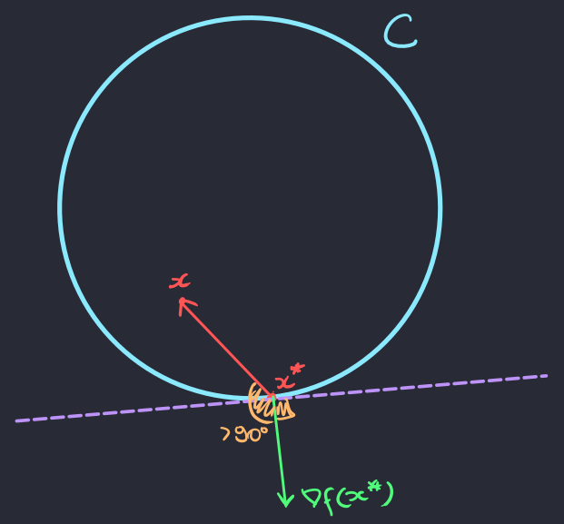

[Otimização para Ciência de Dados](../../index.md) · [Otimização Convexa](../index.md)

<!-- wiki:original:inicio -->

# Otimização sobre conjuntos convexos

Com toda essa bagagem, conseguimos finalmente aplicar a otimização de $f$ em uma restrição convexa $C$ $$\min\limits_{x \in C}f(x)$$

## Condição de primeira ordem: Caso geral

Vamos primeiramente ver uma condição sobre funções generalizadas. Algo que faz sentido pensar quando estamos sendo restringidos, é pensar que não necessariamente meu máximo ou mínimo vai ter derivada igual a 0, veja o exemplo:

*Figura 12. Exemplo de restrição: $f(x) = x^{2}$ com $x \in \lbrack 2,3\rbrack$*

**Teorema: Condição de primeira ordem: Caso restrito**

Seja $f:C \subset {\mathbb{R}}^{n} \rightarrow {\mathbb{R}}$ continuamente diferenciável em $C$ convexo e fechado, então: $$x^{\ast} \in C\text{ mínimo local } \Rightarrow \forall x \in C,\ \nabla{f\left( x^{\ast} \right)}^{T}\left( x - x^{\ast} \right) \geq 0$$

**Demonstração**

Precisamos do seguinte lema: Seja $f:U \rightarrow {\mathbb{R}}$ função continuamente diferenciável sobre um aberto $U \subset {\mathbb{R}}^{n}$. Se para algum $x \in U$ e $d \neq 0$ tem-se $$\nabla f(x)^{T}d < 0$$ então existe $\varepsilon > 0$ tal que para todo $t \in (0,\varepsilon)$, $x + td \in U$ e $$f(x + td) < f(x)$$

Continuemos a demonstração do teorema original. Assuma por contradição que exista $x \in C$ tal que $\nabla f\left( x^{\ast} \right)^{T}\left( x - x^{\ast} \right) < 0$. Temos então que, para $d ≔ x - x^{\ast},f'\left( x^{\ast};d \right) = \nabla f\left( x^{\ast} \right)^{T}\left( x - x^{\ast} \right) < 0$. Segue do lema anterior, que existe $\varepsilon \in (0,1)$ tal que $$\forall t \in (0,\varepsilon),f\left( x^{\ast} + td \right) < f\left( x^{\ast} \right)$$ Sendo $C$ convexo, segue que $x^{\ast} + td = (1 - t)x^{\ast} + tx \in C$. Concluímos então que $x^{\ast}$ não é um ponto de mínimo local de $f$ em $C$ — uma contradição.

Mas o que esse teorema quer dizer??? Vamos por partes. Lembra do cosseno entre dois vetores $v$ e $u$? $$\cos(\theta) = \frac{u^{T}v}{\| u\|\| v\|}$$

Ou seja, quando o sinal do ângulo entre eles depende única e exclusivamente de $u^{T}v$. Lembre que, se $\theta \in \left\lbrack - \frac{\pi}{2},\frac{\pi}{2} \right\rbrack$ então $\cos(\theta) \geq 0$ e se $\theta \in \left\lbrack \frac{\pi}{2},\frac{3\pi}{2} \right\rbrack$ então $\cos(\theta) \leq 0$. Mas o que isso quer dizer? Espera mais um pouco. Lembra que vimos em cálculo 2 que o vetor gradiente indica a direção no domínio que eu devo seguir para que **a função aumente**? Show, agora a gente pode entender o que o teorema quer dizer para nós.

Vamos considerar o caso mais básico, quando $x^{\ast}$ não ta na fronteira de $C$

*Figura 13. Ponto mínimo $x^{\ast} \in C$*

Na imagem temos o vetor gradiente e o vetor $x - x^{\ast}$. Quando variamos o nosso ponto $x$, podemos claramente perceber que o vetor $x - x^{\ast}$ faz vários ângulos com o gradiente, só que se o gradiente for desça forma, ao andarmos na direção oposta ao gradiente, nossa função vai diminuir, ou seja, $x^{\ast}$ não pode ser um ponto de mínimo! O que isso quer dizer? Que meu gradiente é 0!

Mas e se $x^{\ast}$ estiver na minha fronteira?

Perceba que na primeira figura, se eu vejo o ângulo do gradiente com qualquer outro ponto no meu conjunto eu tenho menos que 90 graus, ou seja, o meu gradiente aponta para **dentro do conjunt**, de forma que a única maneira de diminuir mais a função é **saindo da restrição**. Na outra figura isso é melhor ilustrado. Veja que existem vetores no conjunto que fazem mais que 90 graus com o vetor gradiente, ou seja, o vetor gradiente ta para fora do conjunto $C$, de forma que eu consigo andar na direção $- \nabla^{2}f\left( x^{\ast} \right)$ para que diminua ainda mais a função, ou seja, $x^{\ast}$ não seria um mínimo

Esse teorema nos da motivação para uma definição

**Definição: Ponto estacionário**

Seja $f:C \subset {\mathbb{R}}^{n} \rightarrow {\mathbb{R}}$ com $C$ convexo e fechado, chamamos $x^{\ast} \in C$ de ponto estacionário quando $$\forall x \in C,\ \nabla f\left( x^{\ast} \right)\left( x - x^{\ast} \right) \geq 0$$

## Condições de primeira ordem: Caso convexo

**Teorema**

Seja $f:C \subset {\mathbb{R}}^{n} \rightarrow {\mathbb{R}}$ continuamente diferenciável e convexa com $C$ convexo e fechado e $x^{\ast} \in C$, então: $$x^{\ast}\text{ mínimo global } \Leftrightarrow x^{\ast}\text{ é ponto estacionário }$$

**Demonstração**

Precisamos provar apenas $( \Longleftarrow )$ do [\[first-order-condition-convex-set\]](#first-order-condition-convex-set). Seja $x^{\ast} \in C$ um ponto estacionário de $f$ em $C$. Obtemos que, para todo $x \in C$, $$f(x) \geq f\left( x^{\ast} \right) + \nabla f\left( x^{\ast} \right)^{T}\left( x - x^{\ast} \right) \geq f\left( x^{\ast} \right)$$ onde a primeira desigualdade segue da desigualdade do gradiente ([\[gradient-inequality\]](../convexidade/index.md#gradient-inequality)) e a segunda desigualdade segue de que $x^{\ast}$ é ponto estacionário. Sendo que $$\forall x \in C,\ f(x) \geq f\left( x^{\ast} \right)$$ segue que $x^{\ast} \in C$ é ponto de mínimo global de $f$ em $C$.

------------------------------------------------------------------------

<!-- wiki:original:fim -->

## Percurso de estudo

[Trilha: A1](../../../../trilhas/otimizacao-para-ciencia-de-dados/a1.md) · [Apresentação e contexto da fonte](../../../../trilhas/otimizacao-para-ciencia-de-dados/a1.md#apresentacao-original)

- Anterior: [Convexidade](../convexidade/index.md)
- Próximo: [Otimização com restrições lineares](../../otimizacao-com-restricoes-lineares/index.md)
