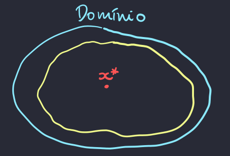
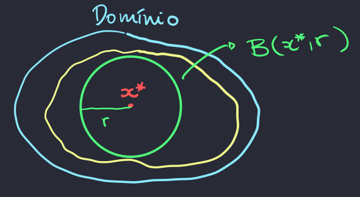
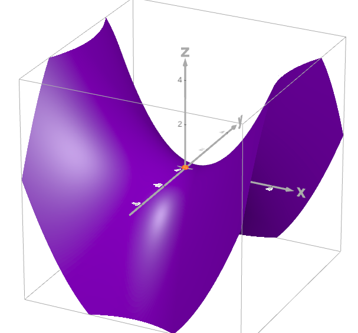

[Otimização para Ciência de Dados](../../index.md) · [Otimização Irrestrita](../index.md)

<!-- wiki:original:inicio -->

# Soluções Locais: Condições de segunda ordem

Nas anotações, o professor generaliza o conceito de que, se $x$ é estacionário e $f''(x) > 0$ então $x$ é mínimo local.

**Definição: Positividade e Negatividade de uma matriz**

Seja $A$ uma matriz simétrica:

- Dizemos que $A$ é positiva semidefinida, denotando-s por $A \succeq 0 \Leftrightarrow \forall x \in {\mathbb{R}}^{n},\ x^{T}Ax \geq 0$

- Dizemos que $A$ é positiva definida, denotando-s por $A \succ 0 \Leftrightarrow \forall x \in {\mathbb{R}}^{n},\ x^{T}Ax > 0$

- Dizemos que $A$ é negativa semidefinida, denotando-s por $A \preceq 0 \Leftrightarrow \forall x \in {\mathbb{R}}^{n},\ x^{T}Ax \leq 0$

- Dizemos que $A$ é negativa definida, denotando-s por $A \prec 0 \Leftrightarrow \forall x \in {\mathbb{R}}^{n},\ x^{T}Ax < 0$

- Dizemos que $A$ é indefinida, quando $\exists x,y \in {\mathbb{R}}^{n}$ tal que $x^{T}Ax > 0$ e $y^{T}Ay < 0$

Nas anotações do professor ele traz alguns conceitos que vimos em álgebra linear, mas eu não vou os abordar aqui.

**Teorema: Condições necessárias de segunda ordem**

Seja $f:U \rightarrow {\mathbb{R}}$ com $U \subset {\mathbb{R}}^{n}$ e suponha que $f$ é duas vezes continuamente diferenciável sobre $U$ e seja $x^{\ast} \in U$, então:

1.  Se $x^{\ast}$ é mínimo local, então $\nabla^{2}f\left( x^{\ast} \right) \succeq 0$

2.  Se $x^{\ast}$ é máximo local, então $\nabla^{2}f\left( x^{\ast} \right) \preceq 0$

**Demonstração**

Vamos apenas provar o item $1$ já que a prova para o $2$ é análoga (Basta aplicar a demonstração na função $- f$).

Sendo $x^{\ast}$ um ponto de mínimo local, $\exists B\left( x^{\ast},r \right) \subset U$ tal que: $$\forall x \in B\left( x^{\ast},r \right)\text{\quad\quad}f(x) \geq f\left( x^{\ast} \right)$$ Seja $0 \neq d \in {\mathbb{R}}^{n}$. Para todo $0 < \alpha < \frac{r}{\| d\|}$, vamos definir: $$x_{\alpha}^{\ast} ≔ x^{\ast} + \alpha d$$ $$x_{\alpha}^{\ast} \in B\left( x^{\ast},r \right) \Rightarrow f\left( x_{\alpha}^{\ast} \right) \geq f\left( x^{\ast} \right)$$ Pelo [\[linear-approximation\]](../definicoes-e-revisoes-de-calculo/index.md#linear-approximation), $\exists\xi_{\alpha} \in \left\lbrack x^{\ast},x_{\alpha}^{\ast} \right\rbrack$ tal que $$f\left( x_{\alpha}^{\ast} \right) - f\left( x^{\ast} \right) = \nabla{f\left( x^{\ast} \right)}^{T}\left( x_{\alpha}^{\ast} - x^{\ast} \right) + \frac{1}{2}\left( x_{\alpha}^{\ast} - x^{\ast} \right)^{T}\nabla^{2}f\left( \xi_{\alpha} \right)\left( x_{\alpha}^{\ast} - x^{\ast} \right)$$ Como $x^{\ast}$ é estacionário, temos: $$f\left( x_{\alpha}^{\ast} \right) - f\left( x^{\ast} \right) = \frac{\alpha^{2}}{2}d^{T}\nabla^{2}f\left( \xi_{\alpha} \right)d$$ Combinando as equações [\[minimal-on-ball-condition\]](#minimal-on-ball-condition) e [\[final-condition-to-minimal-point\]](#final-condition-to-minimal-point), temos que, para todo $\alpha \in \left( 0,\frac{r}{\| d\|} \right)$: $$d^{T}\nabla^{2}f\left( \xi_{\alpha} \right)d \geq 0$$ Usando de que $\xi_{\alpha} \rightarrow x^{\ast}$ quando $\alpha \rightarrow 0^{+}$ e por continuidade da Hessiana, segue: $$d^{T}\nabla^{2}f\left( x^{\ast} \right)d \geq 0$$ Isso é válido pois eu assumi um $d$ genérico

Perceba que essa condição é necessária, mas não é suficiente. Por exemplo, a função $f(x) = x^{3}$ é tal que $f'(0) = 0$, $f''(0) = 0$, porém, não é um ponto de máximo nem de mínimo.

**Teorema: Condições suficientes de segunda ordem**

Seja $f:U \rightarrow {\mathbb{R}}$ com $U \subset {\mathbb{R}}^{n}$ e suponha que $f$ é duas vezes continuamente diferenciável sobre $U$ e seja $x^{\ast} \in U$ um ponto estacionário de $f$ em $U$, então:

- Se $\nabla^{2}f\left( x^{\ast} \right) \succ 0$ então $x^{\ast}$ é um ponto de mínimo local estrito

- Se $\nabla^{2}f\left( x^{\ast} \right) \prec 0$ então $x^{\ast}$ é um ponto de máximo local estrito

**Demonstração**

Provaremos apenas o primeiro item. O segundo segue do primeiro aplicado em $- f$

Seja $x^{\ast} \in U$ um ponto estacionário de $f$ em $U$ tal que $\nabla^{2}f\left( x^{\ast} \right) \succ 0$. Como a Hessiana é contínua, segue que $\exists B\left( x^{\ast},r \right) \subset U$ tal que $\nabla^{2}f\left( x^{\ast} \right) \succ 0\ \forall x \in B\left( x^{\ast},r \right)$. Pelo [\[linear-approximation\]](../definicoes-e-revisoes-de-calculo/index.md#linear-approximation), segue que $\forall x \in B\left( x^{\ast},r \right)\ \exists\xi \in \left\lbrack x^{\ast},x \right\rbrack \subset B\left( x^{\ast},r \right)$ tal que: $$f(x) - f\left( x^{\ast} \right) = \nabla{f\left( x^{\ast} \right)}^{T}\left( x - x^{\ast} \right) + \frac{1}{2}\left( x - x^{\ast} \right)^{T}\nabla^{2}f(\xi)\left( x - x^{\ast} \right)$$ Como $x^{\ast}$ é estacionário, $\nabla f\left( x^{\ast} \right) = 0$. Segue também que $\nabla^{2}f(\xi) \succ 0\ \forall x \in B\left( x^{\ast},r \right)$. Isso significa que $$\forall x \neq x^{\ast},\text{\quad\quad}f(x) > f\left( x^{\ast} \right)$$ Ou seja, $x^{\ast}$ é mínimo local estrito

Para clarear um pouco sobre a demonstração, os passos mais confusos pode ser a conclusão final. Principalmente essa conclusão $\nabla^{2}f(\xi) \succ 0$. Vamos tentar abstrair isso isso com $f:{\mathbb{R}}^{2} \rightarrow {\mathbb{R}}$. Pega um ponto de mínimo estrito local, e faz uma bola em volta dele, todo ponto dentro daquele lugar vai ter hessiana positiva por conta da continuidade da Hessiana. Como assim? Imagina que a Hessiana é uma função ${\mathbb{R}} \rightarrow {\mathbb{R}}$, como ela é uma função contínua, não faz sentido eu mudar a entrada da função e ela bruscamente trocar de positivo pra negativo, certo? Claro que em um certo ponto, ela passa pelo 0 e o sinal troca, mas eu consigo aumentar minha bola até um pouquinho antes disso acontecer

*Figura 2. Desenho de domínio qualquer de uma função $f$*

A partir dessa linha amarela, os pontos vão ter hessiana negativa e, em cima dela, eles tem hessiana igual a 0, ou seja, então eu consigo criar uma bola $B\left( x^{\ast},r \right)$ de forma que ela não ultrapasse a linha amarela

*Figura 3. Desenho de domínio qualquer de uma função $f$ com uma bola $B$*

Ou seja, eu sei que todos os pontos dentro dessa bola tem Hessiana positiva. Depois disso, eu apenas utilizo do [\[linear-approximation\]](../definicoes-e-revisoes-de-calculo/index.md#linear-approximation) para chegar na desigualdade $f(x) > f\left( x^{\ast} \right)$

Um teorema parecido pode ser usado para pontos que tem gradiente $0$, mas que não são nem máximo nem mínimo (Como vimos em $f(x) = x^{3}$)

**Definição: Ponto de Sela**

Seja $f:U \rightarrow {\mathbb{R}}$ definida num conjunto aberto $U \subset {\mathbb{R}}^{n}$. Suponha que $f$ é duas vezes continuamente diferenciável. $x^{\ast} \in U$ é ponto de sela de $f$ em $U$ se ele é um ponto estacionário, mas não é nem ponto de máximo nem ponto de mínimo

**Teorema: Condições suficientes para pontos de sela**

Seja $f:U \rightarrow {\mathbb{R}}$ com $U \subset {\mathbb{R}}^{n}$ e suponha que $f$ é duas vezes continuamente diferenciável sobre $U$ e seja $x^{\ast} \in U$ um ponto estacionário de $f$ em $U$, se $\nabla^{2}f\left( x^{\ast} \right)$ é indefinda, então $x^{\ast}$ é ponto de sela

**Demonstração**

Seja $\nabla^{2}f\left( x^{\ast} \right)$ é indefinida. Portanto, $\nabla^{2}f\left( x^{\ast} \right)$ possui auto-valor positivo $\lambda_{1}$ associado ao auto-vetor $v_{1}$ com norma $\| v_{1}\| = 1$. Sendo $U$ aberto, existe $r > 0$ tal que $x^{\ast} + \alpha v_{1} \in U$ para todo $\alpha \in (0,r)$. Pelo [\[second-order-approximation\]](../definicoes-e-revisoes-de-calculo/index.md#second-order-approximation) e usando que $\nabla f\left( x^{\ast} \right) = 0$, sabemos que existe uma função $o:{\mathbb{R}}_{+} \rightarrow {\mathbb{R}}$ satisfazendo: $$\lim\limits_{t \rightarrow 0^{+}}\frac{o(t)}{t} = 0$$ tal que para todo $\alpha \in (0,r)$: $$\begin{array}{r} f\left( x^{\ast} + \alpha r \right) = f\left( x^{\ast} \right) + \frac{\alpha^{2}}{2}v_{1}^{T}\nabla^{2}f\left( x^{\ast} \right)v_{1} + o\left( \alpha^{2}\| v_{1}\|^{2} \right) \\ = f\left( x^{\ast} \right) + \frac{\lambda_{1}\alpha^{2}}{2}\| v_{1}\|^{2} + o\left( \alpha^{2}\| v_{1}\|^{2} \right) \\ = f\left( x^{\ast} \right) + \frac{\lambda_{1}\alpha^{2}}{2} + o\left( \alpha^{2} \right) \end{array}$$ Segue da equação [\[o-function-property\]](#o-function-property) que $\exists\varepsilon_{1} \in (0,r)$ tal que: $$\forall\alpha \in \left( 0,\varepsilon_{1} \right),\text{\quad\quad}g\left( \alpha^{2} \right) > \frac{- \left( \lambda_{1}\alpha^{2} \right)}{2}$$ Portanto, $$\forall\alpha \in \left( 0,\varepsilon_{1} \right),\text{\quad\quad}f\left( x^{\ast} + \alpha v_{1} \right) > f\left( x^{\ast} \right)$$ Ou seja, $x^{\ast}$ não pode ser máximo local sobre $U$. Um argumento análogo dizendo que $\exists\lambda_{2} < 0$ sendo $\lambda_{2}$ um autovalor da hessiana pode ser usado para mostrar que $x^{\ast}$ também não pode ser mínimo local

Essa prova parece complicada, então vou dar uma noção mais intuitiva. Vimos em álgebra linear que uma matriz é positiva definida se, e somente se, todos os seus autovalores são maiores que $0$ (O mesmo para matrizes negativas definidas), e que se elas possuem um autovalor positivo e outro negativo, então ela é indefinida. Mas o que isso me diz intuitivamente? Lembra que, se uma matriz tem multiplicidade algébrica igual a multiplicidade geométrica em todos os autovalores, então a gente pode dividir ela como: $$\nabla^{2}f(x) = Q^{T}\Lambda Q$$ $Q$ é ortogonal pois $\nabla^{2}f(x)$ é simétrica (Teorema Espectral). Mas o que isso significa? De uma maneira intuitiva, isso significa que os autovetores indicam direções ortogonais e o autovalor indica se a hessiana está crescendo ou diminuindo **naquela direção**, então se ela é indefinida em um ponto de sela, quer dizer que eu tenho direções que a hessiana tanto cresce como diminui, como ela cresce e diminui em direções diferentes partindo do mesmo ponto, ele não é nem máximo, nem mínimo

*Figura 4. Função $f(x,y) = ax^{2} + by^{2}$. Ponto laranja é ponto de sela (Ponto (0,0,0))*

<!-- wiki:original:fim -->

## Percurso de estudo

[Trilha: A1](../../../../trilhas/otimizacao-para-ciencia-de-dados/a1.md) · [Apresentação e contexto da fonte](../../../../trilhas/otimizacao-para-ciencia-de-dados/a1.md#apresentacao-original)

- Anterior: [Soluções Locais: Condições de primeira ordem](../solucoes-locais-condicoes-de-primeira-ordem/index.md)
- Próximo: [Existência de pontos ótimos](../existencia-de-pontos-otimos/index.md)
