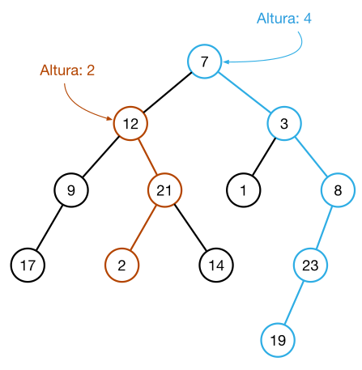

[Projeto e Análise de Algoritmos](../../index.md) · [Algoritmos de busca](../index.md)

<!-- wiki:original:inicio -->
<a id="secao-9"></a>

# Árvores

Uma árvore binária consiste em uma estrutura de dados capaz de armazenar um conjunto de nós.

- Todo nó possui uma chave;

- Opcionalmente um valor (dependendo da aplicação);

- Cada nó possui referências para dois filhos;

- Sub-árvores da direita e da esquerda;

- Toda sub-árvore também é uma árvore.


*Figura 3. Exemplo de árvore binária*

Um nó sem pai é uma **raíz**, enquanto um nó sem filhos é um nó **folha**

**Definição: Altura do nó**

Distância entre um nó e a folha mais afastada. A altura de uma árvore é a algura do nó raíz



*Figura 4. Exemplificação de altura em árvore binária*

**Teorema**

Dada uma árvore de altura $h$, a quantidade máxima de nós $n_{\text{max}}$ e mínima $n_{\text{min}}$ são: $$\begin{array}{r} n_{\text{min }} = h + 1 \\ n_{\text{max }} = 2^{h + 1} - 1 \end{array}$$

Para $n_{\text{min}}$, pense apenas numa lista encadeada. Ela é uma árvore, certo? Ela é o menor caso possível intuitivamente e tem $h + 1$ nós.

Para $n_{\text{max}}$, pense numa árvore completa, claro. Se isso ocorrer, temos $2^{0}$ nós na altura $0$, $2^{1}$ nós na altura $1$, e assim sucessivamente. Temos então um somatório de nós até a altura $h$:

$$S_{h} = \sum_{k = 0}^{k = h}2^{k} = 1.\frac{2^{h + 1} - 1}{2 - 1} = 2^{h + 1} - 1$$

pela forma da soma da PG.

**Definição**

Uma árvore está **balanceada** quando a altura das subárvores de um nó apresentam uma diferença de, no máximo, $1$

**Teorema**

Dada uma árvore com $n$ nós e balanceada, a sua altura $h$ será, no máximo: $$h = \log(n)$$

**Demonstração**

Seja $N(h)$ o número mínimo de nós de uma árvore balanceada de altura $h$. Temos a recorrência (pior caso):

$$N(h) = 1 + N(h - 1) + N(h - 2)$$

O $1$ vem da raiz, $N(h - 1)$ de alguma das sub-árvores, e $N(h - 2)$ vem da outra sub-árvore, com a distância entre as duas de $1$.

Ainda, temos que $N(0) = 1$ e $N(1) = 2$,

**Hipótese:** $N(h) \geq 2^{\frac{h}{2}}$ para todo $h \geq 0$.

**Base:** Para $h = 0$: $N(0) = 1 \geq 2^{0}$. Para $h = 1$: $N(1) = 2 \geq 2^{\frac{1}{2}}$.

**Passo indutivo:** suponha válido para $h - 1$ e $h - 2$. Então

$$N(h) \geq N(h - 1) + N(h - 2) \geq 2^{\frac{h - 1}{2}} + 2^{\frac{h - 2}{2}} = 2^{\frac{h - 2}{2}}\left( 2^{\frac{1}{2}} + 1 \right).$$

Como $2^{\frac{1}{2}} + 1 > 2$, segue $N(h) \geq 2^{\frac{h}{2}}$.

Se a árvore tem $n$ nós então $n \geq N(h) \geq 2^{\frac{h}{2}}$, logo

$$n \geq 2^{\frac{h}{2}} \Rightarrow \log_{2}(n) \geq \frac{h}{2}\log_{2}(2) \Rightarrow h \leq 2\log_{2}(n)$$

Portanto, $h = O\left( \log n \right)$.

Essa hipótese é um pouco não trivial, mas se quiser, também é possível provar reconhecendo que os temos $N(h) = N(h - 1) + N(h - 2)$ lembram bastante Fibonacci.

Agora, vamos ver algumas formas de andar por essa árvore binária, ou seja, andar corretamente de nó em nó usando a estrutura que criamos, além de formas para descobrir sua altura. Para códigos posteriores, considere a seguinte estrutura:

``` cpp
class Node {
  public:
    Node(int key, char data)
      : m_key(key)
      , m_data(data)
      , m_leftNode(nullptr)
      , m_rightNode(nullptr)
      , m_parentNode(nullptr) {}
    Node & leftNode() const { return * m_leftNode; }
    void setLeftNode(Node * node) { m_leftNode = node; }

    Node & rightNode() const { return * m_rightNode; }
    void setRightNode(Node * node) { m_rightNode = node; }

    Node & parentNode() const { return * m_parentNode; }
    void setParentNode(Node * node) { m_parentNode = node; }

  private:
    int m_key;
    char m_data;
    Node * m_leftNode;
    Node * m_rightNode;
    Node * m_parentNode;
};
```

Temos alguns tipos de problemas para trabalhar em cima das árvores e suas soluções:

**Problema**: Dada uma árvore binária A com n nós encontre a sua altura

``` cpp
int nodeHeight(Node * node) {
  if (node == nullptr) {
    return -1;
  }

  int leftHeight = nodeHeight(node->leftNode());
  int rightHeight = nodeHeight(node->rightNode());

  if (leftHeight < rightHeight) {
    return rightHeight + 1;
  } else {
    return leftHeight + 1;
  }
}
```

A complexidade dessa solução é $\Theta(n)$, pois independente da ideia, precisamos passar por todos os nós para termos certeza da altura.

**Problema**: Dada uma árvore binária $A$ imprima a chave de todos os nós através da busca em profundidade. Desenvolva o algoritmo para os 3 casos: Em ordem, pré-ordem, pós-ordem

Relembrando os 3 casos que você provavelmente já viu em Estrutura de Dados:

- Em ordem: Esquerda -\> Raizz -\> Direita

**EM ORDEM**

``` cpp
void printTreeDFSInorder(class Node * node) {
  if (node == nullptr) {
    return;
  }
  printTreeDFSInorder(node->leftNode());
  cout << node->key() << " ";
  printTreeDFSInorder(node->rightNode());
}
```

- Pré-ordem : Raiz -\> Esquerda -\> Direita

**PRÉ-ORDEM**

``` cpp
void printTreeDFSPreorder(class Node * node) {
  if (node == nullptr) {
    return;
  }
  cout << node->key() << " ";
  printTreeDFSPreorder(node->leftNode());
  printTreeDFSPreorder(node->rightNode());
}
```

- Pós - ordem: Esquerda -\> Direita -\> Raiz

**PÓS-ORDEM**

``` cpp
void printTreeDFSPostorder(class Node * node) {
  if (node == nullptr) {
    return;
  }
  printTreeDFSPostorder(node->leftNode());
  printTreeDFSPostorder(node->rightNode());
  cout << node->key() << " ";
}
```

**Problema**: dada uma árvore binária $A$ imprima a chave de todos os nós através da busca em largura. Imagino que você saiba, mas relembrando, busca em largura nada mais é que a busca de altura em altura, começando pela raiz.

``` cpp
void printTreeBFSWithQueue(Node * root) {
  if (root == nullptr) {
    return;
  }
  queue<Node*> queue;
  queue.push(root);
  while (!queue.empty()) {
    Node * node = queue.front();
    cout << node->key() << " ";
    queue.pop();
    Node * childNode = node->leftNode();
    if (childNode) {
      queue.push(childNode);
    }
    childNode = node->rightNode();
    if (childNode) {
      queue.push(childNode);
    }
  }
}
```

<!-- wiki:original:fim -->

## Percurso de estudo

[Trilha: A1](../../../../trilhas/projeto-e-analise-de-algoritmos/a1.md) · [Apresentação e contexto da fonte](../../../../trilhas/projeto-e-analise-de-algoritmos/a1.md#apresentacao-original)

- Anterior: [Busca em um vetor ordenado](../busca-em-um-vetor-ordenado/index.md)
- Próximo: [Árvores Binárias de Busca](../arvores-binarias-de-busca/index.md)
