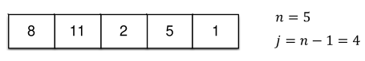

[Projeto e Análise de Algoritmos](../../index.md) · [Algoritmos de Ordenação](../index.md)

<!-- wiki:original:inicio -->
<a id="secao-21"></a>

# Bubble Sort

O algoritmo bubble sort (ordenação por flutuação) é uma das soluções mais simples para o problema de ordenação. A solução consiste em inverter (trocar) valores de posições adjacentes sempre que `v[i + 1] < v[i]`. Essa operação é executada para cada posição $0 \leq i < n - 1$ ao percorrer a sequência. Observe que ao percorrer a sequência j = n − 1 vezes executando esse procedimento atingimos a sequência ordenada.

**Exemplo**

Considere o seguinte array:



*Figura 14. Lista para exemplo do algoritmo Bubble Sort*

E a execução do código decorrerá da forma:


*Figura 15. Fluxo de código do algoritmo Bubble Sort*

Então, a ideia é percorrer cada item da lista e, sempre que um elemento a esquerda é maior que o elemento a direita, os dois trocam de posição

**IMPLEMENTAÇÃO**

``` cpp
#define swap(v, i, j) { int temp = v[i]; v[i] = v[j]; v[j] = temp; }

void bubbleSort(int v[], int n) {
  for (int j = 0; j < n - 1; j++) {
    for (int i = 0; i < n - 1; i++) {
      if (v[i] > v[i + 1]) {
        swap(v, i, i + 1);
      }
    }
  }
}
```

O algoritmo é executado $n - 1$ vezes e, a cada iteração do for de fora, ele executa $n - 1$ subprocessos, logo, no final teremos um total de $T(n) = \Theta(n^{2})$ de complexidade (tanto melhor quanto pior caso, já que independentemente da lista os dois fors vão até $n - 1$).

Porém, fazendo uma otimização no algoritmo:

**IMPLEMENTAÇÃO OTIMIZADA**

``` cpp
void bubbleSortOptimized(int v[], int n) {
  for (int j = 0; j < n - 1; j++) {
    bool swapped = false;
    for (int i = 0; i < n - 1; i++) {
      if (v[i] > v[i + 1]) {
        swap(v[i], v[i + 1]);
        swapped = true;
      }
    }
    if (!swapped) { break; }
  }
}
```

Essa otimização checa se dentro do loop maior houve alguma troca, se não houve nenhuma, então o algoritmo é encerrado, pois significa que está ordenado. Ao fazer isso, a complexidade do melhor caso desce para $\Theta(n)$.

<!-- wiki:original:fim -->

## Conteúdos relacionados

- [3.4 Bubble Sort — Estrutura de Dados](../../../estrutura-de-dados/ordenacao/bubble-sort/index.md)

## Percurso de estudo

[Trilha: A1](../../../../trilhas/projeto-e-analise-de-algoritmos/a1.md) · [Apresentação e contexto da fonte](../../../../trilhas/projeto-e-analise-de-algoritmos/a1.md#apresentacao-original)

- Anterior: [Algoritmos de Ordenação](../index.md)
- Próximo: [Selection Sort](../selection-sort/index.md)
