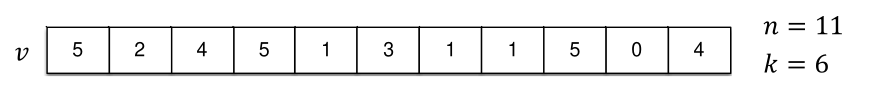
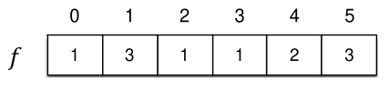

[Projeto e Análise de Algoritmos](../../index.md) · [Algoritmos de Ordenação](../index.md)

<!-- wiki:original:inicio -->
<a id="secao-27"></a>

# Counting Sort

O algoritmo de ordenação por contagem consiste em computar para cada elemento quantos elementos menores existem na lista, pois, sabendo que o elemento $v_{i}$ possui $j$ elementos menores do que ele, podemos definir sua posição final como $j + 1$

Vamos enunciar novamente nosso problema:

Desejamos ordenar os elementos do vetor $v\lbrack 0,\ldots,n - 1\rbrack$ considerando as seguintes restrições:

- Os elementos são números inteiros.

- Os números estão presentes no intervalo $\lbrack 0,\ldots,k - 1\rbrack$

- O universo possui tamanho $k$.

- $k$ é pequeno



*Figura 30. Array de Exemplo*

Nesse exemplo, temos um total de $11$ elementos e $6$ opções entre eles (os elementos vão de $0$ à $5$)



*Figura 31. Array de frequência de cada número $f$*

Criamos então um a **sequência auxiliar** de tamanho $k$. Nessa sequência, cada índice representa um elemento específico do array e os elemento representam **quantas vezes esses elementos aparecem na lista original**. Com essa sequência $f$, vamos gerar **outra** sequência auxiliar $sf$, de tal forma que: $$sf_{i} = \sum_{j = 0}^{i - 1}f\lbrack j\rbrack = f\lbrack i - 1\rbrack - sf\lbrack i - 1\rbrack\text{\quad\quad}(i > 0)$$ Ou seja, o elemento $i$ de $sf$ é a **quantidade de elementos menores que $i$**


*Figura 32. Segunda lista auxiliar $sf$*

Então, utilizando $sf$, podemos criar uma nova lista ordenada, de forma que o elemento $i \in \lbrack 0,k\rbrack$ estará localizado no índice $sf_{i}$


*Figura 33. Lista ordenada*

**IMPLEMENTAÇÃO**

``` cpp
void countingSort(int v[], int n, int k) {
  int fs[k + 2];                 //+1 indexação de arrays +1  de fs[0] = 0
  int temp[n];
  for (int j = 0; j < k + 2; j++) {
    fs[j] = 0;
  }
  for (int i = 0; i < n; i++) {
    fs[v[i] + 1] += 1;            //note que fs[0] = 0
  }
  for (int j = 1; j <= k; j++) {
    fs[j] += fs[j - 1];
  }
  for (int i = 0; i < n; i++) {
    int j = v[i];
    temp[fs[j]] = v[i];
    fs[j]++;
  }
  for (int i = 0; i < n; i++) {
    v[i] = temp[i];
  }
}
```

Criamos o vetor da soma de frequências com $k + 1$ entradas, e o vetor temp, que servirá para ordenar depois das frequências contadas. O primeiro for simplesmente preenche cada elemento de `fs` como $0$. O segundo for conta quantas vezes cada valor aparece (armazenando em `fs[v[i] + 1]`).

O terceiro loop somará todas as frequências anteriores para definir a posição correta dos elementos de índice $j$, transformando `fs` em um array de prefixos acumulados. No quarto loop pegamos j que é o valor de `v[i]` e vemos qual o começo desse valor na lista de frequências, e adicionamos no lugar certo de temp graças a isso. Após, incrementamos o valor de `fs[j]`, pois, se o mesmo número aparecer, ele deve ir no próximo elemento depois do adicionado na iteração.

Por fim, o último loop apenas passa a lista ordenada em `temp` para `v`.

Podemos avaliar o desempenho do algoritmo Counting Sort através da seguinte função: $$\begin{aligned} f(n,k) & = c_{1}k + c_{2}n + c_{3}k + c_{4}n + c_{5}n \\ & = \left( c_{1} + c_{3} \right)k + \left( c_{2} + c_{4} + c_{5} \right)n \\ & = \Theta(k + n) \end{aligned}$$

Exige $O(n + k)$ de espaço adicional. Portanto, se k for muito pequeno a complexidade será $\Theta(n)$. É considerado um algoritmo eficiente para ordenar sequências com elementos repetidos.

<!-- wiki:original:fim -->

## Percurso de estudo

[Trilha: A1](../../../../trilhas/projeto-e-analise-de-algoritmos/a1.md) · [Apresentação e contexto da fonte](../../../../trilhas/projeto-e-analise-de-algoritmos/a1.md#apresentacao-original)

- Anterior: [Heapsort](../heapsort/index.md)
- Próximo: [Radix Sort](../radix-sort/index.md)
