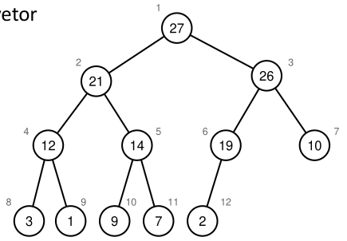

[Projeto e Análise de Algoritmos](../../index.md) · [Algoritmos de Ordenação](../index.md)

<!-- wiki:original:inicio -->
<a id="secao-26"></a>

# Heapsort

O algoritmo Heapsort consiste em organizar os elementos em um heap binário e reinseri-los utilizando uma estratégia semelhante à do algoritmo de ordenação por seleção.

O heap (monte) é uma estrutura de dados capaz de representar um vetor sob a forma de uma árvore binária, que apresenta as seguintes propriedades:

- É uma árvore quase completa

- Todos os níveis devem estar preenchidos exceto pelo último.

- É mínimo ou máximo

  - Heap mínimo – cada filho será maior ou igual ao seu pai.

  - Heap máximo – cada filho será menor ou igual ao seu pai.

Por enquanto, vamos considerar os **heaps máximos**. A altura de um **heap** com $n$ nós é dada por $\left\lfloor {\log_{2}(n)} \right\rfloor$. Podemos representar um heap utilizando um **array**, de forma que ele segue as seguintes regras:

- O índice $1$ é a raíz da árvore

- O pai de qualquer índice $p$ é $\frac{p}{2}$, com exceção do nó raíz

- O filho esquerdo de um nó $p$ é $2p$

- O filho esquerdo de um nó $p$ é $2p + 1$

Essa abordagem de implementação elimina a necessidade de ponteiros para o pai e para os filhos.

<a id="heap-example"></a>



*Figura 26. Exemplo de HEAP*

![Forma da [\[heap-example\]](#heap-example) como vetor](../../assets/heap-array-example.png)

*Figura 27. Forma da [\[heap-example\]](#heap-example) como vetor*

Podemos ordenar uma árvore em um heap caso as propriedades do vetor não sejam satisfeitas. Para isso, utilizamos o algoritmo **max-heapify**

- Assume-se que as sub-árvores do nó são heaps-máximos(ou mínimos no outro caso).

- Caso $v\lbrack p\rbrack$ seja menor que $v\lbrack 2p\rbrack$ ou $v\lbrack 2p + 1\rbrack$ escolhe o maior e executa a troca.

- Em seguida executa max-heapify recursivamente no nó filho alterado.


*Figura 28. Visualização do algoritmo max-heapify*

**IMPLEMENTAÇÃO**

``` cpp
void heapify(int v[], int n, int i) {
  int inx = i;
  int leftInx = 2 * i + 1;    
  int rightInx = 2 * i + 2;
  if ((leftInx < n) && (v[leftInx] > v[inx])) {
    inx = leftInx;
  }
  if ((rightInx < n) && (v[rightInx] > v[inx])) {
    inx = rightInx;
  }
  if (inx != i) {
    swap(v, i, inx);
    heapify(v, n, inx);
  }
}
```

Os índices da esquerda e da direita são criados como $2 \ast i + 1$ e $2 \ast i + 2$, em vez de $2 \ast i$ e $2 \ast i + 1$ por causa da indexação inicial de vetores nas linguagens. o inteiro `i` é o índice do nó que queremos corrigir.

Na primeira verificação vemos se o índice a esquerda que calculamos existe(sendo menor que $n$) e se o filho a esquerda do elemento `i` é maior. Fazemos a mesma coisa só que com o filho a direita de `v[i]`(note que a verificação do da direita compara não só com o pai, mas também com o filho a esquerda).

Se o índice mudou, ou seja, se algum filho é maior que o pai, então trocamos o pai pelo maior filho e fazemos heapify novamente.

A complexidade desse algoritmo é $T(n) = O\left( \log n \right)$, pela propriedade do heap que é criado como uma árvore quase completa, com a altura crescendo proporcionalmente com o número de elementos.

Agora, vamos aprender a construir esse heap:

**IMPLEMENTAÇÃO**

``` cpp
void buildHeap(int v[], int n) {
  for (int i=(n/2-1); i >= 0; i--) {
    heapify(v, n, i);
  }
}
```

Bom, não é nada muito difícil. Todos os nós depois de $\frac{n}{2}$ são folhas, logo, como o heapify garante a propriedade de heap para o nó i e sua subárvore, “afundando” o valor de `v[i]` se necessário, fazemos um for que ordenará desde a raiz até o último pai, garantindo a propriedade do heap por construção.

Vamos ver a complexidade do buildHeap:


*Figura 29. Aproximação de um algoritmo heapsort*

Cada nível $i$, de baixo para cima, tem aproximadamente $n/2^{i}$ nós, ou seja, o custo total vai ser: $$T(n) = \sum_{i = 1}^{\log(n)}i \cdot \frac{n}{2^{i}} = O(n)$$

pois o somatório converge. Agora, dado o devido contexto sobre os **heaps**, vamos voltar para o algoritmo de **heapsort**. Esse algoritmo tem dois passos principais:

1.  Organizar o vetor de entradas em um **heap**

2.  Ordenar os elementos executando os seguintes passos para $v\lbrack n,\ldots,1\rbrack$:

    - Trocar o elemento atual $v\lbrack i\rbrack$ pela raíz $v\lbrack 1\rbrack$ ($v\lbrack 1\rbrack$ é o maior elemento do heap)

    - Corrigir o **heap** usando o **heapify** para a raíz

Dessa forma ignoramos a parte já ordenada que colocamos de `v[i]` para frente e fazemos heapify com o restante da lista.

**IMPLEMENTAÇÃO**

``` cpp
void heapSort(int v[], int n) {
  buildHeap(v, n);
  for (int i=n-1; i > 0; i--) {
    swap(v, 0, i);
    heapify(v, i, 0);
  }
}
```

Para analisar o desempenho, podemos fazer o seguinte:

- **Construção do heap**: Executa um **heapify** em um vetor de $\approx n/2$ posições, logo $O\left( n\log(n) \right)$

- **Ordenação**: Executa o **heapify** para cada elemento em um vetor de $n - 1$ posições, logo, temos um $O\left( n\log(n) \right)$

No final, somando tudo, temos que $T(n) = \Theta(n\log(n))$.

<!-- wiki:original:fim -->

## Percurso de estudo

[Trilha: A1](../../../../trilhas/projeto-e-analise-de-algoritmos/a1.md) · [Apresentação e contexto da fonte](../../../../trilhas/projeto-e-analise-de-algoritmos/a1.md#apresentacao-original)

- Anterior: [Quicksort](../quicksort/index.md)
- Próximo: [Counting Sort](../counting-sort/index.md)
