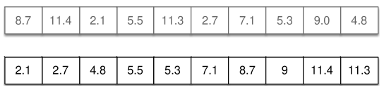

[Projeto e Análise de Algoritmos](../index.md)

<!-- wiki:original:inicio -->
<a id="secao-20"></a>

# Algoritmos de Ordenação

------------------------------------------------------------------------

Agora, dada uma sequência de valores, escreva um algoritmo capaz de retornar a sequência ordenada de valores a partir de uma entrada de vários números não-ordenados.

``` cpp
int v[] = {8, 11, 2, 5, 10, 16, 7, 15, 1, 4};
```

- Exceto quando especificado de outra forma, assuma que o tipo dos valores são números inteiros

- Utilizaremos o vetor como estrutura de dados, no entanto os algoritmos apresentados podem ser implementados utilizando outras estruturas, como listas encadeadas

Um algoritmo de ordenação é considerado **estável** quando, ao final do programa, elementos de mesmo valor aparecem na mesma ordem que antes. Por exemplo:



*Figura 13. Exemplo de algoritmo estável com números fracionários*

Considere um algoritmo que ordena o vetor mostrado acima considerando **apenas a parte inteira**. Nesse algoritmo, $5.5$ e $5.3$ tem o mesmo valor (Já que estamos considerando apenas a parte inteira), e no array antes da ordenação, $5.5$ aparece **antes** do $5.3$. Se o algoritmo for estável, como podemos ver no array ordenado, a ordem deverá ser mantida.

<!-- wiki:original:fim -->

## Tópicos desta página

1. [Bubble Sort](bubble-sort/index.md)
2. [Selection Sort](selection-sort/index.md)
3. [Insertion Sort](insertion-sort/index.md)
4. [Mergesort](mergesort/index.md)
5. [Quicksort](quicksort/index.md)
6. [Heapsort](heapsort/index.md)
7. [Counting Sort](counting-sort/index.md)
8. [Radix Sort](radix-sort/index.md)
9. [Bucket Sort](bucket-sort/index.md)

## Percurso de estudo

[Trilha: A1](../../../trilhas/projeto-e-analise-de-algoritmos/a1.md) · [Apresentação e contexto da fonte](../../../trilhas/projeto-e-analise-de-algoritmos/a1.md#apresentacao-original)

- Anterior: [Soluções para colisão](../tabela-hash/solucoes-para-colisao/index.md)
- Próximo: [Bubble Sort](bubble-sort/index.md)
