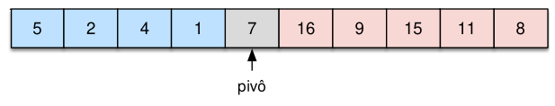

[Projeto e Análise de Algoritmos](../../index.md) · [Algoritmos de Ordenação](../index.md)

<!-- wiki:original:inicio -->
<a id="secao-25"></a>

# Quicksort

É uma ideia parecida com o mergesort, mas contém um algoritmo auxiliar específico, com exceção também que buscamos um algoritmo que não necessite dos $O(n)$ de espaço adicional. O algoritmo escolhe um elemento, o qual chamamos de **pivô**, e separa em duas partições: Os elementos maiores e menores que o **pivô**.



*Figura 23. Exemplificação do algoritmo Quicksort*

Então resumimos o problema do particionamento como:

Dada uma sequência $v$ e um intervalo $\lbrack p,\ldots,r\rbrack$ transponha elementos desse intervalo de forma que ao retornar um índice $j$ (pivô) tenhamos: $$v\lbrack p,\ldots,j - 1\rbrack \leq v\lbrack j\rbrack \leq v\lbrack j + 1,\ldots,r\rbrack$$

Temos a seguinte implementação para o partition:

------------------------------------------------------------------------

**IMPLEMENTAÇÃO**

<a id="partition"></a>

``` cpp
#define swap(v, i, j) { int temp = v[i]; v[i] = v[j]; v[j] = temp; }
int partition(int v[], int p, int r) {
  int pivot = v[r];
  int j = p;
  for (int i=p; i < r; i++) {
    if (v[i] <= pivot) {
      swap(v, i, j);
      j++;
    }
  }
  swap(v, j, r);
  return j;
}
```

Olhando para o algoritmo temos `r`, que é o índice da lista que vamos ordenar em função, temos também `p`, que é o índice de onde vamos começar a ordenar, e `j`, que será a quantidade a partir de `p` de elementos menores que `v[r]`. No caso, ordenaremos para a sublista `v[p, ..., r]` em função de `v[r]`.

Fazemos um for de `p` até `r`, e se `v[i]` for menor que o pivô, trocamos o elemento indexado em `i` com o em `j`. Como `j` só é incrementado quando acha um valor menor, então o que estamos fazendo é separando uma área para os elementos menores que `v[r]` enquanto deixamos que os maiores continuem em suas posições(a menos de troca com menores). No final, trocamos o `v[r]` com a última incrementação de `j`, deixando menores a esquerda e maiores a direita. Retorna a posição correta de `v[r]`.

Como a sequência de $n$(a real é que a sequência é definida por `p` e `r`, mas normalmente esses valores serão o início e o fim da lista, respectivamente) elementos é percorrida uma única vez executando operações constantes, temos que $T(n) = \Theta(n)$


*Figura 24. Exemplo do algoritmo Partition*

Agora que temos a base, vamos para o algoritmo principal!

------------------------------------------------------------------------

**IMPLEMENTAÇÃO**

``` cpp
void quicksort(int v[], int p, int r) {
  if (p < r) {
    int j = partition (v, p, r);
    quicksort(v, p , j - 1);
    quicksort(v, j + 1, r);
  }
}
quicksort(v, 0, n - 1);
```

Funciona da seguinte forma: enquanto tivemos mais de um elemento na lista(isso que o if verifica), particionamos em cima de algum elemento da lista, e fazemos a mesma coisa recursivamente para a parte a esquerda e a direita da lista, com o elemento de j já ordenado.

Note que, se sempre pegarmos um elemento do muito ruim, a complexidade do algoritmo irá aumentar. Por isso, temos algumas formas de escolher o elemento para ordenar em função:

1.  Podemos permutar a entrada do vetor;

2.  Sortear algum índice aleatório.

Dessa forma aumentamos a probabilidade da partição ser razoavelmente equilibrida na média.


*Figura 25. Exemplo do algoritmo quicksort*

Temos que sua função de complexidade é tal que: $$\begin{aligned} T(n) & = T(j) + T(n - j - 1) + n \\ & = T(0) + 1 + 2 + 3 + \ldots + (n - 1) + n \\ & = \frac{n(n + 1)}{2} \\ & = \Theta(n^{2}) \end{aligned}$$ onde $j$ é o índice do primeiro elemento particionado.

O pior caso acontece quando o pivô é o último/primeiro elemento e ele é o maior/menor elemento, já que uma partição fica vazia

Já o melhor caso ocorre quando o algoritmo sempre divide todas as partições ao meio $$T(n) = 2T\left( \frac{n}{2} \right) + n = \Theta(n\log(n))$$

Já o caso médio ocorre quando o algoritmo divide em partições de tamanho diferente. Imagine que o algoritmo divide em partições do tipo $0.1n$ e $0.9n$ $$T(n) = T\left( \frac{n}{10} \right) + T\left( \frac{9n}{10} \right) + n$$

Podemos avaliar como $\Theta(n\log(n))$, ou seja, é o mesmo caso do melhor caso possível, mas tem uma constante maior. Então, conseguimos perceber que o desempenho do algoritmo depende da **escolha do pivô**. O pior caso é $\Theta(n^{2})$, porém só ocorre em casos muito extremos.

<!-- wiki:original:fim -->

## Percurso de estudo

[Trilha: A1](../../../../trilhas/projeto-e-analise-de-algoritmos/a1.md) · [Apresentação e contexto da fonte](../../../../trilhas/projeto-e-analise-de-algoritmos/a1.md#apresentacao-original)

- Anterior: [Mergesort](../mergesort/index.md)
- Próximo: [Heapsort](../heapsort/index.md)
