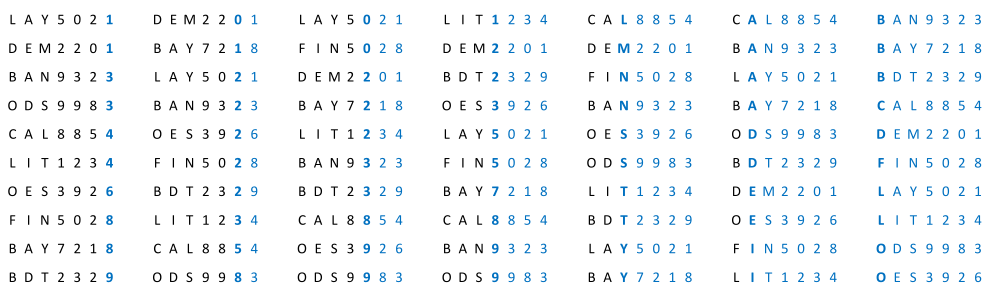

[Projeto e Análise de Algoritmos](../../index.md) · [Algoritmos de Ordenação](../index.md)

<!-- wiki:original:inicio -->
<a id="secao-28"></a>

# Radix Sort

O algoritmo Radix sort consiste em ordenar os elementos de uma sequência digito à digito, do menos significativo para o mais significativo. Considera que cada elemento é uma sequência com $w$ dígitos (Todos os elementos precisam ter $w$ dígitos). Embora o termo dígito remeta à números do conjunto $\left\{ 0,1,\ldots,9 \right\}$, podemos utilizar qualquer valor que possa ser mapeado em um inteiro



*Figura 34. Radix Sort exemplo*

**IMPLEMENTAÇÃO**

``` cpp
void radixSort(unsigned char * v[], int n, int W, int K) {
  int fp [K + 1];
  unsigned char* aux[n];
  for (int w = W - 1; w >= 0; w--) {
    for (int j = 0; j <= K; j++) { fp[j] = 0; }
    for (int i = 0; i < n; i++) {
      fp[v[i][w] + 1] += 1;
    }
    for (int j = 1; j <= K; j++) { fp[j] += fp[j - 1]; }
    for (int i = 0; i < n; i++) {
      int j = v[i][w];
      aux[fp[j]] = v[i];
      fp[j]++;
    }
    for (int i = 0; i < n; i++) { v[i] = aux[i]; }
  }
}
```

Note que esse código é literalmente o Counting Sort só que para cada “dígito” do elemento. Portanto, a explicação do código está uma seção acima.

Podemos avaliar o desempenho do algoritmo Radix Sort através da seguinte função: $$\begin{aligned} f(n,k,w) & = w\left( c_{1}k + c_{2}n + c_{3}k + c_{4}n + c_{5}n \right) \\ & = w\left( \left( c_{1} + c_{3} \right)k + \left( c_{2} + c_{4} + c_{5} \right)n \right) \\ & = \Theta(w(k + n)) \end{aligned}$$ Exige $O(n + k)$ de espaço adicional. Se $k$ e $w$ forem pequenos a complexidade pode ser avaliada como $\Theta(n)$.

<!-- wiki:original:fim -->

## Percurso de estudo

[Trilha: A1](../../../../trilhas/projeto-e-analise-de-algoritmos/a1.md) · [Apresentação e contexto da fonte](../../../../trilhas/projeto-e-analise-de-algoritmos/a1.md#apresentacao-original)

- Anterior: [Counting Sort](../counting-sort/index.md)
- Próximo: [Bucket Sort](../bucket-sort/index.md)
