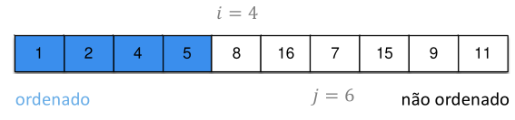
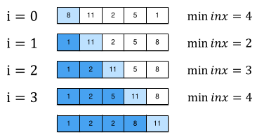

[Projeto e Análise de Algoritmos](../../index.md) · [Algoritmos de Ordenação](../index.md)

<!-- wiki:original:inicio -->
<a id="secao-22"></a>

# Selection Sort

No selection sort, fazemos uma busca em **cada posição** pelo $i$-ésimo valor que **deveria** estar naquela posição



*Figura 16. Exemplificação do algoritmo Selection Sort*

Dada uma posição $i$, e assumindo que todas as posições anteriores já estão ordenadas, o algoritmo irá procurar dentre as próximas $n - i$ posições um valor menor que o da posição $i$. Se isso acontece, significa que esse valor deveria estar na posição que $i$, e então trocamos de posição.

**Exemplo**

Considere o caso:


*Figura 17. Lista para exemplo do algoritmo Selection Sort*

E assim, o fluxo durante a execução do programa será:



*Figura 18. Fluxo do código do algoritmo Selection Sort*

**IMPLEMENTAÇÃO**

``` cpp
void selectionSort(int v[], int n) {
  for (int i = 0; i < n - 1; i++) {
    int minInx = i;
    for (int j = i + 1; j < n; j++) {
      if (v[j] < v[minInx]) {
        minInx = j;
      }
    }
    swap(v, i, minInx);
  }
}
```

No primeiro for, pegamos o índice `i`, e no segundo loop passamos em todos os índices a frente de `i`, e se for menor que o `v[i]`(ou algum que foi substituído), realiza a troca depois de todas as verificações. Dessa forma, sempre pegamos o menor valor de da lista do índice `i` para frente.

Para avaliar o desempenho, podemos montar seu custo total percebendo que, a cada iteração, o algoritmo avalia um elemento a menos, de forma que podemos expressar a **função de complexidade** como: $$\begin{aligned} T(n) & = (n - 1) + (n - 2) + \ldots + 1 + 0 \\ & = \sum_{i = 0}^{n - 1}i = \frac{n(n - 1)}{2} \end{aligned}$$ Ou seja, obtemos que $T(n) = \Theta(n^{2})$, que também é a complexidade no melhor caso, já que, novamente, os fors dependem totalmente de $n$.

<!-- wiki:original:fim -->

## Conteúdos relacionados

- [3.2 Selection Sort — Estrutura de Dados](../../../estrutura-de-dados/ordenacao/selection-sort/index.md)

## Percurso de estudo

[Trilha: A1](../../../../trilhas/projeto-e-analise-de-algoritmos/a1.md) · [Apresentação e contexto da fonte](../../../../trilhas/projeto-e-analise-de-algoritmos/a1.md#apresentacao-original)

- Anterior: [Bubble Sort](../bubble-sort/index.md)
- Próximo: [Insertion Sort](../insertion-sort/index.md)
