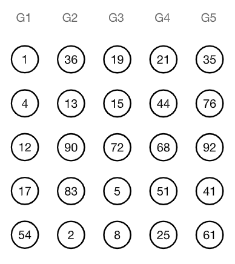
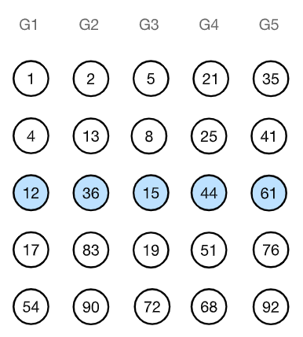
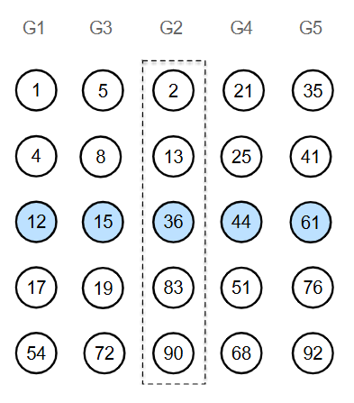

[Projeto e Análise de Algoritmos](../../index.md) · [Algoritmos de Seleção](../index.md)

<!-- wiki:original:inicio -->
<a id="secao-32"></a>

# Mediana das Medianas

O algoritmo MOM é semelhante ao QuickSelect, no entanto escolhe o pivô de forma que as partições sejam balanceadas.

Utilizando essa abordagem, o particionamento produz no pior caso conjuntos com tamanho $\frac{3n}{10}$ e $\frac{7n}{10}$.

Dada a sequência `v[0 ... n - 1]` e a posição `x` buscada:

- Divida a sequência em grupos de 5 elementos;

- Ordene cada grupo e obtenha a mediana de cada um deles (insira cada mediana em uma sequência `M`);

- Encontre a mediana das medianas em `M` executando recursivamente;

- Particione a sequência utilizando a mediana `m`, obtendo o pivô `j`;

- se `j = x - 1`, encontramos o elemento (o - 1 vem da indexação);

- se `j > x - 1`, executamos a recursão para `[0, ..., j - 1]`;

- se `j < x - 1`, executamos a recursão para `[j + 1, ..., n - 1]`.

Vamos buscar a mediana do vetor

`v = [1,4,12,17,54,36,13,90,83,2,19,15,72,5,8,21,44,68,51,25,35,76,92,41,61]`

Divida em grupos de 5:



*Figura 37. Exemplo de divisão para o algoritmo Mediana das Medianas*

E, achando a mediana de cada grupo, teremos:



*Figura 38. Exemplo de encontrar a mediana dos 5 grupos para o algoritmo Mediana das Medianas*

Logo, falta apenas encontrar a mediana das medianas:



*Figura 39. Exemplo de encontrar a mediana das medianas entre os 5 grupos para o algoritmo Mediana das Medianas*

Legal! Descobrimos então que o a mediana é $36$. Vamos para o algoritmo:

``` cpp
int medianOf(int v[], int n) {
  quicksort(v, 0, n - 1);
  return v[n / 2];
}
```

Esse código serve para ordenar os grupos menores e, assim, pegar sua mediana. Usa o algoritmo que aprendemos no capítulo passado, o quicksort($O\left( n\log(n) \right))$ e retorna a mediana. Vamos para o algoritmo central:

------------------------------------------------------------------------

``` cpp
int selectMOM(int arr[], int left, int right, int k) {
    int n = right - left + 1;                                 //|
                                                              //|
    if (k <= 0 || k > n) {                                    //|
        return -1;                                            //|
    }                                                         //|
    int numGroups = (n + 4) / 5;                              //|
    int medians[numGroups];

    int groupIndex = 0;
    int pos = left;

    while (pos <= right) {
        int groupSize;
        if (pos + 4 <= right) {
            groupSize = 5;                                    //O(n)
        } else {
            groupSize = right - pos + 1;
        }

        int group[5];
        for (int i = 0; i < groupSize; i++) {
            group[i] = arr[pos + i];
        }                                                     //|
        int med = medianOf(group, groupSize);                 //|
        medians[groupIndex] = med;                            //|
        groupIndex++;                                         //|
        pos = pos + 5;                                        //|
    }                                                         //|

    int pivotValue;
    if (numGroups == 1) {
        pivotValue = medians[0];
    } else {
        int middleGroup = numGroups / 2;                                 //|
        pivotValue = selectMOM(medians, 0, numGroups - 1, middleGroup);  //T(n/5)
    }                                                                    //|
    int pivotIndex = partition(arr, left, right, pivotValue); //O(n)
    int order = pivotIndex - left + 1;                        //|

    if (order == k) {                                                 //|
        return arr[pivotIndex];                                       //|
    } else if (order > k) {
        return selectMOM(arr, left, pivotIndex - 1, k);               //T(7n/10)
    } else {                                                          //|
        return selectMOM(arr, pivotIndex + 1, right, k - order);      //|
    }
}
```

- Nota: o código está um pouco diferente daquele do slide pois aquilo lá tá bem denso, escondendo a lógica em funções pequenas. Aqui, tentei mudar isso.

Na definição da função, temos o array, o índice à esquerda,o ìndice a direita do vetor e `k`, que é a posição (em termos de ordem) que queremos dentro do subarray atual(ou seja, para $n$ ímpar teremos $\frac{n}{2}$, a mediana)

Fazemos um breve cálculo do `n` e verificamos o tamanho do `k`, após isso calculamos o número de grupos(somamos $+ 4$ para pegar algum resto da divisão por 5 que precise ser fechado para fazermos um grupo), e criamos um array do tamanho das medianas que teremos, para adicioná-las ali. Declaramos um inteiro para marcar o grupo que estamos e a posição atual.

Então começamos um while que continua enquanto ainda houver elementos até right. Dentro do while, declaramos um int para marcar o tamanho do grupo, e o primeiro if else marca o tamanho do grupo atual, se a posição atual $+ 4$ for menor que right, então ainda temos grupos de 5 para formar, caso contrário apenas pega o tamanho necessário.

Cria o array do grupo que será encontrado a mediana na variável group e coloca tamanho $5$ como padrão, e o for preenche ele com os valores dos índices corretos no vetor original. Pega a mediana com o medianOf e adiciona na lista de medianas, incrementa e etc. Legal, agora temos um outro array menor das medianas.

Para esse array, verificamos se tem tamanho $1$, se tiver, então essa é a Mediana das medianas, se não, pegamos o array novamente e o dividimos de novo, até que o vetor de medianas tenha tamanho $1$. Agora vamos procurar o índice correto para esse valor, e para isso usamos o partition. Por fim, criamos o order, que será a posição relativa dentro do array atual.

Se ele for o `k` que procuramos, então retornamos o valor dele, e caso contrário fazemos a procura a direita ou a esquerda do pivô(em casos que queremos achar a mediana, $k = \frac{n}{2}$).

Ok, agora que entendemos o que o código faz, vamos a sua complexidade:

Lembremo-nos que o pivô é a mediana do vetor, e que, por isso, pelo menos metade das medianas está abaixo do pivô. Então pelo menos $\frac{n}{2.5}$ grupos tem medianas menor ou igual a MOM($\frac{1}{5}$ vêm de que cada grupo de $5$ tem uma mediana e o $\frac{1}{2}$ vêm de que metade delas estão abaixo). Além disso, dentro de cada grupo desse, os 3 primeiros elementos(incluindo a mediana com certeza também são menores que a MOM). Por isso, temos

$$\frac{n}{10}.3 = \frac{3}{10}n$$

elementos garantidamente menores que a MOM. Pelo mesmo raciocínio, no mínimo $\frac{3}{10}n$ elementos são maiores que a MOM. Logo, ao dividir o subarray na recurssão a maior metade pode ter no máximo $\frac{7}{10}n$ elementos. Por isso, temos que:

$$T(n) = \begin{cases} c_{1}\text{                                 se }n = 1 \\ T\left( \frac{n}{5} \right) + T\left( \frac{7}{10}n \right) + O(n)\text{   se }n > 1 \end{cases}$$

$T\left( \frac{n}{5} \right)$ vêm da busca pela MOM, quando temos um array de tamanho somente de medianas. $T\left( \frac{7}{10}n \right)$ vem da parte de subdividir o problema para achar o $k$ que queremos, e $O(n)$ do while e do partition.

Gostaríamos que $T(n)$ fosse linear, logo : $$\begin{aligned} T(n) & \leq cn \\ & = \frac{cn}{5} + \frac{7cn}{10} + c_{1}n \\ & = \frac{9cn}{10} + c_{1}n \\ & = n\left( \frac{9c}{10} + c_{1} \right) \end{aligned}$$

e queremos achar $cn$ tal que:

$$cn \geq n\left( \frac{9c}{10} + c_{1} \right) \Rightarrow c = 10c_{1}$$

Como esse $c$ existe, portanto, $T(n) = O(n)$.
<!-- wiki:original:fim -->

## Percurso de estudo

[Trilha: A1](../../../../trilhas/projeto-e-analise-de-algoritmos/a1.md) · [Apresentação e contexto da fonte](../../../../trilhas/projeto-e-analise-de-algoritmos/a1.md#apresentacao-original)

- Anterior: [Quickselect](../quickselect/index.md)
