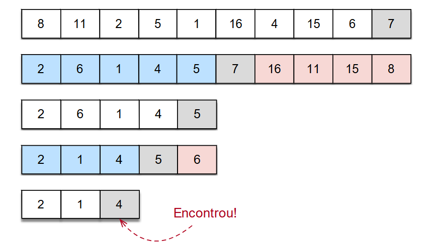

[Projeto e Análise de Algoritmos](../../index.md) · [Algoritmos de Seleção](../index.md)

<!-- wiki:original:inicio -->
<a id="secao-31"></a>

# Quickselect

O algoritmo consiste em particionar a sequência conforme o algoritmo Quicksort, e buscar recursivamente escolhendo uma das partições.

Dada a sequência `v[0 ... n-1]` e a posição `x` buscada:

- Executamos o partition, obtendo a posição do pivô `j`. (note que estamos falando de índices)

  - se `j = x - 1`, encontramos o elemento (o - 1 vem da indexação)

  - se `j > x - 1`, executamos a recursão para `[0, ..., j - 1]`.

  - se `j < x - 1`, executamos a recursão para `[j + 1, ..., n - 1]`.

**Exemplo**

vamos buscar o terceiro menor elemento da sequência abaixo:



*Figura 36. Exemplo do algoritmo Quickselect*

Vamos para sua implementação!

``` cpp
int quickselect(int v[], int l, int r, int x) {
  if (x > 0 && x <= r - l + 1) {
    int j = partition(v, l, r);
    if (j - l == x - 1) {
      return v[j];
    }
    if (j - l > x - 1) {
      return quickselect(v, l, j - 1, x);
    }
    return quickselect(v, j + 1, r, x - j + l - 1);
  }
  return -1;
}
```

O inteiro `l` é o índice do primeiro elemento da lista que iremos ordenar, e o inteiro `r` é o índice do último elemento. O primeiro if verifica se o x está dentro da lista, e a partir daí pega o seu índice `j`(a posição correta do último elemento da lista) pelo partition, e verificamos se ela é exatamente o índice `x` que procuramos. Se não, vai ao próximo if(seria como se fosse um else if nesse caso) e verifica a esquerda de `j`, `[l, ..., j-1]` procurando por `x`.

Por fim, o último return do if inicial faz o quickselect para a esquerda de `j`, `[j + 1, ... , r]`, porém note que ele muda a indexação do `x`, por quê?

Pois ao procurar `x`, note que o `x` não é o mesmo do ínicio, pois nos movemos `l` casas a direita. Por exemplo:

**Exemplo**

Queremos encontrar o **4º menor elemento** no vetor `v = [7, 2, 9, 4, 6]`:

`quickselect(v, l=0, r=4, x=4)`

- Subarray considerado: `[7, 2, 9, 4, 6]`

- Pivô escolhido: 6

Após a partição: `[2, 4, 6, 9, 7]`

- Índice global do pivô: j = 2

- Procuramos x - 1 = 3

- Como j - l = 2 \< 3, o elemento desejado está à direita do pivô.

Note que aqui deveríamos então fazer a recursão a direita, e teríamos então o vetor `[9,7]` para olhar. Porém note que olhando para o mesmo `x` do começo, saíriamos da lista. Por isso precisamos “normalizar” o `x`, somando a quantidade de elementos que já passamos(`j - l`), e o `+1` do índice. Por isso `x = x -(j - l + 1)`.

Agora que entendemos o algoritmo, vamos analisar a complexidade:

No melhor caso a sequência será particionada usando a mediana como pivô, levando à seguinte função:

$$T(n) = cn + T\left( \frac{n}{2} \right)$$

e, continuando:

$$\begin{aligned} T(n) & = cn + T\left( \frac{n}{2} \right) \\ & = cn + \frac{cn}{2} + T\left( \frac{n}{4} \right) \\ & = cn + \frac{cn}{2} + \frac{cn}{4} + T\left( \frac{n}{8} \right) \\ & = cn\left( 1 + \frac{1}{2} + \frac{1}{4} + \ldots \right) \leq O(n) \end{aligned}$$

No entanto, no pior caso teremos sempre um conjunto vazio e um conjunto com $n - 1$ elementos, levando a seguinte função de recorrência: $$T(n) = cn + T(n - 1)$$

e, continuando:

$$\begin{aligned} T(n) & = cn + T(n - 1) \\ & = cn + c(n - 1) + T(n - 2) \\ & = cn + c(n - 1) + c(n - 2) + T(n - 3) \\ & = c\left( n + (n - 1) + (n - 2) + \ldots + 2 + 1 \right) \\ & = \frac{n(n + 1)}{2} \\ & = O\left( n^{2} \right) \end{aligned}$$

Portanto, o pior caso $O\left( n^{2} \right)$ e o melhor caso $O(n)$.

<!-- wiki:original:fim -->

## Percurso de estudo

[Trilha: A1](../../../../trilhas/projeto-e-analise-de-algoritmos/a1.md) · [Apresentação e contexto da fonte](../../../../trilhas/projeto-e-analise-de-algoritmos/a1.md#apresentacao-original)

- Anterior: [Algoritmos de Seleção](../index.md)
- Próximo: [Mediana das Medianas](../mediana-das-medianas/index.md)
