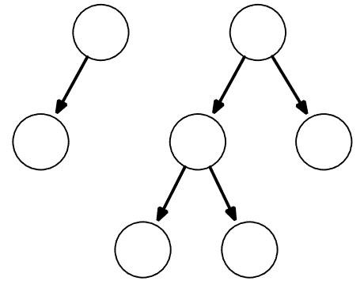

[Projeto e Análise de Algoritmos](../../index.md) · [Árvore Geradora Minima](../index.md)

<!-- wiki:original:inicio -->
<a id="secao-38"></a>

# Algoritmo de Kruskal

A estratégia desse algoritmo consiste em crescer uma floresta $F = (V',E')$ até que ela se torne uma árvore geradora $F = (V,E')$, diferente de crescer arbitrariamente como o Prim.

<a id="secao-39"></a>

## Kruskal Slow

Uma aresta $e_{k}$ é externa a floresta $F$ se $e_{k} \notin F$ e o grafo $F + e_{k}$ é uma floresta. Ideia geral do algoritmo:

1.  **Inicialize a floresta com todos os vértices e nenhuma aresta**

2.  **Escolha a aresta $e_{k} = \left( v_{i},v_{j} \right)$ de $G$ que possua o menor custo**

3.  **Insira $e_{k}$ em $F$.**

Vamos ver como seria a implementação disso:

``` cpp
void mstKruskalSlow(Edge * edges) {
    vertex group[m_numVertices];
    for (vertex v=0; v < m_numVertices; v++) { group[v] = v; }
    int k = 0;
    while (true) {
        int minCost = INT_MAX;
        vertex minV1, minV2 = -1;
        for (vertex v1=0; v1 < m_numVertices; v1++) {
            EdgeNode * edge = m_edges[v1];
            while (edge) {
                vertex v2 = edge->otherVertex();
                int cost = edge->cost();
                if (v1 < v2 && group[v1] != group[v2] && cost < minCost) {
                    minCost = cost;
                    minV1 = v1;
                    minV2 = v2;
                }
                edge = edge->next();
            }
        }
        if (minCost == INT_MAX) return;
        edges[k++] = Edge(minV1, minV2, minCost);
        vertex leaderV1 = group[minV1];
        vertex leaderV2 = group[minV2];
        for (vertex v=0; v < m_numVertices; v++) {
            if (group[v] == leaderV2) {
                group[v] = leaderV1;
            }
        }
    }
}
```

No algoritmo, recebemos uma lista vazia denominada `edges`, onde iremos colocar as arestas da forma `(vértice1, vértice2, custo)`. Criamos um vetor para entendermos de que parte da floresta cada vértice pertence, o `group`. E o `k` vai servir como contador de arestas. Após preenchermos cada vértice a cada grupo próprio, iniciamos o while com o `mincost` e o `minV1` e `minV2`, pra marcar a aresta.

Então, para cada vértice eu pego suas arestas, e faço 3 verificações para atualizar parâmetros:

- `v1 < v2` - Para evitar duplicatas em caso de grafo não dirigido, por exemplo a aresta $(0,1)$ é a mesma que $(1,0)$.

- `group[v2] != group[v1]` - as arestas devem ser de grupos diferentes, caso contrário certamente já pegamos a menor para a árvore.

- e o custo tem que ser menor que o último.

Se passou nessas verificações, então ele deve ser atualizado, e atualizamos a aresta de menor custo, em `minV1` e `minV2`. Após a verificação de contorno e a declaração de da aresta no edges. Por fim, salvamos os líderes de cada grupo e atualizamos o grupo de um dos grupos.

Que ideia do caramba!

**Implementação em Python**

``` py
def mst_kruskal_slow(list_adj):
    num_vertices = len(list_adj)
    group = [v for v in range(num_vertices)]
    edges = []
    while True:
        mincost = float('inf')
        minv1, minv2 = -1, -1
        for v in range(num_vertices):
            for vizinho, custo in list_adj[v]:
                if v < vizinho and group[v] != group[vizinho] and custo < mincost:
                    mincost = custo
                    minv1 = v
                    minv2 = vizinho

        if mincost == float('inf'):
            break
        edges.append((minv1, minv2, mincost))
        leader1 = group[minv1]
        leader2 = group[minv2]
        for v in range(num_vertices):
            if group[v] == leader2:
                group[v] = leader1

    return edges
```

A explicação é análoga à anterior, e, olhando para a complexidade, o while True passa em cada vértice $V$ vezes, e os dois primeiros fors passam por todas as arestas (a cada iteração!). Por fim, o for final percorre todos os vértices novamente, trazendo uma complexidade de $O\left( V(V + E) \right)$.

A corretude do algoritmo pode ser avaliada através do critério de minimalidade baseado em ciclos. Uma árvore geradora $T$ é uma MST de $G$ se e somente se cada aresta $e_{k} \notin T$ apresentar o maior custo no ciclo fundamental de $e_{k}$ relativo à $T$ (não entendi, e espero que vocês acreditem).

Essa versão é um pouco lenta pois:

- A cada iteração todas as arestas são verificadas em busca da com menor custo.

- A cada iteração todos os vértices são verificados para avaliar se é necessário atualizar seu grupo.

Como melhorar isso?

<a id="secao-40"></a>

## Kruskal Fast

Podemos ordenar as arestas por seu custo e utilizar uma estrutura de dados mais eficiente para fazer a busca e união dos vértices.

Na estrutura **union-find**, todo elemento é associado à um conjunto:

- `group[v] = v`, se for o líder do grupo;

- `group[v] = v'`, se não for o líder.

Essa representação força uma estrutura de árvore entre os elementos de mesmo conjunto (também armazenamos o tamanho).

Seguindo essa abordagem podemos comparar se dois elementos pertencem ao mesmo grupo verificando se o líder de cada grupo é o mesmo.



*Figura 44. Exemplo bobo do tal do union-find.*

Como precisamos chegar na raiz, isso consome até $O\left( \log(n) \right)$ no pior caso. A união de grupos passa a ser realizada definindo como pai do menor conjunto o pai do maior conjunto.

Voltando ao Kruskal, podemos otimizá-lo usando o que acabamos de aprender. Veja a ideia:

1.  **Inicialize a floresta com todos os vértices e sem nenhuma aresta**

2.  **Crie a lista de arestas ordenando-a pelo custo**

3.  **Para cada aresta $e_{k} = \left( v_{i},v_{j} \right)$**

    1.  **Obtenha os líderes dos vértices**

    2.  **Se forem diferentes, una-os**

    3.  **insira $e_{k}$ em $F$**

    4.  **Pare ao encontrar $V - 1$ arestas**

``` cpp
void mstKruskalFast(Edge * mstEdges) {
    vector<Edge> edges(m_numEdges);
    int currentEdge = 0;
    for (vertex v1=0; v1 < m_numVertices; v1++) {
        EdgeNode * edge = m_edges[v1];
        while (edge) {
            vertex v2 = edge->otherVertex();
            if (v1 < v2) {
                edges[currentEdge++] = Edge(v1, v2, edge->cost());
            }
            edge = edge->next();
        }
    }
    sort(edges.begin(), edges.end(), compareEdges);
    UnionFind uf(m_numVertices);
    currentEdge = 0;
    for (int e=0; currentEdge < m_numVertices - 1; e++) {
        Edge & edge = edges[e];
        vertex leaderV1 = uf.findE(edge.v1());
        vertex leaderV2 = uf.findE(edge.v2());
        if (leaderV1 != leaderV2) {
            uf.unionE(leaderV1, leaderV2);
            mstEdges[currentEdge++] = edge;
        }
    }
}
```

Após montar a estrutura edges bonitinha e ordenada pelo custo, fazemos literalmente o que foi dito no pseudocódigo - passamos por cada vértice, identificamos os líderes e, se os líderes forem diferentes, adicionamos na lista de retorno a aresta escolhida.

Não vou implementar isso em Python por falta de tempo
<!-- wiki:original:fim -->

## Percurso de estudo

[Trilha: A2](../../../../trilhas/projeto-e-analise-de-algoritmos/a2.md) · [Apresentação e contexto da fonte](../../../../trilhas/projeto-e-analise-de-algoritmos/a2.md#apresentacao-original)

- Anterior: [Algoritmo de Prim](../algoritmo-de-prim/index.md)
