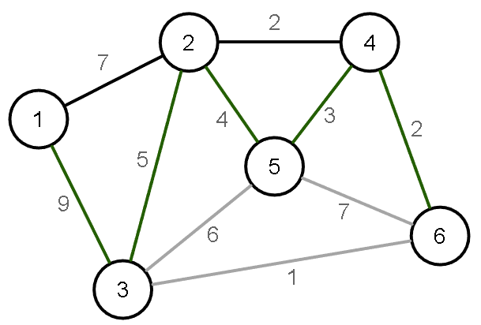

[Projeto e Análise de Algoritmos](../../index.md) · [Árvore Geradora Minima](../index.md)

<!-- wiki:original:inicio -->
<a id="secao-34"></a>

# Algoritmo de Prim

Esse algoritmo é capaz de encontrar a MST de um grafo $G = (V,E)$.

<a id="secao-35"></a>

## Prim Slow

Dada uma árvore $T$ de $G$, considere a franja de $T$ como o corte cuja margem é composta pelos vértices em $T$. Ideia geral do algoritmo:

1.  **Escolha a raiz de $T$**

2.  **Enquanto a franja não estiver vazia:**

    1.  **Escolha a aresta de menor custo**

    2.  **Insira a aresta e o vértice em $T$**

Vamos ver sua implementação:



*Figura 43. Exemplo da franja para $T = \left\{ 1,2,4 \right\}$, com as arestas em verde sendo a franja.*

``` cpp
void mstPrimSlow(vertex * parent) {
    for (vertex v=0; v < m_numVertices; v++) { parent[v] = -1; }
    parent[0] = 0;
    while (true) {
        int min = INT_MAX;
        vertex treeV, newV = -1;
        for (vertex v1=0; v1 < m_numVertices; v1++) {
            if (parent[v1] == -1) { continue; }
            EdgeNode * edge = m_edges[v1];
            while (edge) {
                vertex v2 = edge->otherVertex();
                int cost = edge->cost();
                if (parent[v2] == -1 && cost < min) {
                    min = cost;
                    treeV = v1;
                    newV = v2;
                }
                edge = edge->next();
            }
        }
        if (min == INT_MAX) { break; }
        parent[newV] = treeV;
    }
}
```

O código preenche o vetor de `parent` e abrimos um while true que só para de funcionar quando o `min` não mudou durante toda uma interação. Iniciamos o min, e as variáveis `treeV`, que é o vértice pertencente a $T$, e `newV`, que é o vértice a ser avaliado.

Então, percorremos todos os vértices que já estão na árvore (chamamos de $v_{1}$ e fazemos a verificação vendo se eles já foram incluidos no vetor `parent`), e para cada aresta de `newV` (que chamamos de $v_{2}$), verificamos o custo de adicionar a árvore. Se for menor do que o mínimo, marcamos o respectivo pai e filho, e depois do for acabar, adicionamos essa aresta no vetor de `parent`.

**Implementação em Python**

``` py
def mst_prim_slow(v0, list_adj):
    num_vertices = len(list_adj)
    parent = [-1] * num_vertices
    parent[v0] = v0
    while True:
        min = float('inf')
        treeV, newV = -1, -1
        for i in range(num_vertices):
            if parent[i] == -1:
                continue
            for vizinho, custo in list_adj[i]:
                if parent[vizinho] == -1 and custo < min:
                    min = custo
                    treeV = i
                    newV = vizinho
        if min == float('inf'):
            break
        parent[newV] = treeV

    return parent
```

A ideia é a mesma, claro. Olhando para complexidade, a cada iteração, adicionamos um novo vértice à árvore. No pior caso, onde todos os vértices tem pai, o for passa por todas as arestas para adicionar um único vértice novo, e como rodamos até $V$ vezes, o algoritmo é $O(V + E)$.

A **corretude** do algoritmo pode ser avaliada através do critério de minimalidade baseado em cortes. Uma árvore geradora $T$ é uma MST se e somente se cada aresta $e_{k} \in T$ apresentar o menor custo no corte fundamental de $e_{k}$ relativo à $T$.

Uma coisa que podemos observar no algoritmo é que essa versão calcula a franja a cada iteração, em vez de modificar gradualmente à medida que a árvore é construída. Como melhoramos isso?

<a id="secao-36"></a>

## Prim Fast

Uma estratégia consiste em manter uma estrutura de dados com o custo de cada vértice que pode ser adicionado a $T$. Considere como **fronteira** todos os vértices que podem ser acessados à partir da franja e não pertencem a $T$. A nova ideia é:

1.  **Escolha a raiz de $T$**

2.  **Enquanto a franja não estiver vazia:**

    1.  **Procure $v_{k}$ na fronteira com o menor custo**

    2.  **Insira $V_{k}$ em $T$**

    3.  **Atualize a fronteira adicionando os acessíveis de $v_{k}$**

``` cpp
void mstPrimFastV1(vertex * parent) {
    bool inTree[m_numVertices];
    int vertexCost[m_numVertices];
    for (vertex v = 0; v < m_numVertices; v++) {
        parent[v] = -1;
        inTree[v] = false;
        vertexCost[v] = INT_MAX;
    }
    parent[0] = 0;
    inTree[0] = true;
    EdgeNode * edge = m_edges[0];
    while (edge) {
        vertex v2 = edge->otherVertex();
        parent[v2] = 0;
        vertexCost[v2] = edge->cost();
        edge = edge->next();
    }
    while (true) {
        int minCost = INT_MAX;
        vertex v1 = -1;
        for (vertex v = 0; v < m_numVertices; v++) {
            if (!inTree[v] && vertexCost[v] < minCost) {
                minCost = vertexCost[v];
                v1 = v;
            }
        }
        if (minCost == INT_MAX) {
            break;
        }
        inTree[v1] = true;
        edge = m_edges[v1];
        while (edge) {
            vertex v2 = edge->otherVertex();
            int cost = edge->cost();
            if (!inTree[v2] && cost < vertexCost[v2]) {
                vertexCost[v2] = cost;
                parent[v2] = v1;
            }
            edge = edge->next();
        }
    }
}
```

No código, usaremos três listas, e declaramos e preenchemos elas inicialmente. Após declararmos para o vértice inicial $0$ em `parent[0] = 0` e `inTree[0] = 1`, fazemos um while especificamente para as arestas do vértice inicial para preencher o array `vertexCost` com os respectivos pesos de cada vizinho.

Iniciamos um while para fazer a verificação de cada vértice, e iniciamos `minCost` e `v1`. Para cada vértice, verificamos se ele não está na árvore e se o custo desse vértice é menor que o mínimo. Se for, atualizamos o custo e o vértice. Verificamos a condição de parada e marcamos `v1` como true na árvore, pois é o menor que achamos.

Passamos no outro while por cada aresta do vértice selecionado para atualizar os custos dos seus vizinhos (`v2`). Verificamos se esse vizinho ainda não está incluído na árvore e se o peso da aresta atual é menor do que o custo que já tínhamos registrado para ele em `vertexCost`. Se for menor, atualizamos o `vertexCost[v2]` com esse novo peso (pois achamos uma conexão mais barata) e definimos o `parent[v2]` como sendo o `v1` (isso é a atualização da franja). Ao fim, temos o menor custo possível para cada vértice em `VertexCost` e a árvore mínima pelo `parent`.

**Implementação em Python**

``` py
def mst_prim_fastv1(list_adj):
    num_vertices = len(list_adj)
    parent = [-1] * num_vertices
    intree = [False] * num_vertices
    vertexcost = [float('inf')] * num_vertices
    parent[0] = 0
    intree[0] = True
    for vizinho, custo in list_adj[0]:
        parent[vizinho] = 0
        vertexcost[vizinho] = custo

    while True:
        mincost = float('inf')
        v1 = -1
        for v in range(num_vertices):
            if not intree[v] and vertexcost[v] < mincost:
                mincost = vertexcost[v]
                v1 = v
        if mincost == float('inf'):
            break
        intree[v1] = True
        for v2,custo in list_adj[v1]:
             if not intree[v2] and custo < vertexcost[v2]:
                vertexcost[v2] = custo
                parent[v2] = v1

    return parent
```

É análoga a ideia em C++. Analisando a complexidade, vemos que a cada iteração do while de fora, passamos por todos os vértices, e a cada aresta desse vértice. Como queremos passar por todos os vértices, sabemos que temos que fazer isso $V$ vezes. Isso intuitivamente dá, então, $O\left( V^{2} + E \right)$. Como $E < V^{2}$(ou $E \propto V^{2}$), isso é simplesmente $O\left( V^{2} \right)$. Será que tem como ficar ainda melhor?

<a id="secao-37"></a>

## Prim Fast V2

E se mantessemos os vértices da fronteira em ordem crescente de custo? Dessa forma, não seria necessário procurar o vértice que apresenta o menor custo à cada iteração (basta usar o famoso heap mínimo).

``` cpp
void mstPrimFastV2(vertex * parent) {
    bool inTree[m_numVertices];
    int vertexCost[m_numVertices];
    for (vertex v = 0; v < m_numVertices; v++) {
        parent[v] = -1;
        inTree[v] = false;
        vertexCost[v] = INT_MAX;
    }
    parent[0] = 0;
    inTree[0] = true;
    EdgeNode * edge = m_edges[0];
    while (edge) {
        vertex v2 = edge->otherVertex();
        parent[v2] = 0;
        vertexCost[v2] = edge->cost();
        edge = edge->next();
    }
    Heap heap;
    for (vertex v = 1; v < m_numVertices; v++) { 
        heap.insert_or_update(vertexCost[v], v); 
    }
    while (!heap.empty()) {
        vertex v1 = heap.top().second; 
        heap.pop(); 
        if (vertexCost[v1] == INT_MAX) {
            break;
        }
        inTree[v1] = true;
        edge = m_edges[v1];
        while (edge) {
            vertex v2 = edge->otherVertex();
            int cost = edge->cost();
            if (!inTree[v2] && cost < vertexCost[v2]) {
                vertexCost[v2] = cost;
                parent[v2] = v1;
                heap.insert_or_update(vertexCost[v2], v2);
            }
            edge = edge->next();
        }
    }
}
```

A implementação é muito parecida, e o que muda é que, antes de fazer o while principal, iniciamos o heap, e preenchemos com os custos iniciais de cada vértice (incluindo os que já atualizamos que vem da raiz). Ainda, no while principal, pegamos o topo diretamente do heap e depois retiramos ele ($\log(V)$), e, na hora de atualizarmos a franja, também inserimos no heap.

``` py
import heapq

def mst_prim_fastv2(v0, list_adj):
    num_vertices = len(list_adj)
    parent = [-1] * num_vertices
    intree = [False] * num_vertices
    vertexcost = [float('inf')] * num_vertices
    parent[v0] = v0
    intree[v0] = True
    for vizinho, custo in list_adj[v0]:
        parent[vizinho] = v0
        vertexcost[vizinho] = custo
    heap = []
    for v in range(num_vertices):
        if v != v0:
            heapq.heappush(heap, (vertexcost[v], v))

    while heap:
        custo_v1, v1 = heapq.heappop(heap)
        if intree[v1] or custo_v1 > vertexcost[v1]:
            continue
        if custo_v1 == float('inf'):
            break
        intree[v1] = True
        for v2, custo in list_adj[v1]:
            if not intree[v2] and custo < vertexcost[v2]:
                vertexcost[v2] = custo
                parent[v2] = v1
                heapq.heappush(heap, (vertexcost[v2], v2))

    return parent
```

Para a complexidade, muito parecido com o djikstra, o que vemos aqui é que temos um heap pop quando passamos por todos os vértices e temos um heap push quando temos que adicionar(ao passarmos pelas arestas). Ou seja, juntando com a explicação de complexidades anteriores, isso dá simplesmente $O\left( (V + E)\log(V) \right)$.

<!-- wiki:original:fim -->

## Percurso de estudo

[Trilha: A2](../../../../trilhas/projeto-e-analise-de-algoritmos/a2.md) · [Apresentação e contexto da fonte](../../../../trilhas/projeto-e-analise-de-algoritmos/a2.md#apresentacao-original)

- Anterior: [Árvore Geradora Mínima](../arvore-geradora-minima/index.md)
- Próximo: [Algoritmo de Kruskal](../algoritmo-de-kruskal/index.md)
