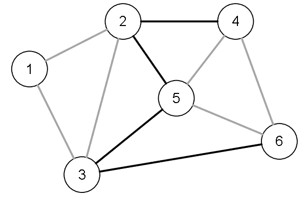
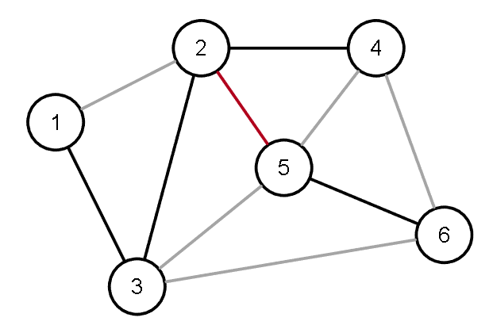

[Projeto e Análise de Algoritmos](../../index.md) · [Árvore Geradora Minima](../index.md)

<!-- wiki:original:inicio -->

# Árvore Geradora Mínima

Uma árvore geradora de um grafo $G = (V,E)$ é um subgrafo $T$ que não possua ciclos e que contenha todos os vértices de $G$. Se um grafo $G$ possui uma árvore geradora, então ele é conexo (claro, uma árvore é conexa) e possui sempre $V - 1$ arestas. Considere abaixo grafos conexos e não-dirigidos.

Um **corte** é um conjunto de arestas que conecta duas partes de um grafo.Dado um conjunto $A$ de vértices, as arestas que possuem uma ponta em $A$ e a outra ponta no complemento de $Ã$ representam um corte.

*Figura 41. Exemplo de corte em grafo*

Dada uma árvore geradora, temos duas operações básicas:

- A adição de uma aresta em uma árvore geradora cria um ciclo.

- A remoção de uma aresta em uma árvore geradora cria um corte.

Dada uma árvore geradora $T$ e um grafo $G = (V,E)$, a propriedade dos ciclos consiste em :

- Se $e_{i} \notin T$, o grafo $T + e_{i}$ possui um único ciclo $C$.

- Se $e_{j} \in C$, o grafo $T + e_{i} - e_{j}$ é uma árvore geradora.

Claro que, se existir um $e_{k} \in T$, $T - e_{k}$ produz uma florest com duas componentes conexas em $G$.

Dada as mesmas coisas, a propriedade dos cortes consiste em:

- Dado $e_{i} \in T$ e $e_{j} \in \text{ corte}\left( T - e_{i} \right)$.

- $T - e_{i} + e_{j}$ é uma árvore geradora.

*Figura 42. Exemplo da propriedade dos cortes: Se retirarmos a aresta $(2,5)$, o corte que conectaria as duas árvores geradoras seria qualquer aresta $\left\lbrack (3,5),(3,6),(4,5),(4,6) \right\rbrack$.*

Se $G = (V,E)$ for um grafo não-dirigido com custos nas arestas (com valores positivos e negativos), sabemos que o custo de um subgrafo $H$ de $G$ é calculado pelo somatório de custos das arestas em $H$. Com isso, podemos definir que uma **Árvore Geradora Mínima** (Mininum Spamming Tree - MST) de um grafo $G$ é qualquer árvore geradora cujo custo seja mínimo.

**Problema:** dado $G = (V,E)$ não-dirigido com custos nas arestas encontre uma árvore geradora mínima.

<!-- wiki:original:fim -->

## Percurso de estudo

[Trilha: A2](../../../../trilhas/projeto-e-analise-de-algoritmos/a2.md) · [Apresentação e contexto da fonte](../../../../trilhas/projeto-e-analise-de-algoritmos/a2.md#apresentacao-original)

- Anterior: [Árvore Geradora Minima](../index.md)
- Próximo: [Algoritmo de Prim](../algoritmo-de-prim/index.md)
