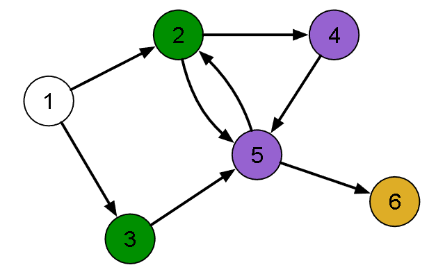

[Projeto e Análise de Algoritmos](../../index.md) · [Busca em Grafos](../index.md)

<!-- wiki:original:inicio -->
<a id="secao-23"></a>

# BFS

O algoritmo de busca em largura (BFS - Breadth First Search) é uma outra estratégia de varredura em um grafo. A ideia principal é:

Percorrer o grafo por camadas, ou seja:

- Inicia visitando um grafo $v_{0}$;

- Visita seus vértices adjacentes;

- Visita os adjacentes dos adjacentes (que ainda não foram visitados);

- Continua até todos os vértices terem sido visitados.

Assim como o DFS, define a ordem de descoberta dos vértices.



*Figura 34. Exemplo do algoritmo BFS (note que cada nível está de uma cor).*

Uma implementação comum desse algoritmo utiliza uma fila para armazenar os vértices descobertos que ainda não foram explorados. Vamos ver o código:

``` cpp
void bfs(vertex v0, int * order) {
    queue<int> queue;
    int counter = 0;
    for (int i=0; i < m_numVertices; i++) {
        order[i] = -1;
    }
    order[v0] = counter++;
    queue.push(v0);
    while (!queue.empty()) {
        int v1 = queue.front();
        queue.pop();
        EdgeNode * edge = m_edges[v1];
        while (edge) {
            vertex v2 = edge->otherVertex();
            if (order[v2] == -1) {
                order[v2] = counter++;
                queue.push(v2);
            }
            edge = edge->next();
        }
    }
}
```

Essa função recebe um vértice inicial `v[0]` e um ponteiro para a lista de ordem que será dada a ele. Inicia-se também uma fila (estrutura de dados que vimos em ED) e um counter que vai determinar a posição de cada vértice (a ordem). Após preencher a lista de ordem como -1, ele marca a posição do elemento `v[0]` na lista de ordem e faz o push de $v_{0}$ na fila.

Continuando, enquanto a fila não for vazia, chamamos de $v_{1}$ o primeiro item da fila, o retiramos da fila e pegamos sua lista de adjacência. Enquanto tiverem vértices nessa lista, pegamos o vértice do outro lado da aresta ($v_{2}$) e verificamos se ele não está na lista de ordem (já visitado). Caso já não tenha sido visitado, ele é adicionado na fila, e passamos para o próximo vértice.

O que podemos ver aqui é que a utilização da fila como estrutura de dados para esse algoritmo faz total diferença, já que isso faz com que, começando do vértice $v_{0}$, passamos por todos os seus filhos, e o uso da fila faz com que apenas os próximos $i$ a serem visitados sejam exatamente os $i$ filhos de $v_{0}$, e assim sucessivamente, trazendo uma busca em nível. Observe que essa implementação númera apenas os vértices a partir de $v_{0}$ (funciona bem quando você sabe que é um grafo com apenas uma componente conexa e com $v_{0}$ como raiz).

Como faríamos para garantir um algoritmo que numera todos os vértices?

``` cpp
void bfsForest(int * order) {
    int counter = 0;
    for (int i=0; i < m_numVertices; i++) { order[i] = -1; }
    for (int i=0; i < m_numVertices; i++) {
        if (order[i] != -1) { 
            continue; 
            }
        order[i] = counter++;
        queue<int> queue;
        queue.push(i);
        while (!queue.empty()) {
            int v1 = queue.front();
            queue.pop();
            EdgeNode * edge = m_edges[v1];
            while(edge) {
                vertex v2 = edge->otherVertex();
                if (order[v2] == -1) {
                    order[v2] = counter++;
                    queue.push(v2);
                }
                edge = edge->next();
            }
        }
    }
}
```

O que muda desse algoritmo para o anterior é simplesmente a inicialização, pois agora nos baseamos no número de vértices para preencher a ordem como $- 1$ e além disso, fazemos um for para passar por todos os vértices. Mas a ideia é a mesma, pois dentro desse for continuamos se ele já foi visitado, e se não foi, marcamos sua posição, e fazemos a mesma verificação para a lista de adjacências dele.

Legal, temos um array (`order`) que mostra a ordem de visitação, mas isso não me mostra exatamente como chegar de um vértice a outro diretamente. E se marcassemos o pai de cada vértice?

``` cpp
void bfs(vertex v0, int * order, int * parent) {
    queue<int> queue;
    int counter = 0;
    for (int i=0; i < m_numVertices; i++) {
        order[i] = -1;
        parent[i] = -1;
    }
    order[v0] = counter++;
    parent[v0] = v0;
    queue.push(v0);
    while (!queue.empty()) {
        int v1 = queue.front();
        queue.pop();
        EdgeNode * edge = m_edges[v1];
        while (edge) {
            vertex v2 = edge->otherVertex();
            if (order[v2] == -1) {
                order[v2] = counter++;
                parent[v2] = v1;
                queue.push(v2);
            }
            edge = edge->next();
        }
    }
}
```

Note que precisamos voltar com o $v_{0}$, já que marcar o vértice no caminho mais curto vindo da origem sem uma origem não faz muito sentido.

Ele é exatamente igual o algoritmo anterior, a menos do vetor `parents`, que inicialment é declarado como $- 1$ para todo vértice e, quando entra no if do não visitado, é marcado que $v_{1}$ é seu pai. Simples assim!

Analisando a complexidade (do último algoritmo), passamos por um for no número de vértices ($O(V)$), depois fazemos um while na queue. Como a queue terá no máximo tamanho $\vert V\vert$, pois o if verifica se já foi adicionado, e no while de dentro passamos por cada aresta de $v_{i}$ (que sabemos que $\sum_{i = 1}^{\vert V\vert }g_{s}\left( v_{i} \right) = \vert E\vert$), temos uma complexidade de no máximo $\Theta(V + E)$ ao utilizar lista de adjacências.

Ao utilizar matriz de adjacências, teríamos que buscar cada ligação de cada vértice sem receber uma lista pronta com isso, o que traria uma complexidade de $\Theta(V^{2})$. Ainda, para grafos densos, ambas as estruturas de dados traria uma complexidade de $\Theta(V^{2})$.

**Implementação em Python**

Vamos implementar os dois últimos algoritmos, pois são os mais completos. Forest:

``` py
from collections import deque

def bfs_forest (list_adj):
    num_vertices = len(list_adj)
    counter = 0
    order = [-1] * num_vertices
    for i in range(num_vertices):
        if order[i] != -1:
            continue
        fila = deque()
        order[i] = counter
        counter += 1
        fila.append(i)
        while fila:
            v1 = fila.popleft()
            for vizinho in list_adj[v1]:
                if order[vizinho] == -1:
                    order[vizinho] = counter
                    counter += 1
                    fila.append(vizinho)

    return order
```

Note que ambos precisam de usar deque(fila com ponteiros para início e fim) para funcionarem com as mesmas complexidades. BFS:

``` py
from collections import deque

def bfs (v0, list_adj):
    num_vertices = len(list_adj)
    fila = deque()
    counter = 0
    order = [-1] * num_vertices
    parent = [-1] * num_vertices

    order[v0] = counter
    counter += 1
    parent[v0] = v0
    fila.append(v0)
    while fila:
        v1 = fila.popleft()
        for vizinho in list_adj[v1]:
            if order[vizinho] == -1:
                order[vizinho] = counter 
                counter += 1
                parent[vizinho] = v1
                fila.append(vizinho)
    return parent, order
```

Fim! Mas agora, como achar o menor caminho em um grafo??

------------------------------------------------------------------------

<!-- wiki:original:fim -->

## Percurso de estudo

[Trilha: A2](../../../../trilhas/projeto-e-analise-de-algoritmos/a2.md) · [Apresentação e contexto da fonte](../../../../trilhas/projeto-e-analise-de-algoritmos/a2.md#apresentacao-original)

- Anterior: [Propriedades úteis advindas do DFS](../propriedades-uteis-advindas-do-dfs/index.md)
- Próximo: [Menor caminho em Grafos](../../menor-caminho-em-grafos-a2/index.md)
