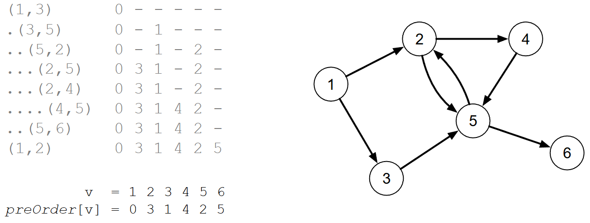

[Projeto e Análise de Algoritmos](../../index.md) · [Busca em Grafos](../index.md)

<!-- wiki:original:inicio -->
<a id="secao-19"></a>

# DFS

O algoritmo de **busca em profundidade (Depth First Search)** consiste em visitar todos os vértices ao menos uma vez e levantar propriedades sobre a estrutura do grafo

Vamos começar identificando a ordem de descoberta dos vértices (ou pré-ordem). Em **C++:**

Esse código assume a existência de tipos como ‘vertex’, ‘EdgeNode” e variáveis de membro como ‘m_numVertices” e ‘m_edges’, que seriam parte de uma classe de Grafo. Ele usa algumas funções que não definiu antes, e eu não vou ficar tentando entender isso agora :p

``` cpp
void dfs(int * preOrder) {
    int counter = 0;
    for (vertex v=0; v < m_numVertices; v++) {
        preOrder[v] = -1;
    }
    for (vertex v=0; v < m_numVertices; v++) {
        if (preOrder[v] == -1) {
            dfsRecursive(v, preOrder, counter);
        }
    }
}

void dfsRecursive(vertex v1, int * preOrder, int & counter) {
    preOrder[v1] = counter++;
    EdgeNode * edge = m_edges[v1];
    while (edge) {
        vertex v2 = edge->otherVertex();
        if (preOrder[v2] == -1) {
            dfsRecursive(v2, preOrder, counter);
        }
        edge = edge->next();
    }
}
```

Implementação em Python:

Intuitiva com a ideia, inicia a lista de descoberto como $- 1$ e se o vértice é $- 1$ (ainda não descoberto), realiza a busca profunda partindo desse vértice, e atualizando a lista ``preorder`` da ordem que foi a partir do primeiro ``v``.

``` py
def dfs_preorder(adj_list):
    num_vertices = len(adj_list)
    preorder = [-1] * num_vertices
    counter = 0 
    for v in range(num_vertices):
        if preorder[v] == -1: 
            counter = dfs_recursive(v, preorder, counter, adj_list)
    return preorder

def dfs_recursive(v_atual, preorder, counter, adj_list): #Auxiliar
    preorder[v_atual] = counter
    counter += 1
    for v_vizinho in adj_list[v_atual]:
        if preorder[v_vizinho] == -1:
            counter = dfs_recursive(v_vizinho, preorder, counter, adj_list)
    return counter
```

Voltando ao exemplo inicial, veja como seria o algoritmo:



*Figura 27. Exemplo da execução do algoritmo DFS para o mesmo grafo*

À esquerda, os parênteses indicam as arestas visitadas e a lista da ordem de visita. A interpretação de ``preorder`` é: o vértice $1$ foi o primeiro a ser visitado, o vértice $3$ foi o segundo, o $5$ o terceiro e assim sucessivamente.

Dizemos então que um vértice $v$ é **visitado** quando ``preOrder\[v\]`` é consultado e que um vértice $v$ é **descoberto** quando ``preOrder\[v\]`` é definido (a busca pode iniciar em qualquer vértice).

A abordagem de tentar percorrer a partir de cada vértice garante que todos os vértices serão inspecionados, mesmo que o grafo não seja conexo. Além disso, um grafo pode apresentar múltiplas sequências de pré-ordem (depende da ordem em que as arestas são inspecionadas).

Falando de complexidade, sabemos pelo algoritmo que cada vértice será processado uma única vez, e em cada vértice são verificadas cada $g_{s}\left( v_{i} \right)$ arestas. Sabendo que isso soma $\vert E\vert$, fica claro que temos uma complexidade de $\Theta(\vert V\vert  + \vert E\vert )$ usando lista de adjacências, e $\Theta(\vert V\vert ^{2})$ para matriz de adjacência.

<!-- wiki:original:fim -->

## Percurso de estudo

[Trilha: A2](../../../../trilhas/projeto-e-analise-de-algoritmos/a2.md) · [Apresentação e contexto da fonte](../../../../trilhas/projeto-e-analise-de-algoritmos/a2.md#apresentacao-original)

- Anterior: [Busca em Grafos](../index.md)
- Próximo: [Grafo topológico](../grafo-topologico/index.md)
