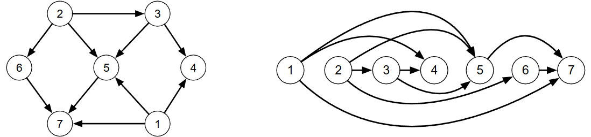

[Projeto e Análise de Algoritmos](../../index.md) · [Busca em Grafos](../index.md)

<!-- wiki:original:inicio -->

# Grafo topológico

Um **grafo topológico** é um grafo que admite uma ordenação dos vértice de forma que para toda aresta $\left( v_{i},v_{j} \right)$ temos que $i < j$.

*Figura 28. Exemplo da grafo topológico (Note que se os vértices forem dispostos em ordem crescente toda aresta irá apontar para o sentido de crescimento dos números).*

Algumas propriedades de grafos topológicos:

- Não apresentam ciclos;

- Todo vértice é:

  - o término de um caminho que começa numa fonte;

  - a origem de um caminho que termina num sorvedouro;

- Se um grafo é topológico, podem existir várias numerações topológicas diferentes;

Como verificar se um grafo $G = (V,E)$ possui numeração topológica e determiná-la?

Podemos eliminar uma fonte $g_{e}\left( v_{k} \right) = 0$ de $G$ produzindo um subgrafo $G'$, e repetindo o procedimento sobre ele. Se redumovermos a fonte inicial, isso provavelmente vai criar (caso não tenhamos outra) outra fonte. Se não criar, isso significa que o restante dos vértices estão presos em um ciclo. Numere os vértices removidos, e, se todos eles forem removidos, a numeração é topológica.

**Nota:** O exercício de como fazer o algoritmo que verifica a topologia do grafo está na pasta Exercises.

Uma **floresta radicada** é um grafo topológico sem vértices com grau de entrada maior que 1

As fontes de uma floresta radicada são as raízes das árvores, e os sorvedouros são folhas.

A floresta gerada pela execução do algoritmo de busca em profundidade também é chamada de floresta DFS (essa floresta é também um grafo gerador).

*Figura 29. Exemplo de floresta radicada (a raiz no 2 foi proposital)*

<!-- wiki:original:fim -->

## Percurso de estudo

[Trilha: A2](../../../../trilhas/projeto-e-analise-de-algoritmos/a2.md) · [Apresentação e contexto da fonte](../../../../trilhas/projeto-e-analise-de-algoritmos/a2.md#apresentacao-original)

- Anterior: [DFS](../dfs/index.md)
- Próximo: [DFS modificado](../dfs-modificado/index.md)
