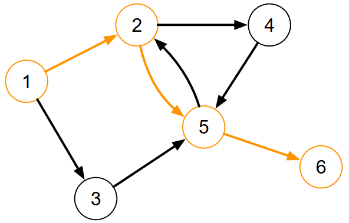
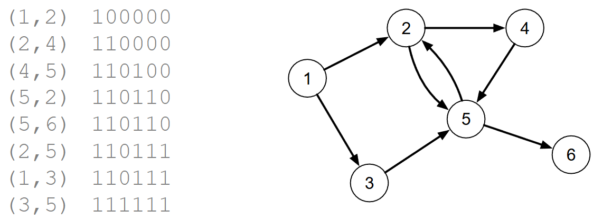

[Projeto e Análise de Algoritmos](../index.md)

<!-- wiki:original:inicio -->
<a id="secao-18"></a>

# Busca em Grafos

------------------------------------------------------------------------

Após relembrar conceitos e aprender algumas estruturas, temos um novo problema:

Dado um par de vértices $v_{i}$ e $v_{j}$ verificar se $v_{j}$ pode ser alcançado iniciando um caminho em $v_{i}$.

Como resolver esse problema?



*Figura 25. Exemplo do caminho $P = \left\{ 1,2,5,6 \right\}$*

A ideia principal é passar pelo grafo e marcar cada nó e aresta visitada, voltando ao nó anterior se chegar a uma junção já visitada ou sorvedouro. Podemos escrever um algoritmo que percorre o grafo a partir do vértice $v_{i}$ armazenando os vértices visitados, e, ao final, verificar se $v_{j}$ foi visitado. Exemplo dessa ideia em Python para a estrutura de matriz de adjacência:

``` py
def reach_recursive_matrix(v_atual, visited, matrix, num_vertices):
    visited[v_atual] = True
    for v_vizinho in range(num_vertices):
        if matrix[v_atual][v_vizinho] == 1 and not visited[v_vizinho]:
            reach_recursive_matrix(v_vizinho, visited, matrix, num_vertices)

def can_reach_matrix(matrix, v1, v2):
    num_vertices = len(matrix)
    visited = [0] * num_vertices
    reach_recursive_matrix(v1, visited, matrix, num_vertices)
    return visited[v2]
```

Como seria a execução desse algoritmo no que grafo que acabamos de ver?



*Figura 26. Exemplo da execução do algoritmo can_reach para o mesmo grafo*

À esquerda temos a aresta escolhida e ao lado a iteração anterior (começando do vértice 1). Observe que o resultado também indica todos os demais vértices que podem ser alcançados a partir de $v_{i}$.

Um **algoritmo de busca** em grafo é qualquer algoritmo que visita todos os vértices percorrendo as arestas definidas (a ordem de pesquisa depende do algoritmo).

<!-- wiki:original:fim -->

## Tópicos desta página

1. [DFS](dfs/index.md)
2. [Grafo topológico](grafo-topologico/index.md)
3. [DFS modificado](dfs-modificado/index.md)
4. [Propriedades úteis advindas do DFS](propriedades-uteis-advindas-do-dfs/index.md)
5. [BFS](bfs/index.md)

## Percurso de estudo

[Trilha: A2](../../../trilhas/projeto-e-analise-de-algoritmos/a2.md) · [Apresentação e contexto da fonte](../../../trilhas/projeto-e-analise-de-algoritmos/a2.md#apresentacao-original)

- Anterior: [Estruturas de dados para representar grafos](../grafos-a2/estruturas-de-dados-para-representar-grafos/index.md)
- Próximo: [DFS](dfs/index.md)
