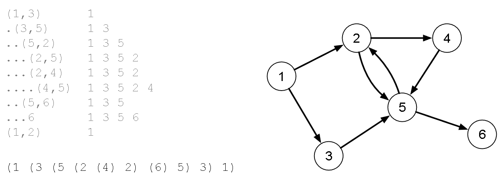

[Projeto e Análise de Algoritmos](../../index.md) · [Busca em Grafos](../index.md)

<!-- wiki:original:inicio -->
<a id="secao-22"></a>

# Propriedades úteis advindas do DFS

Algumas delas já vimos: ordenação topológica, floresta DFS, etc. Vamos ver outras

O **intervalo de vida (lifespan)** de um vértice no contexto da busca ocorre entre o momento que ele é descoberto e o momento em que ele é exaurido. Ele não pode ser definido como ``(preOrder\[v\], postOrder)``, pois são numerações independentes (isso APENAS no algoritmo passado, normalmente o lifespan é definido dessa forma).

Considere dois vértices $v_{1}$ e $v_{2}$.

- Se $v_{1}$ é descoberto antes de $v_{2}$, então $v_{1}$ é exaurido:

  - Antes de $v_{2}$ ser descoberto ($v_{2}$ não tem nenhum parentesco próximo de $v_{1}$, por isso $v_{1}$ e seus filhos são vistos, $v_{1}$ é exaurido e só depois $v_{2}$ é descoberto);

  - Depois de $v_{2}$ ser exaurido (para o caso em que $v_{2}$ é filho de $v_{1}$, que acontece porque na chamada recursiva o filho tem que ser limpo primeiro).

Como podemos representar o intervalo de vida da execução do DFS no grafo a seguir?



*Figura 32. Exemplo do mapeamento do lifespan no grafo de exemplo.*

À esquerda temos a aresta escolhida e ao lado a iteração anterior (começando do vértice 1). a listagem à direita da escolha à esquerda é o histórico da chamada de funções para o vértice i. A lista em baixo representa visualmente o lifespan de cada vértice.

Dado dois vértices $v_{1}$ e $v_{2}$ de uma floresta radicada produzida pro uma execução DFS, o relacionamento desses dois vértices pode ser:

- Ancestral: $v_{1}$ é ancestral de $v_{2}$ se, para chegar em $v_{2}$, o algoritmo DFS “passou por” $v_{1}$ primeiro. (lifespan de $v_{2}$ contido no lifespan de $v_{1}$);

- Descendente: É o oposto de ancestral. $v_{2}$ é descendente de $v_{1}$ se $v_{1}$ for seu ancestral.;

- Primo descreve qualquer par de vértices que não tem relação de ancestralidade (lifespans disjuntos).

Primos ainda podem ser comparados:

- $v_{1}$ é primo mais velho de $v_{2}$ se:

  - ``preOrder\[v1\] \< preOrder\[v2\]``

- $v_{1}$ é primo mais novo de $v_{2}$ se:

  - ``preOrder\[v1\] \> preOrder\[v2\]``

Arestas que não pertencem à floresta DFS podem ser classificados de acordo com o grau do parentesco:

- Uma aresta é de retorno caso $v_{j}$ seja ancestral de $v_{i}$;

- Uma aresta é de avanço caso $v_{j}$ seja descendente de $v_{i}$;

- Uma aresta é cruzada caso $v_{j}$ seja primo de $v_{i}$.

Algumas outras características:

- Vértices de arestas cruzadas podem estar em diferentes árvores da floresta;

- Arestas cruzadas são sempre de um primo mais novo para um primo mais velho;

- Grafos não-orientados não possuem arestas cruzadas.

**Problema:** Dada uma aresta não pertencente à floresta DFS, como determinar algoritmicamente se:

- É uma aresta de avanço:

  - se o intervalo de $v_{j}$ está contido no intervalo de $v_{i}$, ou seja:

  - `preOrder[vi] < preOrder[vj] AND postOrder[vi] > postOrder[vj]`

- É uma aresta de retorno:

  - se o intervalo de $v_{j}$ contém o intervalo de $v_{i}$, ou seja:

  - `preOrder[vi] > preOrder[vj] AND postOrder[vi] < postOrder[vj]`

- É uma aresta cruzada:

  - se o intervalo de $v_{j}$ ocorre antes do intervalo de $v_{i}$, ou seja:

  - `preOrder[vi] > preOrder[vj] AND postOrder[vi] > postOrder[vj]`


*Figura 33. Exemplo de arestas de avanço, retorno e cruzada.*

**Nota:** essas propriedades para as arestas que não são da árvore são apenas quando usamos o `preOrder` e o `postOrder` com a contagem junta, ou seja, dependentes, da forma:

``` py
# Índices:     0  1  2  3  4
pre_order  = [ 4, 2, 3, 7, 1]
post_order = [ 5, 9, 6, 8, 10]
```

Nesse caso, as definições valem do jeito que foram passadas.

Algumas outras propriedades:

- Um grafo é acíclico se e somente se possuir uma numeração topológica.

- Grafos acíclicos também são chamados de **DAGs** (Direct acyclic graphs).

- Uma floresta radicada é um DAG sem vértices com grau de entrada maior que 1.

- Uma árvore radicada é um DAG em que exatamente um vértice tem grau de entrada zero, e os demais grau de entrada 1.

**Problema:** Como determinar se um grafo $G = (V,E)$ possui ao menos um ciclo?

Basta executar a busca DFS e procurar por uma aresta de retorno comparando os intervalos de vida encontrados para cada vértice. Veja o código em C++:

``` cpp
bool hasCycle(int * preOrder, int * postOrder) {
dfs(preOrder, postOrder);
for (vertex v1=0; v1 < m_numVertices; v1++) {
    EdgeNode * edge = m_edges[v1];
    while(edge) {
        vertex v2 = edge->otherVertex();
        if (preOrder[v1] > preOrder[v2]
            && postOrder[v1] < postOrder[v2]) {
            return true;
        }
        edge = edge->next();
    }
}
return false;
}
```

**Implementação em Python:**

Indo para Python, vamos considerar que passamos as listas de preorder e postorder:

``` py
def has_cycle(adj_list, preorder, postorder):
    num_vertices = len(adj_list)
    for v1 in range(num_vertices):
        for v2 in adj_list[v1]:            
            if preorder[v1] > preorder[v2] and postorder[v1] < postorder[v2]:
                return True
    return False
```

<!-- wiki:original:fim -->

## Percurso de estudo

[Trilha: A2](../../../../trilhas/projeto-e-analise-de-algoritmos/a2.md) · [Apresentação e contexto da fonte](../../../../trilhas/projeto-e-analise-de-algoritmos/a2.md#apresentacao-original)

- Anterior: [DFS modificado](../dfs-modificado/index.md)
- Próximo: [BFS](../bfs/index.md)
