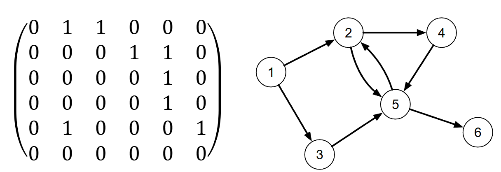
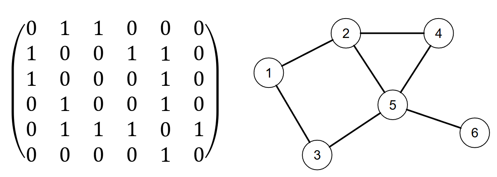
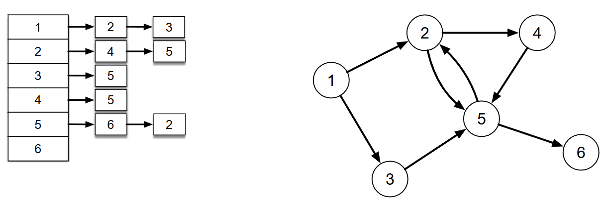

[Projeto e Análise de Algoritmos](../../index.md) · [Grafos](../index.md)

<!-- wiki:original:inicio -->

# Estruturas de dados para representar grafos

Dependendo do problema, a escolha da estrutura pode variar, e, em geral, usamos duas formas de implementar essa representação:

## Matriz de adjacência

Consiste em um matriz quadrada $A$ de ordem $\vert V\vert$ cujas linhas e colunas são indexadas pelos vértices de $V$. Exemplo para grafos orienteados:

*Figura 21. Exemplo de matriz de adjacência para o grafo à direita.*

Analogamente, para não orientados:

*Figura 22. Exemplo de matriz de adjacência para o grafo à direita. Nota: a matriz é simétrica!*

A complexidade de acessar(ou verificar) uma aresta é $\Theta(1)$, e claramente conta com uma complexidade de espaço de $\Theta(\vert V\vert ^{2})$. Além disso, o fato da matriz ser simétrica para grafos não-orientados faz com que o tamanho se reduza para a metade, podendo se armazenar apenas a diagonal superior ou inferior da matriz.

## Lista de adjacência

Consiste em uma sequência de vértices contendo na estrutura de cada ponteiro para uma lista encadeada com elemento representando as arestas adjacentes ao vértices. Exemplo para grafo dirigido:

*Figura 23. Exemplo da lista de adjacência para o grafo à direita.*

Exemplo para grafo não-dirigido:

*Figura 24. Exemplo da lista de adjacência para o grafo à direita.*

A complexidade de acessar o conjunto de arestas de um vértice é $\Theta(1)$ (mas encontrar uma aresta específica é $\Theta(\vert V\vert )$ no pior caso). Ainda, uma lista de adjacência exige um espaço $\Theta(\vert V\vert  + \vert E\vert )$

As estruturas de dados do vértice e da aresta podem ser estendidas para armazenar informações específicas do problema.

**Nota:** Os exercícios passados no slide não serão feitos aqui (pois isso é um “resumo” teórico), e sim na pasta Exercises.

------------------------------------------------------------------------

<!-- wiki:original:fim -->

## Percurso de estudo

[Trilha: A2](../../../../trilhas/projeto-e-analise-de-algoritmos/a2.md) · [Apresentação e contexto da fonte](../../../../trilhas/projeto-e-analise-de-algoritmos/a2.md#apresentacao-original)

- Anterior: [Relembrando conceitos](../relembrando-conceitos/index.md)
- Próximo: [Busca em Grafos](../../busca-em-grafos-a2/index.md)
