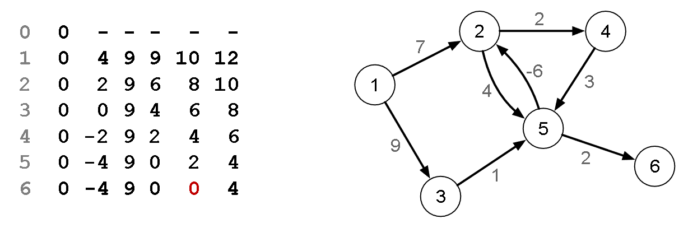

[Projeto e Análise de Algoritmos](../../../index.md) · [Menor caminho em Grafos](../../index.md) · [Caminho mais barato em grafos](../index.md)

<!-- wiki:original:inicio -->
<a id="secao-31"></a>

# Bellman-Ford

Esse algoritmo é capaz de encontrar caminhos mais baratos em um grafo $G = (V,E)$ mesmo que as arestas possuam custos positivos e negativos. Ele retorna falso se detectar um ciclo negativo.

O algoritmo consiste em relaxar as arestas do grafo sistematicamente,reduzindo progressivamente uma estimativa $d\lbrack v\rbrack$ para cada vértice $v \in V$ do grafo, até alcançar a menor distância.

Essa é a ideia geral:

1.  **insira** $v_{0}$ **em** $T$

2.  **defina** $d\left\lbrack v_{0} \right\rbrack = 0$

3.  **execute V - 1 vezes:**

    1.  **para cada arsta $\left( v_{i},v_{j} \right)$:**

        1.  **aplique o relaxamento**

4.  **execute o relaxamento sobre todas as arestas**

    1.  **se alguma distância $d\left\lbrack v_{k} \right\rbrack$ for reduzida, ciclo negativo**

O algoritmo executa as primeiras $V - 1$ iterações construindo caminhos com 1 aresta, 2 arestas, até $V - 1$ arestas, pois sabemos que um caminho simples pode ter no máximo $V - 1$ arestas. Antes de implementarmos o algoritmo, vejamos como ele ocorreria para o grafo de exemplo.



*Figura 40. Exemplo do estado do algoritmo Bellman-Ford*

Note que temos 6 iterações, 5 dos $V - 1$ vértices e o último é a verificação do ciclo negativo. Vamos analisar de perto da primeira iteração: Indo em ordem e sendo o vértice $0$ como raiz, temos a distância para ele é $0$. Vendo seus filhos, ele adiciona que a distância para o vértice $2$ é $7$, e para o $3$ $9$, então temos o vetor de distâncias como $\lbrack 0,7,9, - , - , - \rbrack$.

Na próxima iteração, temos vamos analisar o vértice $2$. Como ele tem uma distância, significa que podemos chegar nele dos vértices que já descobrimos, então podemos realizar a análise. Ele coloca distância $9$ no vértice $4$, e distância $11$ no vértice $5$. Temos então $\lbrack 0,7,9,9,11, - \rbrack$.

Com $i = 2$, estamos no vértice $3$ e atualizamos a distância para o $5$, ficando com $\lbrack 0,7,9,9,10, - \rbrack$.

No vértice $4$ não conseguimos mudar o valor de nada, já que só mudaríamos no 5, que já é um valor menor.

No vértice $5$, conseguimos mudar o valor do vértice $2$ e ao vértice $6$, e somando $- 6$ ao custo do $5$ (para o $2$) e $2$ ao custo do $5$(para o $6$), chegamos em $\lbrack 0,4,9,9,10,12\rbrack$.

Como o último vértice não tem nenhuma aresta de saída, a primeira iteração se encerra como $\lbrack 0,4,9,9,10,12\rbrack$.

Vamos ver como programar esse algoritmo:

``` cpp
bool cptBellmanFord(vertex v0, vertex * parent, int * distance) {
    for (int v=0; v < m_numVertices; v++) {
        parent[v] = -1;
        distance[v] = INT_MAX;
    }
    parent[v0] = v0;
    distance[v0] = 0;
    for (int i=1; i <= m_numVertices - 1; i++) {
        for (int v1 = 0; v1 < m_numVertices; v1++) {
            EdgeNode * edge = m_edges[v1];
            while (edge) {
                vertex v2 = edge->otherVertex();
                int cost = edge->cost();
                if (distance[v1] + cost < distance[v2]) {
                    parent[v2] = v1;
                    distance[v2] = distance[v1] + cost;
                }
                edge = edge->next();
            }
        }
    }
    for (int v1=0; v1 < m_numVertices; v1++) {
        EdgeNode * edge = m_edges[v1];
        while (edge) {
            vertex v2 = edge->otherVertex();
            int cost = edge->cost();
            if (distance[v1] + cost < distance[v2]) {
                return false;
            }
            edge = edge->next();
        }
    }
    return true;
}
```

A explicação já foi explicada, o algoritmo apenas passa por todas as arestas do grafo (pois o for de dentro passa por todos os vértices acessando todas as arestas) $V - 1$, ou seja, temos uma complexidade fácil de $O(VE)$.

**Implementação em Python**

``` py
def bellman_ford(v0, list_adj):
    num_vertices = len(list_adj)
    parent = [-1] * num_vertices
    distance = [float('inf')] * num_vertices
    parent[v0] = v0
    distance[v0] = 0
    for i in range(num_vertices - 1):
        for j in range(num_vertices):
            for vizinho, custo in list_adj[j]:
                if distance[j] + custo < distance[vizinho]:
                    parent[vizinho] = j
                    distance[vizinho] = distance[j] + custo

    for j in range(num_vertices):
        for vizinho, custo in list_adj[j]:
            if distance[j] + custo < distance[vizinho]:
                return False

    return parent, distance
```

Show! Mas, como achar a árvore mais barata que gera o grafo??

------------------------------------------------------------------------

<!-- wiki:original:fim -->

## Percurso de estudo

[Trilha: A2](../../../../../trilhas/projeto-e-analise-de-algoritmos/a2.md) · [Apresentação e contexto da fonte](../../../../../trilhas/projeto-e-analise-de-algoritmos/a2.md#apresentacao-original)

- Anterior: [Djikstra “Rápido”](../djikstra-rapido/index.md)
- Próximo: [Árvore Geradora Minima](../../../arvore-geradora-minima/index.md)
