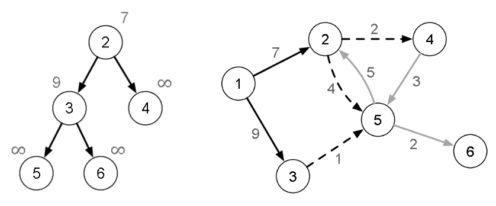

[Projeto e Análise de Algoritmos](../../../index.md) · [Menor caminho em Grafos](../../index.md) · [Caminho mais barato em grafos](../index.md)

<!-- wiki:original:inicio -->
<a id="secao-29"></a>

# Djikstra “Rápido”

**Ideia**: manter os vértices da franja em uma fila de prioridades, implementada como um heap mínimo e que contém todos os vértices que ainda não foram verificados.



*Figura 39. Exemplo do estado do algoritmo após processar o vértice 1. A imagem à esquerda mostra o heap nessa iteração.*

Esse é o código em C++:

``` cpp
void cptDijkstraFast(vertex v0, vertex * parent, int * distance) {
    bool checked[m_numVertices];
    Heap heap; // Create the heap
    for (vertex v=0; v < m_numVertices; v++) {
        parent[v] = -1;
        distance[v] = INT_MAX;
        checked[v] = false;
    }
    parent[v0] = v0;
    distance[v0] = 0;

    heap.insert_or_update(distance[v0], v0);
    while (!heap.empty()) {
        vertex v1 = heap.top().second; // Min vertex
        heap.pop(); // Remove from heap
        if (distance[v1] == INT_MAX) { break; }
        EdgeNode * edge = m_edges[v1];
        while (edge) {
            vertex v2 = edge->otherVertex();
            if (!checked[v2]) {
                int cost = edge->cost();
                if (distance[v1] + cost < distance[v2]) {
                    parent[v2] = v1;
                    distance[v2] = distance[v1] + cost;
                    heap.insert_or_update(distance[v2], v2);
                }
            }
            edge = edge->next();
        }
        checked[v1] = true;
    }
}
```

Sabendo que o heap ordena pelo menor valor e no caso de adicionarmos (distância, vértice) ele ordena pelo primeiro elemento, o código atualiza o heap inicial com $v_{0}$, e, enquanto o heap não estiver vazio, chamamos de $v_{2}$ o próximo vizinho e, se ele não tiver sido visitado, acessa seu custo e verifica se pode relaxar a aresta. Se puder, adiciona também ao heap. Por fim, marca como checado.

**Implementação em Python**

``` py
import heapq

def cpt_dijkstra_fast(v0, list_adj):
    num_vertices = len(list_adj)
    checked = [False] * num_vertices
    parent = [-1] * num_vertices
    distance = [float('inf')] * num_vertices
    parent[v0] = v0
    distance[v0] = 0
    heap = []
    heapq.heappush(heap, (0, v0))

    while heap:
        dist_v1, v1 = heapq.heappop(heap)
        if dist_v1 > distance[v1]:
            continue
        if distance[v1] == float('inf'):
            break
        for v2, cost in list_adj[v1]:
            if not checked[v2]:
                if distance[v1] + cost < distance[v2]:
                    parent[v2] = v1
                    distance[v2] = distance[v1] + cost
                    heapq.heappush(heap, (distance[v2], v2))
        checked[v1] = True
    return parent, distance
```

A explicação é análoga. Para analisar a complexidade, note que o heappop é feito dentro do while que acontece para cada vértice(pois o while heap roda no máximo $V$ vezes), e que o heappush acontece dentro do for das arestas (que já discutirmos ter complexidade $E$). Portanto, é fácil ver que a complexidade é $O\left( \log(V)(V + E) \right)$. Note:

- Se todos os vértices forem acessíveis a partir de $v_{0}$, temos $O\left( E\log(V) \right)$ (pois isso significa que o grafo é conexo e, sabemos que $E \geq V - 1$, e, por isso, $E$ domina).

- Se o grafo for esparso (onde $E \approx V$), a complexidade será $O\left( V\log(V) \right)$.

- Se o grafo for denso (onde $E \approx V^{2}$), temos que a complexidade é $O\left( V^{2}\log(V) \right)$.Ou seja, apresenta um desempenho inferior à abordagem anterior, que mantém $O\left( V^{2} \right)$ fixo independentemente da densidade das arestas.

<a id="secao-30"></a>

# eventualmente adicionar corretude

Por fim, como seria a implementação de um algoritmo que funcionasse em grafos com ciclos negativos?

<!-- wiki:original:fim -->

## Percurso de estudo

[Trilha: A2](../../../../../trilhas/projeto-e-analise-de-algoritmos/a2.md) · [Apresentação e contexto da fonte](../../../../../trilhas/projeto-e-analise-de-algoritmos/a2.md#apresentacao-original)

- Anterior: [Djikstra](../djikstra/index.md)
- Próximo: [Bellman-Ford](../bellman-ford/index.md)
