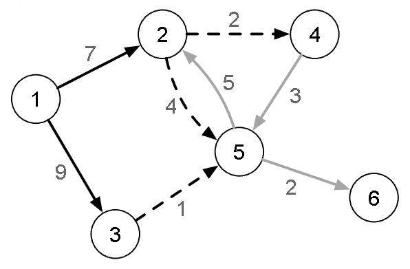

[Projeto e Análise de Algoritmos](../../../index.md) · [Menor caminho em Grafos](../../index.md) · [Caminho mais barato em grafos](../index.md)

<!-- wiki:original:inicio -->
<a id="secao-28"></a>

# Djikstra

Esse famoso algoritmo, que provavelmente você, caro leitor, já viu em MD, é capaz de encontrar caminhos mais baratos em um grafo $G = (V,E)$ que possua arestas com custos positivos.

A solução consiste em crescer uma árvore radicada a partir do vértice inicial $v_{0}$ até que ela seja uma árvore geradora do subgrafo induzido a partir de $v_{0}$.

Antes de explicar melhor, a **franja** de uma árvore radicada $T$ com raiz em $v_{0}$ é o conjunto das arestas $\left( v_{i},v_{j} \right)$ que possuem $v_{i}$ em $T$ e $v_{j}$ fora de $T$. A franja pode ser vista como o grau de saída do conjunto de vértices de $T$.



*Figura 38. Exemplo de franja. Os vértices $(1,2,3)$ já estão árvore radicada, e a franja é o conjuntos de arestas pontilhadas de peso $(2,4,1)$.*

Depois de entender esse conceito, essa é a ideia geral para o Djikstra:

1.  **insira** $v_{0}$ **em** $T$

2.  **defina** $d\left\lbrack v_{0} \right\rbrack = 0$

3.  **enquanto a franja não estiver vazia:**

    1.  **escolha $v_{k}$ de menor distância**

    2.  **aplique a operação de relaxamento em todas as arestas de $v_{k}$ da franja**

    3.  **insira $v_{k}$ em $T$**

Veja a implementação em C++:

``` cpp
void cptDijkstraSlow(vertex v0, vertex *parent, int *distance) {
  std::vector<bool> checked(m_numVertices);
  for (vertex v = 0; v < m_numVertices; v++) {
      parent[v] = -1;
      distance[v] = INT_MAX;
      checked[v] = false;
  }
  parent[v0] = v0;
  distance[v0] = 0;

  while (true) {
      int minDistance = INT_MAX;
      vertex v1 = -1;
      for (vertex i = 0; i < m_numVertices; i++) {
          if (!checked[i] && distance[i] < minDistance) {
              minDistance = distance[i];
              v1 = i;
          }
      }
      if (minDistance == INT_MAX || v1 == -1) break;
      checked[v1] = true;
      EdgeNode *edge = m_edges[v1];
      while (edge) {
          vertex v2 = edge->otherVertex();
          if (!checked[v2]) {
              int cost = edge->cost();
              if (distance[v1] != INT_MAX && distance[v1] + cost < distance[v2]) {
                  parent[v2] = v1;
                  distance[v2] = distance[v1] + cost;
              }
          }
          edge = edge->next();
      }
  }
}
```

O algoritmo inicializa os vetores do começo `parent`, `distance` e `checked`, e declara as informações iniciais de $v_{0}$. Depois, inicializa um while onde, a cada iteração declara a maior distância como um inteiro máximo, e, após isso, o vértice escolhido de $- 1$(pois não escolhemos ainda). Nosso objetivo no for de baixo é escolher, dentre os que tem distância definida e ainda não foram checados (ou seja, a franja), quem tem a menor distância. Após selecionar esse vértice e verificarmos a condição de parada(se a menor distância não mudou, então não temos mais vértices para checar), marcamos ele como checado e fazemos a análise para cada vizinho.

Para cada vizinho, chamamos de $v_{2}$ o vizinho a ser analisado. Se ele não tiver sido checado, pegamos o seu custo e se a distância do $v_{1} +$ custo da aresta for menor, então atualizamos a distância e o pai de $v_{2}$, e passamos para o próximo vértice. (a outra verificação desse if é pra evitar overflow).

**Implementação em Python**

Aqui, consideramos que a lista de adjacências é da forma:

``` py
[
[(vértice, custo), (vértice, custo)], #arestas do vértice 0
[(vértice, custo), (vértice, custo)], #arestas do vértice 1
]
```

Isso é apenas a transformação do código para Python, usando essa estrutura mais simples, que fica dessa forma:

``` py
def cpt_djikstra_slow(v0, list_adj):
    num_vertices = len(list_adj)
    checked = [0] * num_vertices
    parent = [-1] * num_vertices
    distance = [float('inf')] * num_vertices
    parent[v0] = v0
    distance[v0] = 0

    while True:
        mindistance = float('inf')
        v1 = -1
        for i in range(num_vertices):
            if checked[i] == False and distance[i] < mindistance:
                mindistance = distance[i]
                v1 = i
        if mindistance == float('inf') or v1 == -1:
            break
        checked[v1] = True
        for vizinho, custo in list_adj[v1]:
            if checked[vizinho] == False:
                if distance[v1] != float('inf') and distance[v1] + custo < distance[vizinho]:
                    parent[vizinho] = v1
                    distance[vizinho] = distance[v1] + custo

    return parent,  distance
```

Esse código é bem parecido com os que já vimos, ele faz várias declarações de variáveis $O(V)$, e o while True roda no máximo $V$ vezes, já que depende de um for que roda também $V$ vezes (pois a verificação em algum intervalo $\lbrack 0,\vert V⟧$ é interrompida, porque cai no caso de condição de parada). Esse for só faz verificações constantes, e por isso é $O(V)$. continuando, temos um if e outro for que passa por $g_{s}\left( v_{k} \right)$ arestas, que ao final somam $E$. Portanto, dentro do while temos $O\left( V\left( V + g_{s}\left( v_{k} \right) \right) \right) = O\left( V^{2} + E \right)$, já que $\sum_{i = 1}^{\vert V\vert }g_{s}\left( v_{i} \right) = \vert E\vert$.

Existe uma característica importante nesse algoritmo: a cada iteração onde verificamos o elemento da franja a ser escolhido (passando por mais elementos que o necessário para escolher o menor, pois passamos por todos), uma iteração qualquer é sempre semelhante à iteração anterior. Com essa informação, como podemos melhorar o desempenho do algoritmo?

<!-- wiki:original:fim -->

## Percurso de estudo

[Trilha: A2](../../../../../trilhas/projeto-e-analise-de-algoritmos/a2.md) · [Apresentação e contexto da fonte](../../../../../trilhas/projeto-e-analise-de-algoritmos/a2.md#apresentacao-original)

- Anterior: [Caminho mais barato em grafos](../index.md)
- Próximo: [Djikstra “Rápido”](../djikstra-rapido/index.md)
