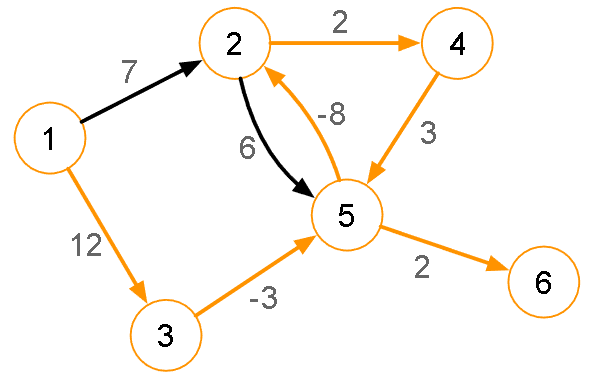

[Projeto e Análise de Algoritmos](../../index.md) · [Menor caminho em Grafos](../index.md)

<!-- wiki:original:inicio -->

# Caminho mais barato em grafos 

Um grafo (orientado ou não) é ponderado se cada aresta estiver associada à um valor (pode ser custo, peso, capacidade, etc).

**Problema:** dado dois vértices $v_{i}$ e $v_{j}$ em um grafo, encontre o caminho $p$ com o custo mínimo que comea-ça em $v_{i}$ e termina em $v_{j}$. (O custo é a soma das arestas e o custo mínimo é o menor valor possível de custo de um caminho de $v_{i}$ a $v_{j}$).

A distância entre $v_{i}$ e $v_{j}$ é definida pelo comprimento do caminho mais barato. Essa distância pode ser negativa se existirem arstas negativas, se não existir caminho entre dois vértices podemos dizer que a distância é infinita. Ainda, a distância entre os mesmos dois vértices podem ser diferentes caso o grafo seja orientado.

Um **ciclo negativo** é um ciclo cujo custo restante da soma de suas arestas é negativo. Se um grafo possuir ciclos negativos o caminho mais barato entre dois vértices pode não ser simples.

*Figura 37. Exemplo de grafo com ciclo negativo.*

O problema de busca pelo caminho mais barato se torna muito mais simples quando não existem ciclos negativos, já que se $v_{0}$ é um vértice que não possui negativos ao seu alcance, todo caminho $p$ é simples e todo trecho inicial de $p$ entre $v_{0}$ e $v_{k}$ é o caminho mais barato de $v_{0}$ e $v_{k}$.

A árvore encontrada na busca pelo caminho mais barato é chamada de Árvore de caminhos mais barato - CPT (Cheapest Path Tree)

Essa árvore é sub-radicada em $G$:

- Todos os vértices de $G$ estão presentes na $\text{CPT}$;

- Todo caminho na $\text{CPT}$ a partir da raiz é mínimo no grafo $G$.

<!-- wiki:original:fim -->

## Tópicos desta página

1. [Djikstra](djikstra/index.md)
2. [Djikstra “Rápido”](djikstra-rapido/index.md)
3. [Bellman-Ford](bellman-ford/index.md)

## Percurso de estudo

[Trilha: A2](../../../../trilhas/projeto-e-analise-de-algoritmos/a2.md) · [Apresentação e contexto da fonte](../../../../trilhas/projeto-e-analise-de-algoritmos/a2.md#apresentacao-original)

- Anterior: [Caminho mais curto em grafos não-dirigidos/ciclo](../caminho-mais-curto-em-grafos-nao-dirigidos-ciclo/index.md)
- Próximo: [Djikstra](djikstra/index.md)
