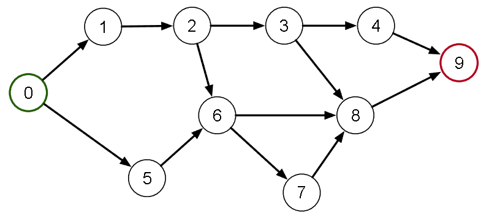
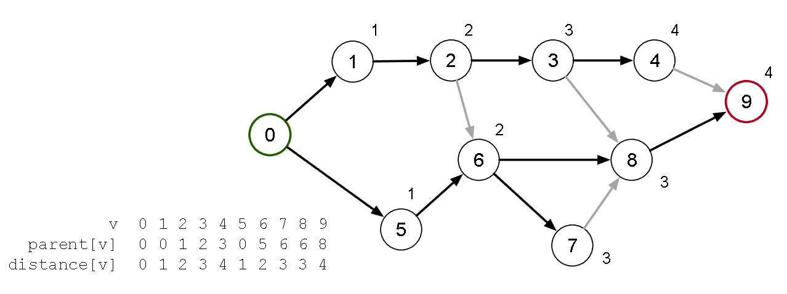

[Projeto e Análise de Algoritmos](../../index.md) · [Menor caminho em Grafos](../index.md)

<!-- wiki:original:inicio -->

# Caminho mais curto em um DAG

**Problema:** Como criar um algoritmo capaz de gerar a SPT de um DAG iniciando na sua única fonte? (Considere que você possui uma possível ordem topológica para o DAG)

Dica: use as propriedades do DAG!

*Figura 35. Exemplo de DAG com uma fonte (verde) e um sorvedouro (vermelho)*

Solução:

- Inicialize cada vértice com a distância infinita para a raiz ($d\left\lbrack v_{i} \right\rbrack = \infty$) e pai indefinido ($\text{parent}\left\lbrack v_{i} \right\rbrack = - 1$)

- Defina a raiz com distância zero ($d\left\lbrack v_{1} \right\rbrack = 0$)

- Percorra os vértices seguindo a ordem topológica

  - Avalie para cada vértice adjacente se $d\left\lbrack v_{i} \right\rbrack + 1 \leq d\left\lbrack v_{j} \right\rbrack$

    - se for, atualiza $d\left\lbrack v_{j} \right\rbrack$ no vértice adjacente com a menor distância e define o novo pai do vértice adjacente.

Como seria a execução desse algoritmo para o grafo de exemplo?

*Figura 36. Exemplo do algoritmo para o grafo dado anteriormente.*

Esse algoritmo funciona pois o vetor `parent` define uma árvore radicada $T$ com raiz em $v_{0}$ e, para toda aresta $e = \left( v_{i},v_{j} \right)$, se $v_{i}$ foi processado então $e$ já foi avaliada. Por fim, ao término de execução $T$ é uma árvore radicada de um grafo induzido $H$, induzido de $G$, contendo os vértices acessíveis a partir de $v_{0}$, toda aresta de $H$ foi avaliada e $T$ é uma árvore geradora de $H$.

**Nota:** a implementação disso está nos Exercises

<!-- wiki:original:fim -->

## Percurso de estudo

[Trilha: A2](../../../../trilhas/projeto-e-analise-de-algoritmos/a2.md) · [Apresentação e contexto da fonte](../../../../trilhas/projeto-e-analise-de-algoritmos/a2.md#apresentacao-original)

- Anterior: [Menor caminho em Grafos](../index.md)
- Próximo: [Caminho mais curto em grafos não-dirigidos/ciclo](../caminho-mais-curto-em-grafos-nao-dirigidos-ciclo/index.md)
