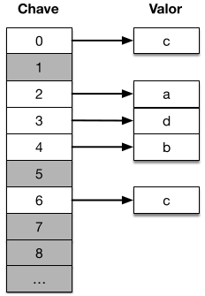
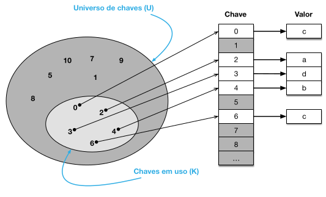

[Projeto e Análise de Algoritmos](../index.md)

<!-- wiki:original:inicio -->

# Tabela Hash

------------------------------------------------------------------------

Nós a utilizamos para armazenar e pesquisar tuplas *\<chave, valor\>*. São comumente chamadas de **dicionários**, porém, podemos classificar assim:

- **Dicionários**: Maneira genérica de mapear *chaves* e *valores*

- **Hash Tables**: Implementação de um dicionário por meio de uma função de **hash**

*Figura 6. Exemplificação do algoritmo de tabela hash*

Nós queremos criar funções $\Theta(1)$ para executar funções de **inserção, busca** e **remoção**. Todas as chaves contidas na tabela são **únicas**, já que elas identificam os valores unicamente.

*Figura 7. Estruturação da Hash Table*

- **Universo de Chaves ($U$)**: Conjunto de chaves possíveis

- **Chaves em Uso($K$)**: Conjunto de chaves utilizadas

Vamos idealizar um problema para motivar os nossos objetivos.

<!-- wiki:original:fim -->

## Tópicos desta página

1. [Desafio](desafio/index.md)
2. [Definição](definicao/index.md)
3. [Soluções para colisão](solucoes-para-colisao/index.md)

## Percurso de estudo

[Trilha: A1](../../../trilhas/projeto-e-analise-de-algoritmos/a1.md) · [Apresentação e contexto da fonte](../../../trilhas/projeto-e-analise-de-algoritmos/a1.md#apresentacao-original)

- Anterior: [Árvores Binárias de Busca](../algoritmos-de-busca/arvores-binarias-de-busca/index.md)
- Próximo: [Desafio](desafio/index.md)
