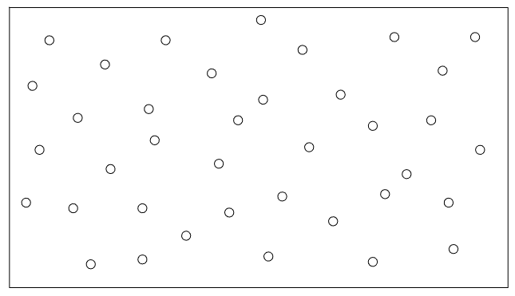
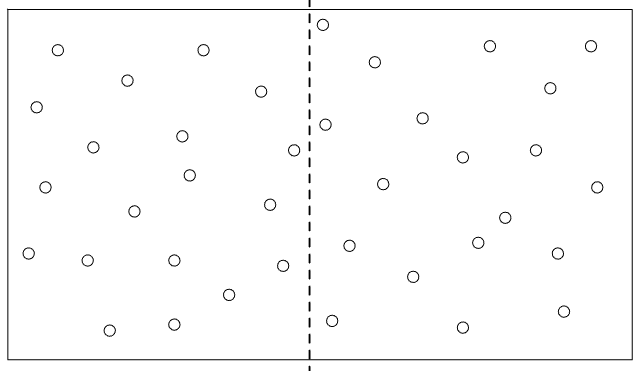
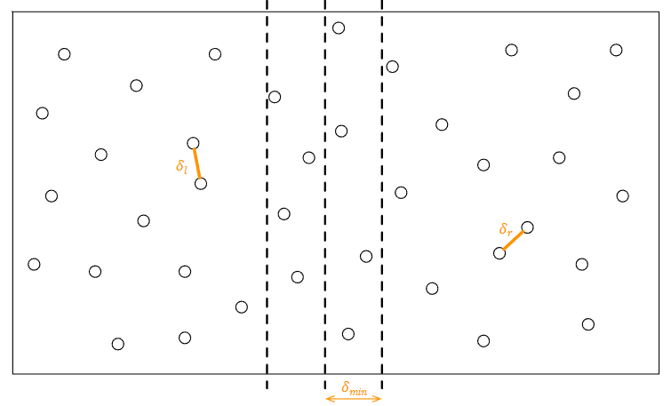

[Projeto e Análise de Algoritmos](../../index.md) · [Técnicas de Projeto](../index.md)

<!-- wiki:original:inicio -->
<a id="secao-5"></a>

# Dividir e Conquistar

O nome já diz muito, e esse paradigma é dividido em três etapas:


- Dividir o problema em um conjunto de sub-problemas menores.

- Resolver cada sub-problema recursivamente.

- Combinar os resultados de cada sub-problema gerando a solução.

Figura 6: Exemplificação do paradigma Dividir e Conquistar.

<a id="secao-6"></a>

## O problema de contagem de inversões 

Dado um problema com $n$ números, calcule o número de inversões necessário para torná-la ordenada.

**Exemplo**

Considere a sequência `A = [3,7,2,9,5]`

O número de inversões é 4: `(7,2),(3,2),(9,5),(7,5)`

A solução por força bruta seria verificar todos os pares, exigindo $\Theta(n^{2})$.

A solução baseada em dividir e conquistar deverá definir estratégias para resolver cada sub-problema do número de inversões, e depois juntar, claro. Podemos dividir a sequência em dois grupos com aproximadamente metade (O primeiro array até $\frac{n}{2}$, o segundo de $\frac{n}{2} + 1$ até $n$). Essa operação é constante, portanto $O(1)$.

A estratégia de resolução deve contar o número de inversões de cada grupo:

**Exemplo**


*Figura 7. Exemplo do problema da contagem de inversões*

Esse resultado pode ser obtido executando o algoritmo recursivamente ($\sim T\left( \frac{n}{2} \right)$). Claro que, por fim, teremos que contar as inversões da junção das duas listas:


Totalizando, assim, 18 inversões.

Ok, a ideia está concisa, mas como fazer essa junção? Se ordenarmos cada segmento, e “juntarmos” direto, conseguiríamos fazer isso de forma fácil. Voltemos ao exemplo após ordenar:


Para a contagem de inversões para a junção, considere a sequências à esquerda de $L$ e à direita de $R$ e defina $i = 0$.

1.  **para** $a_{j}$ **de** $R$:

    1.  **incremente** $i$ **até** $L\lbrack i\rbrack > a_{j}$

    2.  $\text{inv}_{\text{aj}}$ $= \vert L\vert  - i$.

Com $\text{inv}_{\text{aj}}$ sendo a quantidade de inversões do elemento $a_{j}$ de $R$.

Para explicar, considere o exemplo da imagem anterior e relembre um pouco do algoritmo de ordenação MergeSort. Dado que as listas menores já estão ordenadas, se colocarmos um ponteiro no início de cada lista, digamos `l` e `r`, então basta verificar se $L\lbrack l\rbrack \leq R\lbrack r\rbrack$, e incrementarmos $l$(ou $r$, dependendo da comparação).

Vamos continuar o exemplo (à princípio, pense que apenas juntamos as duas listas):

- Para `l = 0` e `r = 0`, temos $1 \leq 3$, que é verdade. Incrementamos o `l`.

- Para `l = 1` e `r = 0`, temos $2 \leq 3$, que ainda é verdade. Incrementamos o `l`.

- Para `l = 2` e `r = 0`, temos $4 \leq 3$, que é mentira. Então, podemos aplicar o raciocínio: sabendo que todos os elementos após o $4$, como estão ordenados, são maiores ou iguais a $4$ e, portanto, também teriam que ser considerados como maiores do que 3, então do ínidice $l$ atual até $\vert L\vert$, uma inversão precisaria ser feita, se concatenássemos as duas listas. Logo, temos $\vert L\vert  - l$ trocas a serem feitas a partir de $L\lbrack l\rbrack$. Isso explica o algoritmo para a contagem de inversões para a junção.

Agora que resolvemos esse problema, podemos desenhar o algoritmo final:

1.  **CountInversions** $(A):$

    1.  **se** $\text{len(A) } = 1:$

        1.  **retorne** $0$

    2.  **divida a lista em** $L$ e $R$

    3.  $i_{l} = \text{ CountInversions}(L)$

    4.  $i_{r} = \text{ CountInversions}(R)$

    5.  $L = \text{ Sort}(L)$

    6.  $R = \text{ Sort(R)}$

    7.  $i = \text{ Combine (L, R)}$

    8.  **retorne** $i_{l} + i_{r} + i$

Avaliando a complexidade desse algoritmo, temos:

$$T(n) = 2T\left( \frac{n}{2} \right) + O\left( n\log(n) \right) = O\left( n\left( \log(n) \right)^{2} \right)$$

O $O\left( n\log(n) \right)$ vem da ordenação das duas listas, e o $2T\left( \frac{n}{2} \right)$ das duas listas que separamos. Os métodos de complexidade aprendidos na A1 nos levam a uma solução simples de $O\left( {n\left( \log(n) \right)}^{2} \right)$, já que sabemos que essa divisão pela metade traz um peso de $\log(n)$.

Seria possível trazer uma otimização ainda maior? Sim, se eliminassemos a etapa de ordenação explícita. Podemos fazer isso se, no algoritmo de contagem de inversão, além de contar, invertessemos e realizassemos o merge, trazendo o array ordenado direto.

Novo algoritmo:

1.  **CountInversions** $(A):$

    1.  **se** $\text{len(A) } = 1:$

        1.  **retorne** $0,A$

    2.  **divida a lista em** $L$ e $R$

    3.  $i_{l},L = \text{ CountInversions}(L)$

    4.  $i_{r},R = \text{ CountInversions}(R)$

    5.  $i = \text{ Combine (L, R)}$

    6.  $A = \text{ Merge}(L,R)$

    7.  **retorne** $\left( i_{l} + i_{r} + i \right),A$

Aqui, nós nos aproveitamos da recursão para fazer a ordenação, em vez de fazer isso por outro algoritmo. Dado que a recursão vai até quando só tivermos um elemento, e que sempre fazemos um merge, a lista está garantidamente sempre ordenada. Isso permite a execução do Combine sem problemas.

A função Combine é $O(n)$, já que apenas conta a quantidade de inversões que precisaríamos. A função Merge também é $O(n)$, já que apenas junta as duas listas. Portanto, temos:

$$T(n) = 2T\left( \frac{n}{2} \right) + O(n) = n\log(n)$$

**Implementação em python**

Para essa implementação, vamos relembrar basicamente a função MergeSort, só que contando a quantidade de inversões. Ainda, vamos juntar as funções CountInversions e a Merge numa mesma.

``` py
def combine_merge(v, start_a, start_b, end_b):
    r = [0] * (end_b - start_a)
    a_idx = start_a
    b_idx = start_b
    r_idx = 0
    num_inv = 0                         #adicionado

    while a_idx < start_b and b_idx < end_b:
        if v[a_idx] <= v[b_idx]:
            r[r_idx] = v[a_idx]
            a_idx += 1
        else:
            num_inv += start_b - a_idx  #adicionado (explicado anteriormente)
            r[r_idx] = v[b_idx]
            b_idx += 1
        r_idx += 1

    while a_idx < start_b:
        r[r_idx] = v[a_idx]
        a_idx += 1
        r_idx += 1

    while b_idx < end_b:
        r[r_idx] = v[b_idx]
        b_idx += 1
        r_idx += 1

    for i in range(len(r)):
        v[start_a + i] = r[i]

    return num_inv                      #adicionado

def count_inversions(v, start_idx, end_idx):
    if (end_idx - start_idx) > 1:
        mid_idx = (start_idx + end_idx) // 2
        il = count_inversions(v, start_idx, mid_idx)      #essas linhas mudaram 
        ir = count_inversions(v, mid_idx, end_idx)        #apenas a igualdade

        i = combine_merge(v, start_idx, mid_idx, end_idx) #antes não tinha
      return il + ir + i                #adicionado
    else:
      return 0
```

Todo o código (a menos de linhas comentadas) foi tirado da versão original do MergeSort. Como dito, fizemos o MergeSort contando a quantidade de inversões. :)

<a id="secao-7"></a>

## O problema de pares mais próximos

Dado uma sequência com n pontos em um plano, encontre o par com a menor distância euclidiana.



A primeira solução que vem a cabeça é simplesmente testar cada par com cada outro par, trazendo uma complexidade de $O\left( n^{2} \right)$

Como desenvolver uma solução melhor com o método que aprendemos?

Figura 10: Exemplificação do problema de pares mais próximos

Podemos dividir o plano de forma que cada lado tenha aproximadamente o mesmo número de pontos (ordenando pelo eixo x).

Em seguida, resolva cada lado encontrando o par mais próximo recursivamente.

Figura 11: Exemplificação da solução do problema de pares mais próximos



Com o plano dividido, combine os resultados comparando O par mais próximo no lado direito, o par mais próximo do lado esquerdo, e o par mais próximo em cada lado. A última comparação parece exigir $\Theta(n^{2})$, não parece muito bom.

Se pensarmos apenas na comparação da divisão dos planos, sejam $\delta_{l}$ e $\delta_{r}$ os pares com menor distância nos lados esquerdo e direito, respectivamente.



*Figura 11. Exemplo da distância de comparação.*

Como estamos procurando o par mais próximo, seja $\delta_{\text{min }} \leq \min(\delta_{l},\delta_{r})$ (sabemos que $\delta_{\text{min}}$ está restrito a, no máximo, essa distância).

Ideia: procurar somente os pontos que estejam no máximo à $\delta_{\min}$ da divisória, ordenando os pontos na faixa $2\delta_{\min}$ pela posição o eixo y.

Qual seria a complexidade desse algoritmo?

Bom, não seria $O\left( n^{2} \right)$, pois a distância em cada lado é no mínimo $\delta_{\min}$.

<a id="secao-8"></a>

## como faz isso cara como é 11 7, 5 sla

<a id="secao-9"></a>

## Implementação em Python

<!-- wiki:original:fim -->

## Percurso de estudo

[Trilha: A2](../../../../trilhas/projeto-e-analise-de-algoritmos/a2.md) · [Apresentação e contexto da fonte](../../../../trilhas/projeto-e-analise-de-algoritmos/a2.md#apresentacao-original)

- Anterior: [Método guloso (Greedy)](../metodo-guloso-greedy/index.md)
- Próximo: [Programação Dinâmica](../programacao-dinamica/index.md)
