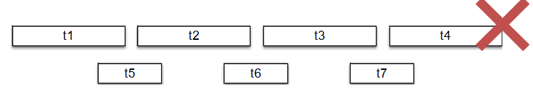
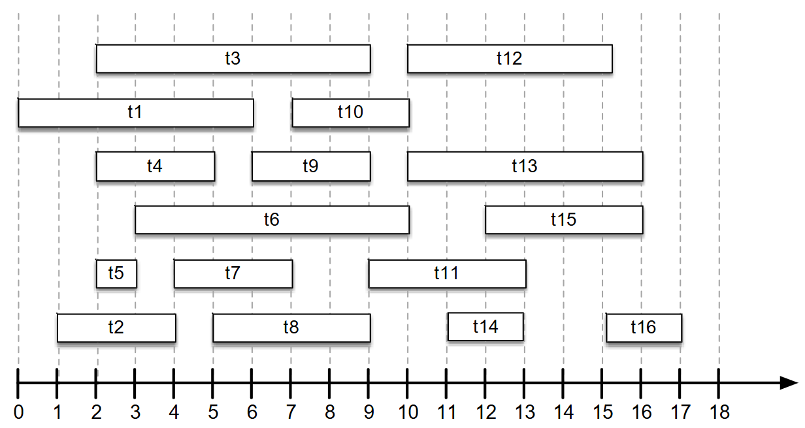

[Projeto e Análise de Algoritmos](../../index.md) · [Técnicas de Projeto](../index.md)

<!-- wiki:original:inicio -->
<a id="secao-2"></a>

# Método guloso (Greedy)

O método guloso é uma famoso paradigma utilizado para projetos de algoritmo, onde a estratégia consiste em escolher a cada iteração a opção com maior valor, e avaliar se deve ser adicionada ao resultado final.

Seguindo essa abordagem, as opções precisam ser ordenadas pro algum critério. Costuma ser simples e eficiente, porém nem todo projeto pode ser resolvido através dessa abordagem.

<a id="secao-3"></a>

## O problema do agendamento de tarefas

Dado o conjunto de tarefas $T = \left\{ t_{1},t_{2},\ldots,t_{n} \right\}$ com $n$ elementos, cada uma com tempo de ínicio

``` start
[tk]
```

, e um tempo de término

``` end
[tk]
```

, encontre o maior subconjunto de tarefas que pode ser alocado sem sobreposição temporal.


*Figura 1. Exemplo do problema de agendamento*

Vamos projetar a solução!

Perguntas:

1.  Quais serão as opções a serem avaliadas a cada iteração?

    - Conjunto de tarefas que ainda não foi alocada ou descartada.

2.  Qual critério iremos utilizar para ordenar as opções?

    - Tempo de ínicio?

    - Menor duração?

    - Menor número de projetos?

    - Tempo de término?

Vamos analisar cada critério tentando construir ao menos um cenário que demonstre que o critério gera um resultado não-ótimo.

Que tal se colocarmos o critério de seleção como o tempo de início do agendamento?


*Figura 2. Contra-exemplo para uma possível solução do problema de agendamento*

Isso não daria certo, pois nesse caso, por exemplo, o $t_{5}$ seria escolhido, enquanto a melhor escolha seria pegar as 4 primeiras tarefas.

E se escolhessemos pela menor duração?



*Figura 3. Contra-exemplo para uma possível solução do problema de agendamento*

Isso também daria errado, já que escolheríamos $t_{5},t_{6}\text{  e  }t_{7}$ enquanto, novamente, a melhor escolha seriam os 4 primeiros.

Nada funcionou… Mas e se nosso critério fosse o tempo do término?

Ideia geral:

1.  **ordene** $T$ (pelo tempo de término)

2.  $T_{a}\lbrack 1,\ldots,n\rbrack = 0$

3.  **Insira a primeira tarefa da lista** $t_{0}$ **em** $T_{a}$

4.  $t_{\text{prev }} = t_{0}$

5.  **para** $t_{k}$ **em** $T$:

    1.  **se** $\text{start}\left\lbrack t_{k} \right\rbrack \geq \text{ end}\left\lbrack t_{\text{prev}} \right\rbrack:$

        1.  **adicione** $t_{k}$ **em** $T_{a}$

        2.  $t_{\text{prev }} = t_{k}$

6.  **retorne** $T_{a}$.

Essa ideia não é muito difícil. Como a lista é ordenada pelo horário de saída, então o primeiro elemento a ser adicionado é simplesmente o primeiro elemento. Note que, como o objetivo é apenas a quantidade máxima de tarefas, e não o tempo máximo que podemos otimizar para todas as tarefas que temos, então pegar o menor término **desde o início** é o que realmente faz o algoritmo funcionar (por exemplo, se tivéssemos os horários `[(5,10),(5,12)]`, pegar o menor tempo de saída nos ajudaria no caso de termos outra tarefa, como `(11,14)`).

Após selecionarmos a primeira tarefa da lista, basta compararmos os tempos de entrada das próximas tarefas, já que, pelo mesmo raciocínio do porque escolher a menor saída, se a próxima tarefa não colidir com a saída passada, então podemos pegar nossa nova tarefa e atulizar com o tempo de saída da nova tarefa atual (como a lista está ordenada pelo tempo de fim, a nova tarefa a ser pega garantiria que seria a melhor tarefa, já que seria a primeira que se encaixa com o tempo de finalização da última tarefa selecionada e a mais curta já que estamos olhando por ordenação).

Nosso pseudocódigo usa apenas um for sem nada demais dentro dele, mas precisamos ordenar a lista antes. Isso nos traz uma complexidade de $\Theta(n\log(n))$.




*Figura 4. Solução para o problema de tarefas usando o algoritmo proposto*

**Por que essa solução é ótima?**

**Definição**

Escolha gulosa

Uma solução ótima global pode ser atingida realizando uma sequência de escolhas locais ótimas (gulosas).

- A escolha local não considera o resultado das escolhas posteriores, e produz um sub-problema contendo um número menor de elementos.

- A definição do critério de escolha nos auxilia à organizar os elementos de forma que o algortimo seja eficiente.

**Definição**

Sub-estrutura ótima

Ocorre quando uma solução ótima de um problema apresenta dentro dela soluções ótimas para sub-problemas.

**Definição**

Swap argument (Argumento de troca)

Considere que temos uma solução ótima $S$, e a solução gulosa $G$. Então é possível substituir iterativamente os elementos de $S$ por elementos de $G$ sem que a solução deixe de ser viável e ótima, provando assim que $G$ é, no mínimo, tão boa quanto $S$.

Vamos usar o que aprendemos então:

Seja $T_{a} = \left\{ g_{1},g_{2},\ldots,g_{k} \right\}$ o conjunto de $k$ tarefas selecionadas pelo nosso algoritmo guloso, já ordenadas pelo tempo de término (como no pseudocódigo). Seja $S = \left\{ s_{1},s_{2},\ldots,s_{m} \right\}$ uma *solução ótima* qualquer, com $m$ tarefas, também ordenadas por tempo de término.

Nosso objetivo é provar que $T_{a}$ é ótima, ou seja, que $k = m$.

Queremos primeiro provar que a primeira escolha gulosa, $g_{1}$, pode fazer parte de *alguma* solução ótima.

1.  $g_{1}$ é a tarefa escolhida por nosso algoritmo, então ela é a tarefa em *todo* o conjunto $T$ com o *menor tempo de término*.

2.  $s_{1}$ é a primeira tarefa da solução ótima $S$. Ela tem o menor tempo de término *dentro de $S$*.

Por definição, como $g_{1}$ tem o menor tempo de término de *todas* as tarefas, seu tempo de término deve ser menor ou igual ao de $s_{1}$:

$$\text{ end}\left\lbrack g_{1} \right\rbrack \leq \text{ end}\left\lbrack s_{1} \right\rbrack$$

Agora, vamos comparar $g_{1}$ e $s_{1}$.

1.  *Caso 1:* $g_{1} = s_{1}$. Se a primeira tarefa da solução ótima $S$ é a mesma da solução gulosa $T_{a}$, então $S$ já começa com a escolha gulosa.

2.  *Caso 2:* $g_{1} \neq s_{1}$. Vamos “trocar” $s_{1}$ por $g_{1}$ na solução ótima $S$. Considere uma nova solução $S'$: $S' = \{ g_{1},s_{2},s_{3},\ldots,s_{m}\}$ Precisamos verificar se $S'$ ainda é uma solução viável (sem sobreposições).

    - Como $S$ era uma solução viável, todas as suas tarefas eram compatíveis. Sabemos que $s_{2}$ devia começar após $s_{1}$ terminar: $\text{start}\left\lbrack s_{2} \right\rbrack \geq \text{ end}\left\lbrack s_{1} \right\rbrack$.

    - Mas, como vimos na Etapa 1, $\text{end}\left\lbrack g_{1} \right\rbrack \leq \text{ end}\left\lbrack s_{1} \right\rbrack$.

    - Combinando os fatos, temos que $\text{start}\left\lbrack s_{2} \right\rbrack \geq \text{ end}\left\lbrack g_{1} \right\rbrack$.

    - Isso significa que $g_{1}$ não se sobrepõe a $s_{2}$, e o resto das tarefas ($s_{3},\ldots$) também não, pois já eram compatíveis com $s_{2}$.

A nova solução $S'$ é, portanto, viável. O mais importante é que $S'$ tem $m$ tarefas, o *mesmo tamanho* da solução ótima $S$. Isso significa que $S'$ *também é uma solução ótima*.

Concluímos que *sempre* existe uma solução ótima (seja $S$ ou $S'$) que começa com a primeira escolha gulosa $g_{1}$. Podemos repetir esse processo indutivamente. Em cada passo $i$, trocamos $s_{i}$ por $g_{i}$, transformando a solução ótima $S$ na solução gulosa $T_{a}$, sem nunca diminuir o número de tarefas, usando sub-estruturas ótimas. Isso só é possível se as duas soluções tiverem o mesmo tamanho desde o início. Portanto, $k = m$.

Logo, a solução gulosa $T_{a}$ é, de fato, uma solução ótima.

**Implementação em Python:**

``` py
def scheduling_problem(tasks):  
    if len(tasks) == 0:                               #caso de contorno
        return 0

    sorted_by_end = sorted(tasks, key= lambda x:x[1]) #ordena pelo término
    choosed_tasks = []
    choosed_tasks.append(sorted_by_end[0]) 
    t_prev = sorted_by_end[0]

    for task in sorted_by_end[1:]:                    #começa depois da primeira
        if task[0] >= t_prev[1]:                      #tempo maior que o de saída
            choosed_tasks.append(task)
            t_prev = task
    return choosed_tasks, len(choosed_tasks)          #retorna lista, quantidade
```

<a id="secao-4"></a>

## O problema da mochila fracionária

Dado um conjunto de itens ${\mathbb{I}} = \left\{ 1,2,3,\ldots,n \right\}$ em que cada item $i \in {\mathbb{I}}$ tem um peso $w_{i}$ e um valor $v_{i}$, e uma mochila com capacidade de peso $W$, encontre o subconjunto $S \subseteq {\mathbb{I}}$ tal que $\sum_{i \in S}^{\vert S\vert }\alpha_{i}w_{i} \leq W$ e $\sum_{i \in S}^{\vert S\vert }\alpha_{i}v_{i}$ seja máximo, considerando que $0 < \alpha_{k} \leq 1$.


*Figura 5. Tabela de exemplo para o exemplo da mochila*

**Exemplo**

- W = 9

  - A escolha $\left\{ 1,2,3 \right\}$ tem peso 8, valor 12 e cabe na mochila;

  - A escolha $\left\{ 3,5 \right\}$ tem peso 11, valor 14 e **não** cabe na mochila

  - A escolha $\left\{ 3_{50\%},5_{100\%} \right\}$ tem peso 9, valor 11 e cabe na mochila

  - A escolha $\left\{ 1_{100\%},3_{75\%},4_{100\%} \right\}$ tem peso 9, valor 16.5 e cabe na mochila

Seria possível criar um algoritmo capaz de encontrar uma solução ótima para esse problema?

- Pergunta 1: quais são as opções a serem avaliadas à cada iteração?

  - Itens (ou fragmentos de itens) que ainda não foram adicionados ou descartados.

- Pergunta 2: Qual critério iremos utilizar para ordenar as opções?

  - Menor peso?

  - Menor valor?

  - Maior razão peso/valor?

Essa ideia de razão parece fazer sentido, já que podemos separar e pegar a proporção que quisermos. Daí vem a ideia do algoritmo:

1.  **Mochila** $$(I,v,w,n,W):$$

    1.  **ordene** $I$ (pela razão valor/peso)

    2.  $C,i = W,1$

    3.  $M\lbrack 1,\ldots,n\rbrack = 0$

    4.  **enquanto** $i \leq n\text{  e  }C \geq w_{i}$:

        1.  $M\lbrack i\rbrack = 1$

        2.  $C = C - w_{i}$

        3.  $i + = 1$

    5.  **se** $i \leq n:$

        1.  $M\lbrack i\rbrack = \frac{C}{w_{i}}$

    - **retorne** $M$

Onde $I$ é o conjunto de itens, $v$ o vetor de valores de cada item, $w$ o vetor de pesos de cada item, $n$ a quantidade de itens e $W$ é a capacidade máxima da mochila.

Analisando brevemente, ordenamos **descrescentemente** o vetor de itens $\mathbb{I}$, e declaramos a variável $C$, de capacidade, e $i$, de índice. Criamos o vetor de zeros $M$ (de tamanho $n$), que é o vetor de porcentagem, referente a cada item. Note que como estamos ordenando pela proporção de valor por peso decrescentemente, pegar o primeiro item significa pegar o que item que mais vale a pena. Logo, o while serve para, enquanto couber a capacidade, pegara maior quantidade possível de valores. Quando o while quebra (no índice $i$), o algoritmo verifica se não chegou ao final, e, caso não tenha chegado, pega a proporção máxima da capacidade máxima restante sobre o peso, e retorna a lista de pesos ao final.

O mais complexo é a ordenação, que pode ser garantido com $\Theta(n\log(n))$.

**Implementação em Python:**

``` py
def fractional_bag_problem(I, v, w, max_w):
  n = len(I)                            #as três listas têm o mesmo tamanho   
  idx_w_ratio = []
  for i in range(n):
      ratio = v[i]/w[i]
      idx_w_ratio.append((i, w[i], ratio))#lista que armazena o índice, peso e razão
                                        #ordena por razão logo abaixo
  idx_w_ratio = sorted(idx_w_ratio, key = lambda x: x[2], reverse=True)
  capacity, i = max_w, 0
  M = [0] * n

  while i < n and capacity >= idx_w_ratio[i][1]: 
      M[i] = 1                          #faz o while normal 
      capacity -= idx_w_ratio[i][1]
      i += 1
  if i < n:
      M[i] = capacity/idx_w_ratio[i][1]

  itens_choosed = [0] * n               #lista que referencia a cada item a sua 
  for j in range(n):                    #porcentagem escolhida
      if M[j] != 0:
          itens_choosed[idx_w_ratio[j][0]] = M[j]

  return itens_choosed                  #retorna a lista de índices com a %
```

<!-- wiki:original:fim -->

## Percurso de estudo

[Trilha: A2](../../../../trilhas/projeto-e-analise-de-algoritmos/a2.md) · [Apresentação e contexto da fonte](../../../../trilhas/projeto-e-analise-de-algoritmos/a2.md#apresentacao-original)

- Anterior: [Técnicas de Projeto](../index.md)
- Próximo: [Dividir e Conquistar](../dividir-e-conquistar/index.md)
