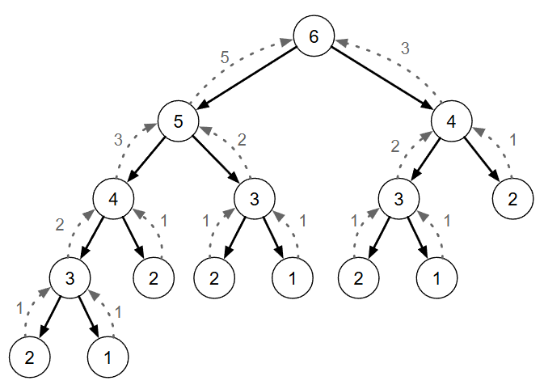
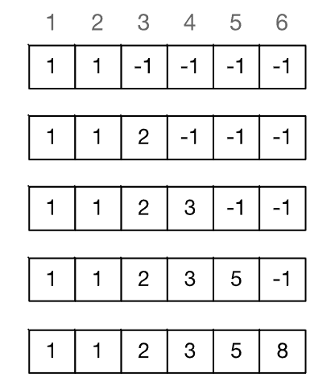
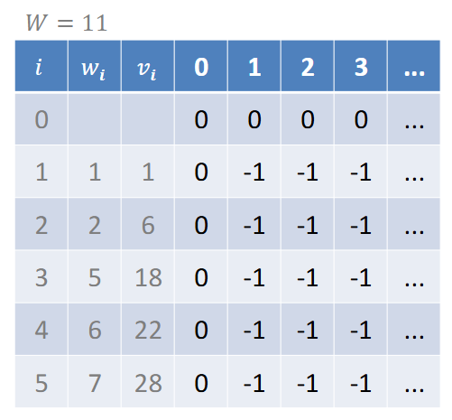
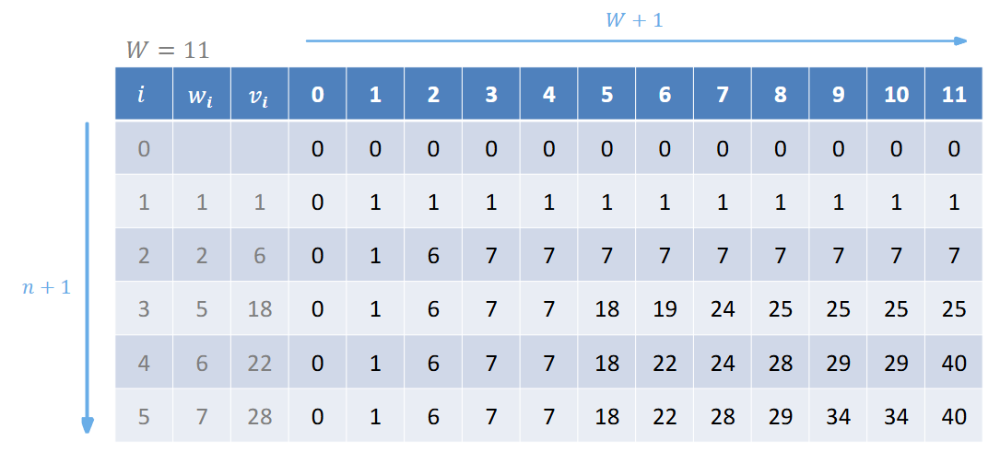
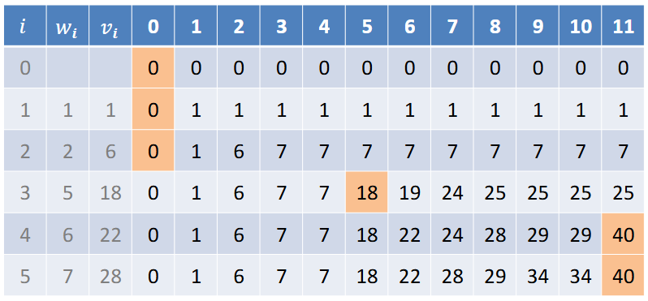

[Projeto e Análise de Algoritmos](../../index.md) · [Técnicas de Projeto](../index.md)

<!-- wiki:original:inicio -->
<a id="secao-10"></a>

# Programação Dinâmica

O paradigma de programação dinâmica consiste em quebrar em sub-problemas menores e resolvê-los de forma independente. Semelhante ao dividir e conquistar, porém com foco em sub-problemas que usam repetição. Nessa técnica, um sub-problema só é resolvido caso não tenha sido resolvido antes (caso contrário é usado o resultado anterior guardado previamente).

<a id="secao-11"></a>

## O problema de Fibonacci



*Figura 12. Exemplo de como seria $\text{fib}(6)$*

Dado um inteiro $n \geq 1$, encontre $F_{n}$. Solução recursiva (e ineficiente):

``` py
def fib(n):
  if n <= 2:
    return 1
  return fib(n-1) + fib(n-2)
```

Note como, para $n$, o tempo de execução é exponencial, e que, grande parte dos problemas são re-computados. Podemos utilizar um cachê para reaproveitar resultados. Vamos fazer isso!

Solução Top-Down (recursiva):

``` py
def Fib(n):
  if n == 0:
      return 0
  if n == 1:
      return 1

  F = [-1] * (n + 1)
  F[0], F[1], F[2] = 0,1,1

  def FibAux(k):
    if F[k] == -1:
      F[k] = FibAux(k - 1) + FibAux(k-2)
    return F[k]

  return FibAux(n)
```



*Figura 13. Exemplo de como fica o cachê para $\text{Fib}(6)$*

A complexidade desse algoritmo é $\Theta(n)$, sabendo que usamos apenas a lista para guardar os valores da lista de Fibonacci.

Solução Bottom-Up (interativa):

``` py
def Fib(n):
  if n <= 2:
      return 1
  F = [0] * n
  F[1], F[2] = 1, 1
  for i in range (3,n + 1,1):
      F[i] = F[i - 1] + F[i - 2]
  return F[n]
```

A complexidade é a mesma da recursiva, desde que continuamos usando apenas um for e usando-a para guardar apenas uma lista.

A abordagem Top-Down é recursiva, somente executa a recursão caso o sub-problema não tenha sido resolvido e inicia no problema maior, enquanto em problemas Bottom-Up a solução é iterativa e resolve os sub-problemas do menor para o maior. Além disso, em geral apresentam a mesma complexidade.

<a id="secao-12"></a>

## O problema da mochila (não fracionária)

Dado um conjunto de itens ${\mathbb{I}} = \left\{ 1,2,3,\ldots,n \right\}$ em que cada item $i \in {\mathbb{I}}$ tem um peso $w_{i}$ e um valor $v_{i}$, e uma mochila com capacidade de peso $W$, encontre o subconjunto $S \subseteq {\mathbb{I}}$ tal que $\sum_{i \in S}^{\vert S\vert }w_{i} \leq W$ e $\sum_{i \in S}^{\vert S\vert }v_{i}$ seja máximo.

A diferença desse problema para o que vimos no paradigma Guloso é que agora, não podemos pegar uma fração do item, apenas ou o pegamos ou não. Isso faz com que, agora, por mais que o item seja o mais valoroso possível na proporção valor/peso, ainda assim possa existir alguma outra combinação que tenha um valor maior.

Exemplo:

W = 11

A escolha $\left\{ 1,2,4 \right\}$ tem peso 9, valor 29 e cabe na mochila.

A escolha $\left\{ 3,5 \right\}$ tem peso 12, valor 46 e não cabe na mochila.


*Figura 14. Tabela auxiliar para exemplo*

Solução(ineficiente): criar um algoritmo de força bruta que testa todas as possibilidades e escolhe a que cabe na mochila com maior valor.

Tentando usar o que estamos aprendendo aqui (programação dinâmica), temos:

- para cada item $i$, considere a possibilidade de adicioná-lo ou não a mochila;

  - se adiconado, o valor é incrementado de $v_{i}$ e a capacidade é reduzida de $w_{i}$

  - avalie qual o melhor valor obtido em cada caso.

Após considerar esse item, restam $n - 1$ itens disponíveis para serem avaliados (encontramos a sub-estrutura ótima).

Ideia geral (sem cachê):

1.  **Mochila** $$(I,v,w,W):$$

    1.  **se** $\vert I\vert  = 0$ **ou** $W = 0$

        1.  **retorne** 0

    2.  **escolha** um item $i \in I$

    3.  **se** $w_{i} > W:$

        1.  **retorne Mochila** $$(I - i,v,w,W):$$

    4.  $\text{value\_using } = v_{i} +$ **Mochila** $\left( I - i,v,w,W - w_{i} \right)$

    5.  $\text{value\_not\_using } =$ **Mochila** $(I - i,v,w,W)$

    6.  **retorna** $\max\left\{ \text{value\_using},\text{ value\_not\_using} \right\}$

Vamos para as soluções definitivas, usando o paradigma que estamos aprendendo. A ideia, como temos que fazer uma comparação a cada item que podemos pegar com e sem ele, é usar uma matriz $I\text{ x }W$, onde o valor de cada célula $M\lbrack i\rbrack\lbrack w\rbrack$ responde a seguinte pergunta: Qual é o valor máximo que consigo obter usando apenas os itens de 1 até $i$, com uma mochila de capacidade máxima $w$ (não $W$).

Solução Top-Down:

1.  **Mochila** $$(n,v,w,W):$$

    1.  **crie** uma matriz $n\text{ x }W$

    2.  **para** $i = 0$ **até** $W$:

        1.  $M\lbrack 0\rbrack\lbrack i\rbrack = 0$

        2.  **para** $j = 1$ **até** $n$:

            1.  $M\lbrack j\rbrack\lbrack 0\rbrack = 0$

            2.  $M\lbrack j\rbrack\lbrack i\rbrack = - 1$

    3.  **retorna MocilhaAux**$(n,v,w,W)$

onde $n$ é o total de itens.

Continuação da solução:



*Figura 15. Exemplo da matriz para o algoritmo Top-Down e valores anteriores.*

1.  **MochilaAux** $$(i,v,w,W):$$

    1.  **se** $M\lbrack i\rbrack\lbrack W\rbrack = - 1$:

        1.  **se** $w_{i} > W$:

            1.  $M\lbrack i\rbrack\lbrack W\rbrack =$ **MochilaAux** $(i - 1,v,w,W)$

        2.  **caso contrário**:

            1.  $\text{using } = v_{i} +$ **MochilaAux** $\left( i - 1,v,w,W - w_{i} \right)$

            2.  $\text{not\_using } =$ **MochilaAux** $(i - 1,v,w,W)$

            3.  $M\lbrack i\rbrack\lbrack W\rbrack = \max\left\{ \text{using,not\_using} \right\}$

    2.  **retorna** $M\lbrack i\rbrack\lbrack W\rbrack$

Onde $i$ é o item que estamos considerando no momento. Essa solução usa a ideia explicada anteriormente, de fazer a verificação entre o melhor caso, adicionando e não adicionando. Vamos agora para a solução Bottom-Up:

1.  **Mochila** $$(n,v,w,W):$$

    1.  **crie** uma matriz $n\text{ x }W$

    2.  **para** $i = 0$ **até** $W$:

        1.  $M\lbrack 0\rbrack\lbrack i\rbrack = 0$

    3.  **para** $j = 1$ **até** $n$:

        1.  $M\lbrack j\rbrack\lbrack 0\rbrack = 0$

    4.  **para** $j = 1$ **até** $n$:

        1.  **para** $i = 1$ **até** $W$:

            1.  **se** $w_{j} > i:$

                1.  $M\lbrack j\rbrack\lbrack i\rbrack = M\lbrack j - 1\rbrack\lbrack i\rbrack$

            2.  **caso contrário**:

                1.  $\text{using } = v_{j} + M\lbrack j - 1\rbrack\left\lbrack i - w_{j} \right\rbrack$

                2.  $\text{not\_using } = M\lbrack j - 1\rbrack\lbrack i\rbrack$

                3.  $M\lbrack j\rbrack\lbrack i\rbrack = \max\left\{ \text{using,not\_using} \right\}$

    5.  **retorna** $M\lbrack n\rbrack\lbrack W\rbrack$

Sabendo que toda a análise e o algoritmo é baseado na criação da matriz, onde dentro da criação de cada item acontecem apenas verificações, então a complexidade $\Theta(nW)$ (o que **não** é polinomial, já que $W$ é um tamanho, não um valor). Vamos ver agora como essa matriz ficaria no final:



*Figura 16. Resultado final da matriz finalizando o primeiro exemplo da mochila fracionária.*

Lembre qual a função da matriz: o índice $i$ (na linha) representa que podemos pegar qualquer dos itens $1$ até $i$, e o peso $W$ (na coluna) é o peso $w$ que foi escolhido, e o número no índice $n\text{ x }w$ é o valor que conseguimos nessa combinação. Portanto, podemos interpretar que, na segunda linha, na coluna de $w = 0$, temos $0$ itens para ser colocados e podemos colocar até um peso $0$, logo, o valor máximo é 0. Ao continuar dessa linha, conseguimos ver que, a partir de quando o peso fica $\geq 1$, conseguimos colocar o único item liberado ($1$), com peso $1$ e valor $1$. Por isso, toda a segunda linha é igual a $1$ a partir do momento que $w \geq 1$.

**Nota:** Seguindo esse raciocínio, você, caro leitor, pode verificar cada valor da tabela. Existe **um** erro na tabela. Convido a você interpretá-la e entendê-lá e encontrar o erro. Se quiser validar que encontrou o erro, mande uma mensagem (Thalis).

Para finalizar, precisamos definir quais itens devem ser adicionados à mochila:



*Figura 17. Exemplo da busca dos itens adicionados (as células pintadas de laranja são as células visitadas pelo algoritmo)*

1.  $S,i,j = \left\{ \right\},W,n$

2.  **enquanto** $j \geq 1$:

    1.  **se** $M\lbrack j\rbrack\lbrack i\rbrack = M\lbrack j - 1\rbrack\left\lbrack i - w_{j} \right\rbrack + v_{j}$

        1.  $S = S \cup \left\{ j \right\}$

        2.  $i = i - w_{j}$

    2.  $j = j - 1$

3.  **retorna** $S$

Vamos entender o código: $j$ itera nas linhas, W nas colunas. Em teoria, a última célula da matriz ($n\text{ x }W$) carrega com certeza o maior valor que satisfaz a condição do problema, e por isso começamos por ela. O que estamos fazendo é verificar se $M\lbrack j\rbrack\lbrack i\rbrack = M\lbrack j - 1\rbrack\left\lbrack i - w_{j} \right\rbrack + v_{j}$, ou seja, se o valor da célula voltando o peso do item atual (supondo que ele foi adicionado) e voltando um item ($j - 1$) somado ao valor de $v_{j}$ é igual ao valor da célula atual, pois, se isso for verdade, significa que adicionamos esse valor ao descobrir o item $j$.

Vamos olhar para o exemplo da tabela:

- Ponto de partida: $M\lbrack 5\rbrack\lbrack 11\rbrack$. Valor $= 40$. O item 5 (peso 7, valor 28) foi usado para obter esse valor de 40?

  - Comparamos o valor atual ($M\lbrack 5\rbrack\lbrack 11\rbrack = 40$) com o valor da célula de cima ($M\lbrack 4\rbrack\lbrack 4\rbrack = 7 + v_{j} = 7 + 28 \neq 40$).

  - Como os valores não são iguais, significa que o item 5 **não** foi incluído. A solução ótima para capacidade 11 já existia sem ele.

  - Então o algoritmo “sobe” para a célula $M\lbrack 4\rbrack\lbrack 11\rbrack$.

- Posição Atual: Célula $M\lbrack 4\rbrack\lbrack 11\rbrack$. Valor $= 40$. O item 4 (peso 6, valor 22) foi usado?

  - Comparamos o valor atual ($M\lbrack 4\rbrack\lbrack 11\rbrack = 40$) com o valor da célula de cima ($M\lbrack 3\rbrack\lbrack 5\rbrack = 18 + v_{j} = 18 + 22 = 40$).

  - Os valores são iguais. Isso significa que o item 4 **foi** incluído!

  - Adicionamos o item 4 ao nosso conjunto de solução $S$.O algoritmo “sobe” para a linha anterior ($i = 3$) e “anda para a esquerda” subtraindo o peso do item 4 da capacidade: $11 - 6 = 5$. O novo ponto de análise é $M\lbrack 3\rbrack\lbrack 5\rbrack$ .

E assim sucessivamente!

**Implementação em Python**

``` py
def bag_problem_bottom_up(n, v, w, W):
  #primeira parte (criar a matriz e inserir os valores)
  M = [[0] * (W + 1) for _ in range(n + 1)]
  for j in range(1, n + 1):
      for i in range(1, W + 1):
          peso_item_j = w[j-1]
          valor_item_j = v[j-1]          
          if peso_item_j > i:
              M[j][i] = M[j - 1][i]
          else:
              not_using = M[j - 1][i]
              using = valor_item_j + M[j - 1][i - peso_item_j]
              M[j][i] = max(using, not_using)

  #segunda parte (identificar os itens selecionados)
  itens_selecionados = []
  valor_maximo = M[n][W]
  j, i = n, W
  while j > 0 and i > 0:
      peso_item_j = w[j-1]
      valor_item_j = v[j-1]
      if peso_item_j <= i and M[j][i] == (M[j- 1][i - peso_item_j] + valor_item_j):
          itens_selecionados.append(j)
          i -= peso_item_j
          j -= 1
  itens_selecionados.reverse()
  return valor_maximo, M, itens_selecionados
```

Convido o caro leitor a implementar a solução Top-Down.

------------------------------------------------------------------------

<!-- wiki:original:fim -->

## Conteúdos relacionados

- [Programação Dinâmica — Aprendizado por Reforço](../../../aprendizado-por-reforco/programacao-dinamica/index.md)

## Percurso de estudo

[Trilha: A2](../../../../trilhas/projeto-e-analise-de-algoritmos/a2.md) · [Apresentação e contexto da fonte](../../../../trilhas/projeto-e-analise-de-algoritmos/a2.md#apresentacao-original)

- Anterior: [Dividir e Conquistar](../dividir-e-conquistar/index.md)
- Próximo: [Grafos](../../grafos-a2/index.md)
