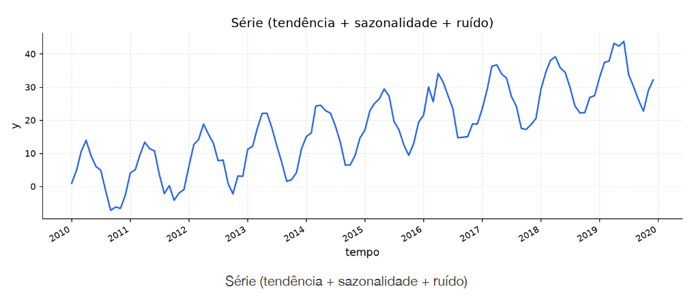

[Séries Temporais](../../index.md) · [Diagnóstico Visual](../index.md)

<!-- wiki:original:inicio -->

# Introdução

Antes de testes formais, ARIMA, ACF, PACF, etc., podemos fazer um diagnóstico visual da série temporal. O objetivo é identificar padrões, tendências, sazonalidades e possíveis anomalias nos dados. Essa análise inicial nos ajuda a formular hipóteses sobre o comportamento da série e a escolher modelos apropriados para previsão. Podemos primeiro pensar na série como $$y_{t} = T_{t} + S_{t} + R_{t}$$

onde $T_{t}$ representa a tendência (nível que a série se move no médio/longo prazo), $S_{t}$ a sazonalidade (padrões que se repetem em intervalos fixos) e $R_{t}$ os resíduos (por definição, o que sobra após fixar $T_{t}$ e $S_{t}$)

**Exemplo**

Vamos analisar a seguinte figura

Visualmente conseguimos identificar cada um dos componentes da série temporal.

**$T$**: No médio/longo prazo, a tendência é um crescimento linear, com inclinação positiva. Mesmo que existam flutuações de subida e descida, é perceptível que a cada a no o valor de $y_{t}$ tende a aumentar. **$S$**: A série mostra uma sazonalidade de subida no inicio de cada ano e descida no final, mostrando um padrão anual claro (mas de forma que a descida sempre se mantém acima do padrão anterior, gerando a tendência positiva citada anteriormente)

<!-- wiki:original:fim -->

## Percurso de estudo

[Trilha: A1](../../../../trilhas/series-temporais/a1.md) · [Apresentação e contexto da fonte](../../../../trilhas/series-temporais/a1.md#apresentacao-original)

- Anterior: [Diagnóstico Visual](../index.md)
- Próximo: [Covariáveis](../covariaveis/index.md)
