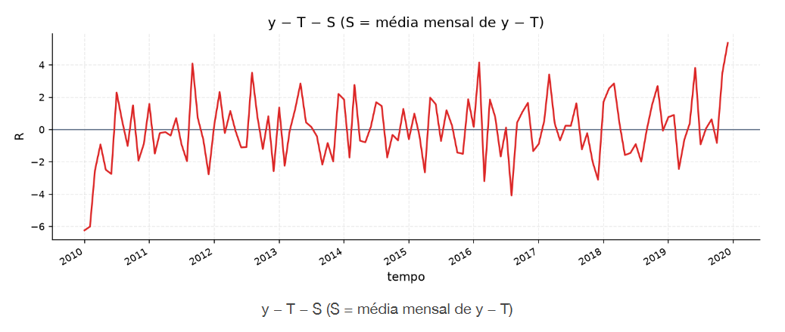

[Séries Temporais](../../index.md) · [Diagnóstico Visual](../index.md)

<!-- wiki:original:inicio -->

# Resíduos

Por definição $R_{t} = y_{t} - \left( T_{t} + S_{t} \right)$, ou seja, o que sobra após extraírmos a tendência e a sazonalidade. Tomemos por exemplo o seguinte gráfico

*Figura 6. Exemplo de resíduos em uma série temporal*

Aqui, estratificamos $T$ que é a média móvel, no entanto, o gráfico ainda contém a estrutura da **sazonalidade**. Podemos, nesse caso, interpretar a sazonalidade como a **média mensal** de $y_{t} - T_{t}$ (detalhes serão melhor compreendidos posteriormente). Removendo essa sazonalidade $S_{t}$, então obtemos um gráfico dos resíduos

*Figura 7. Exemplo de resíduos em uma série temporal*

Essa extração visual é temporária, serve no momento para termos um entendimento do que são resíduos e como eles se comportam. Posteriormente, vamos aprender a extrair $T$ e $S$ de forma formal, utilizando modelos estatísticos

<!-- wiki:original:fim -->

## Percurso de estudo

[Trilha: A1](../../../../trilhas/series-temporais/a1.md) · [Apresentação e contexto da fonte](../../../../trilhas/series-temporais/a1.md#apresentacao-original)

- Anterior: [Sazonalidade](../sazonalidade/index.md)
- Próximo: [Split Temporal](../split-temporal/index.md)
