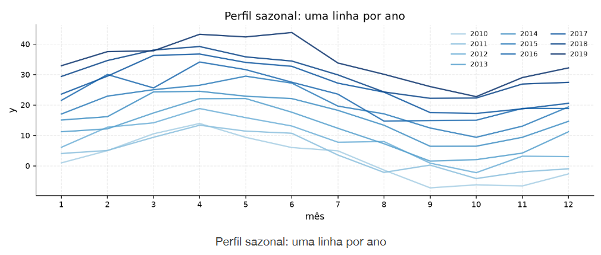

[Séries Temporais](../../index.md) · [Diagnóstico Visual](../index.md)

<!-- wiki:original:inicio -->

# Sazonalidade

Sazonalidade é estrutura que se repete em fases do calendário (mês do ano, dia da semana, hora do dia, …). Distinguir sazonalidade de “subiu uma vez e nunca mais” é parte da descrição. Três gráficos olham a mesma sazonalidade, mas respondem perguntas diferentes.

**Overlay por ano**. Eixo = mês; uma linha por ano. Serve para ver **o ciclo se repetindo**: o formato do ano (pico/vale em quais meses); se o padrão é estável ou muda de ano para ano (linhas parecidas vs. um ano “fora”); a amplitude. Anos mais “altos” no gráfico ainda carregam tendência — o formato relativo é o que importa

*Figura 3. Exemplo de sazonalidade em uma série temporal (overlay por ano)*

**Série sem tendência**. Plotar $y_{t}$ menos a média móvel (12) no calendário real. Serve para ver a **onda anual na seta do tempo**, depois de tirar o nível lento $T_{t}$. Dá para ver se a oscilação volta todo ano (liga a $S_{t}$) e se a amplitude muda ao longo dos anos. Ainda mistura sazonalidade + ruído — não é puro.

*Figura 4. Exemplo de sazonalidade em uma série temporal (série sem tendência)*

**Boxplot por mês**. Resume o nível típico de cada mês, agregando os anos. Serve para o ranking (quais meses são sistematicamente mais altos/baixos), a dispersão dentro do mês (caixa larga = aquele mês varia muito entre anos) e outliers. Não mostra a trajetória no tempo — cada mês aparece uma vez.

*Figura 5. Exemplo de boxplot por mês*

Em uma frase: overlay = “como o ano se parece”; sem tendência = “a onda no tempo”; boxplot = “estatística por mês”

<!-- wiki:original:fim -->

## Percurso de estudo

[Trilha: A1](../../../../trilhas/series-temporais/a1.md) · [Apresentação e contexto da fonte](../../../../trilhas/series-temporais/a1.md#apresentacao-original)

- Anterior: [Tendência](../tendencia/index.md)
- Próximo: [Resíduos](../residuos/index.md)
