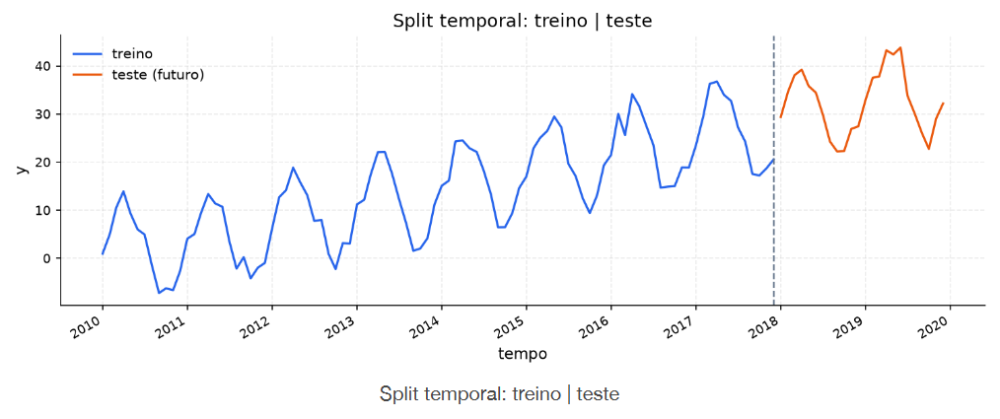

[Séries Temporais](../../index.md) · [Diagnóstico Visual](../index.md)

<!-- wiki:original:inicio -->

# Split Temporal

Comentamos anteriormente sobre, para fazer modelos preditivos das séries temporais, para separar eles em **treino** e **teste**. Sendo mais formal, isso é feito a partir de um **split temporal**, onde, ao invés de embaralhar os dados, pegamos uma parte inicial da série para treino e uma parte final para teste a partir de uma data-fronteira.

*Figura 8. Exemplo de split temporal em uma série temporal*

------------------------------------------------------------------------

<!-- wiki:original:fim -->

## Percurso de estudo

[Trilha: A1](../../../../trilhas/series-temporais/a1.md) · [Apresentação e contexto da fonte](../../../../trilhas/series-temporais/a1.md#apresentacao-original)

- Anterior: [Resíduos](../residuos/index.md)
- Próximo: [Estacionariedade e ACF](../../estacionariedade-e-acf/index.md)
