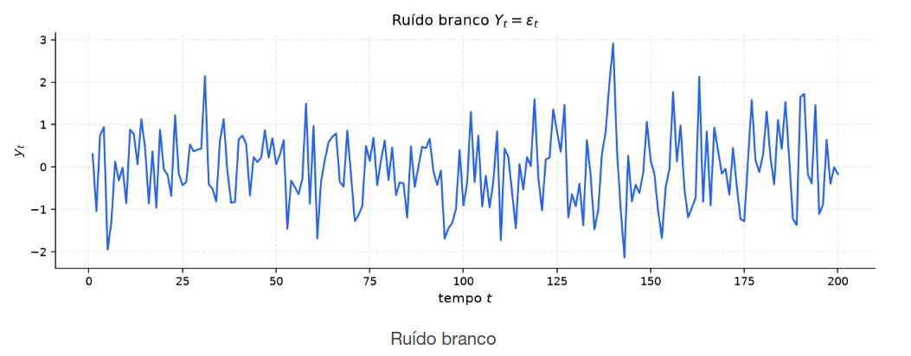
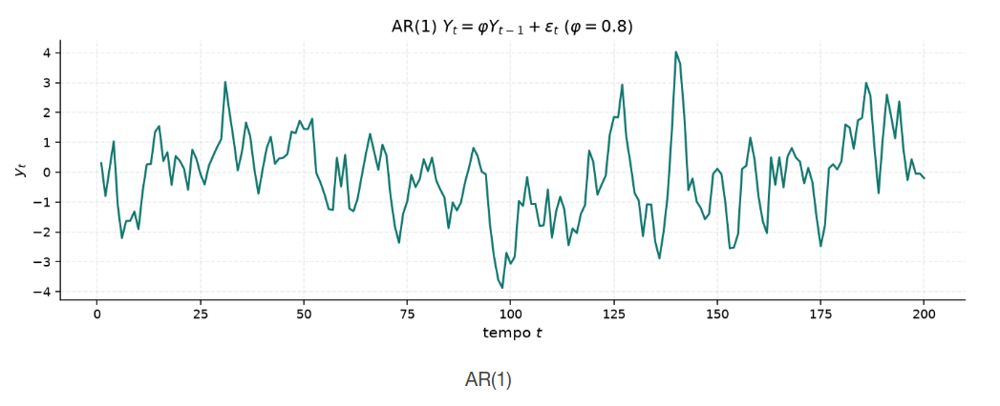
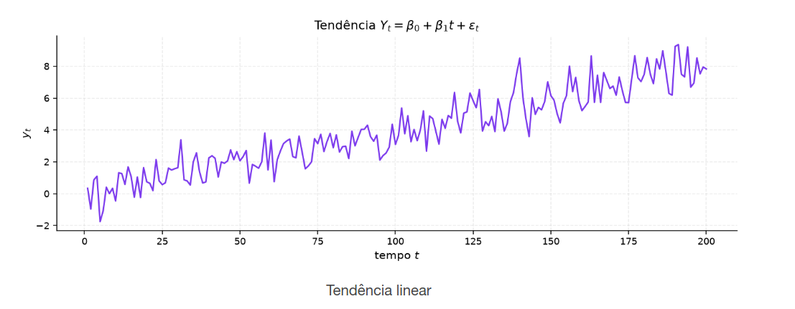

[Séries Temporais](../../index.md) · [Estacionariedade e ACF](../index.md)

<!-- wiki:original:inicio -->

# Exemplos de Série

Esses serão os exemplos que vamos utilizar de forma recorrente

**Exemplo: Ruído Branco**

$$Y_{t} = \varepsilon_{t}$$ Não existe memória, cada instante contém um ruído que não conseguimos traçar a partir dos anteriores

**Exemplo: AR**

$$Y_{t} = \varphi Y_{t - 1} + \varepsilon_{t},\text{\quad\quad}\vert \varphi\vert  < 1$$ Depende diretamente do valor anterior, mas não de valores mais antigos. A memória é curta, mas existe

**Exemplo: Passeio Aleatório**

$$Y_{t} = Y_{t - 1} + \varepsilon_{t}$$ Acumula os ruídos passados, de forma que a memória é longa e o valor atual depende de todos os valores anteriores

**Exemplo: Tendência Linear**

$$Y_{t} = \beta_{0} + \beta_{1}t + \varepsilon_{t}$$ A tendência linear é um caso especial de passeio aleatório, onde o valor atual depende do tempo e de todos os valores anteriores

<!-- wiki:original:fim -->

## Percurso de estudo

[Trilha: A1](../../../../trilhas/series-temporais/a1.md) · [Apresentação e contexto da fonte](../../../../trilhas/series-temporais/a1.md#apresentacao-original)

- Anterior: [Introdução](../introducao/index.md)
- Próximo: [Conceitos](../conceitos/index.md)
