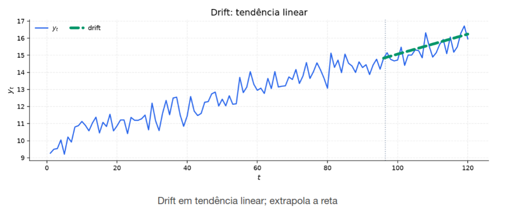

[Séries Temporais](../../../index.md) · [Previsão e Baselines](../../index.md) · [Métodos simples de previsão (baseline)](../index.md)

<!-- wiki:original:inicio -->

# Método do desvio (drift)

*Figura 12. Ilustração do método do desvio*

Extrapola uma tendência linear permitindo que a previsão mude ao longo do tempo a uma taxa constante $C$ $${\hat{Y}}_{T + h\vert T} = Y_{T} + hC\text{\quad\quad}\forall h \geq 1$$

onde a taxa de variação (inclinação do desvio) é estimada pela variação média por período entre a primeira e a última observação da amostra $$C = \frac{Y_{T} - Y_{1}}{T - 1}$$

na intuição geométrica, estamos traçando uma linha reta entre o primeiro e o último ponto da série temporal, e projetando essa linha para frente. Esse método assume um modelo de **Passeio Aleatório com Drift (Tendência)**: $$Y_{t} = C + Y_{t - 1} + \varepsilon_{t},\text{\quad\quad}\varepsilon_{t} \sim \text{ WN}\left( 0,\sigma^{2} \right)$$

<!-- wiki:original:fim -->

## Percurso de estudo

[Trilha: A1](../../../../../trilhas/series-temporais/a1.md) · [Apresentação e contexto da fonte](../../../../../trilhas/series-temporais/a1.md#apresentacao-original)

- Anterior: [Método ingênuo sazonal](../metodo-ingenuo-sazonal/index.md)
- Próximo: [Valores Ajustados V.S Previsões](../../valores-ajustados-v-s-previsoes/index.md)
