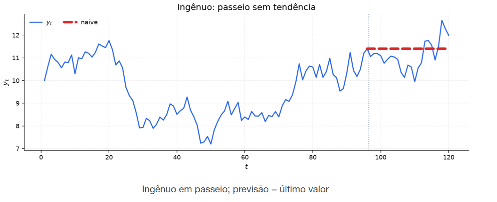

[Séries Temporais](../../../index.md) · [Previsão e Baselines](../../index.md) · [Métodos simples de previsão (baseline)](../index.md)

<!-- wiki:original:inicio -->

# Método ingênuo (Passeio aleatório sem tendência)

*Figura 10. Ilustração do método ingênuo*

A previsão para qualquer horizonte futuro é o **último valor observado** da série $${\hat{Y}}_{T + h\vert T} = Y_{T}\text{\quad\quad}\forall h \geq 1$$

ele assume que o processo segue um **Passeio Aleatório** puro (não-estacionário na variância) $$Y_{t} = Y_{t - 1} + \varepsilon_{t},\text{\quad\quad}\varepsilon_{t} \sim \text{ IID}\left( 0,\sigma^{2} \right)$$

É o caso limite em que a autocorrelação de curto prazo é extremamente alta ($\rho(h) \approx 1$ para $h$ pequeno). O estado atual $Y_{T}$ é a melhor estimativa para a posição futura

O erro de previsão acaba por ser a soma dos ruídos futuros acumulados $$Y_{T + h} - {\hat{Y}}_{T + h\vert T} = Y_{T + h} - Y_{T} = \varepsilon_{T + 1} + \ldots + \varepsilon_{T + h}$$

É fácil ver que o estimador é não-viezado (basta tirar a esperança do erro de previsão). E podemos mostrar que a variância da previsão aumenta linearmente com o horizonte de previsão, pois a variância do erro de previsão é a soma das variâncias dos ruídos futuros

**Teorema: Variância do Erro de Previsão**

$${\mathbb{V}}\left\lbrack Y_{T + h} - {\hat{Y}}_{T + h\vert T} \right\rbrack = h\sigma^{2}\text{\quad\quad}\forall h \geq 1$$ Ou seja, a precisão da previsão diminui linearmente com o horizonte de previsão, pois a variância do erro de previsão aumenta linearmente com o horizonte de previsão

**Demonstração**

$$\begin{aligned} {\mathbb{V}}\left\lbrack Y_{T + h} - {\hat{Y}}_{T + h\vert T} \right\rbrack & = {\mathbb{V}}\left\lbrack \varepsilon_{T + 1} + \ldots + \varepsilon_{T + h} \right\rbrack \\ & = {\mathbb{V}}\left\lbrack \varepsilon_{T + 1} \right\rbrack + \ldots + {\mathbb{V}}\left\lbrack \varepsilon_{T + h} \right\rbrack \\ & = h\sigma^{2} \end{aligned}$$

<!-- wiki:original:fim -->

## Percurso de estudo

[Trilha: A1](../../../../../trilhas/series-temporais/a1.md) · [Apresentação e contexto da fonte](../../../../../trilhas/series-temporais/a1.md#apresentacao-original)

- Anterior: [Método da média](../metodo-da-media/index.md)
- Próximo: [Método ingênuo sazonal](../metodo-ingenuo-sazonal/index.md)
