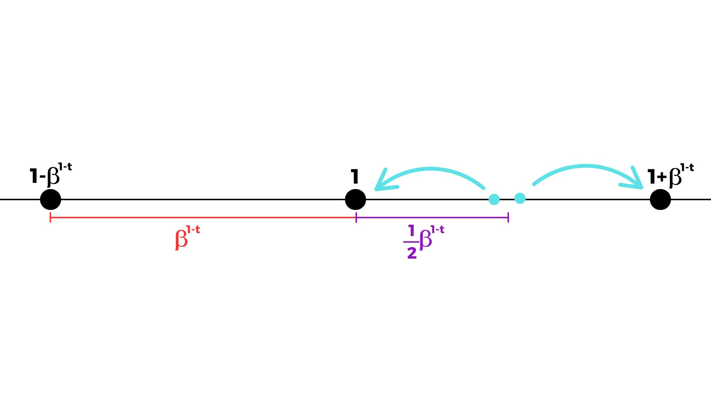

[Álgebra Linear Numérica](index.md)

<!-- wiki:original:inicio -->

# Aritmética de Ponto Flutuante

## Conjunto de Ponto Flutuante

O conjunto de números que um computador pode entender e representar é chamado de **Conjunto de Ponto Flutuante**. O livro nos dá uma definição bem complicada, então vou te dar uma mais simples e, depois, entender a definição do livro:

**Definição: Definição Simples**

Um **Conjunto de Ponto Flutuante** é definido como: $$F = \left\{ \pm 0,d_{1}d_{2.}..d_{t} \ast \beta^{e}/e \in {\mathbb{Z}} \right\}$$ Onde $0,d_{1.}..d_{t}$ é a **mantissa**, $t \in {\mathbb{N}}^{\ast}$ é a **precisão** da mantissa, $\beta \in {\mathbb{N}}(\beta \geq 2)$ é a base, $d_{j}\left( 0 \leq d_{j} < \beta \right)$ são os dígitos da mantissa e $e \in {\mathbb{Z}}$ é o **expoente**. Em computadores, **nós** definimos um intervalo para $t$, $e$ e uma base específica $\beta$

Vamos analisar tudo. Primeiro, definimos tudo, mas o que e por que defini essas coisas?

### Mantissa

É o núcleo de um número, um número nesse conjunto tem apenas uma mantissa, mas uma mantissa pode estar associada a vários números, por exemplo, podemos representar $1$ no sistema decimal como $0,1 \ast 10$ e podemos representar 10 como $0,1 \ast 10^{2}$, isso significa que a mesma mantissa pode representar muitos números. É importante dizer que a mantissa é sempre escrita na base $\beta$, veremos o que isso significa agora

### Base e Precisão

**Definição**

Se temos $x \in {\mathbb{R}}$, escrever $x$ na base $\beta$ significa escolher coeficientes $\ldots,\alpha_{- 1},\alpha_{0},\alpha_{1},\ldots$ com $0 \leq \alpha_{j} < \beta$ e $\alpha_{j}$ são inteiros tais que: $$x = \ldots + \alpha_{2}\beta^{2} + \alpha_{1}\beta^{1} + \alpha_{0}\beta^{0} + \alpha_{- 1}\beta^{- 1} + \alpha_{- 2}\beta^{- 2} + \ldots$$ Então escrevemos $x$ na base $\beta$ como $\ldots\alpha_{2}\alpha_{1}\alpha_{0},\alpha_{- 1}\alpha_{- 2}\ldots_{\beta}$, onde cada $\alpha_{j}$ é um dígito

Essa é uma maneira de representar cada número real, mas o computador é limitado a uma certa quantidade de $\alpha_{j}$, ele não pode armazenar, por exemplo, 1 bilhão de $\alpha_{j}$, é aí que entra a precisão, ela diz ao computador quantos dígitos a mantissa pode representar!

Espere… mas vimos que a mantissa só armazena números após a *”,”*, então como o conjunto representa números maiores que 1? É aí que entra o **expoente**

### Expoente

O expoente indica a ordem do nosso número, por exemplo, com uma mantissa $0,d_{1}d_{2}d_{3}$, podemos representar 4 números diferentes: $0,d_{1}d_{2}d_{3}$, $d_{1},d_{2}d_{3}$, $d_{1}d_{2},d_{3}$, $d_{1}d_{2}d_{3}$, eles têm expoentes $0,1,2$ e $3$, respectivamente. Mas, se eu tenho uma mantissa $0,d_{1.}..d_{t}$, por que multiplicá-la por $\beta^{e}$ move a vírgula por $e$ dígitos? (Só para fazer um paralelo, é exatamente assim que nosso sistema decimal funciona, se você tem $0,1$, multiplicá-lo por 10 dá $1$)

**Teorema**

Se você tem $x$ escrito na base $\beta$, multiplicá-lo por $\beta^{e}$ moverá a vírgula, na notação da base $\beta$, $e$ dígitos para a direita

**Demonstração**

$$x = \ldots + \alpha_{2}\beta^{2} + \alpha_{1}\beta^{1} + \alpha_{0}\beta^{0} + \alpha_{- 1}\beta^{- 1} + \alpha_{- 2}\beta^{- 2} + \ldots$$ $$\Leftrightarrow \beta^{e}x = \left( \ldots + \alpha_{2}\beta^{2} + \alpha_{1}\beta^{1} + \alpha_{0}\beta^{0} + \alpha_{- 1}\beta^{- 1} + \alpha_{- 2}\beta^{- 2} + \ldots \right)\beta^{e}$$ $$\Leftrightarrow \beta^{e}x = \ldots + \alpha_{2}\beta^{2}\beta^{e} + \alpha_{1}\beta^{1}\beta^{e} + \alpha_{0}\beta^{0}\beta^{e} + \alpha_{- 1}\beta^{- 1}\beta^{e} + \alpha_{- 2}\beta^{- 2}\beta^{e} + \ldots$$ $$\Leftrightarrow \beta^{e}x = \ldots + \alpha_{2}\beta^{e + 2} + \alpha_{1}\beta^{e + 1} + \alpha_{0}\beta^{e} + \alpha_{- 1}\beta^{e - 1} + \alpha_{- 2}\beta^{e - 2} + \ldots$$ Observe como todos os $\alpha_{j}$ moveram $e$ dígitos para a esquerda, isso significa que a vírgula move $e$ dígitos para a direita

Vamos analisar um exemplo para entender melhor:

**Exemplo**

Criei uma máquina que representa meus números por um conjunto de ponto flutuante $F$ com base decimal ($\beta = 10$), precisão $3$ e $e \in \lbrack - 5,5\rbrack$, responda estas perguntas:

1.  Qual é o menor número positivo que $F$ pode representar?

    Bem, se $F$ tem precisão 3, minha mantissa é assim: $$0,d_{1}d_{2}{d_{3}}_{\beta}$$ Então, se queremos o mínimo, precisamos tornar $d_{j}$ o menor possível, mas ainda diferente de $0$, isso significa que fazemos o último dígito ($d_{3}$) igual a 1 e o resto igual a $0$, isso significa que a menor mantissa que podemos ter é: $$0,001$$ Mas ainda podemos representar um número maior usando o expoente, o menor expoente que temos é $- 5$, isso significa que o menor número positivo que esse conjunto pode representar é $$0,001 \ast 10^{- 5} = 0,00000001$$

2.  Qual é o maior número positivo que $F$ pode representar?

    Seguindo a mesma lógica, a maior mantissa que podemos ter é: $$0,999$$ Usando o maior expoente possível, o maior número que nosso conjunto pode representar é: $$0,999 \ast 10^{5} = 99900$$

3.  O número -3921 está no conjunto?

    Vamos testar, se o decompusermos: $$- 3921 = - 0,3921 \ast 10^{4}$$ O expoente está no intervalo $\lbrack - 5,5\rbrack$, mas a mantissa tem precisão $4$, isso significa que $- 3921$ **NÃO ESTÁ NO CONJUNTO $F$**

4.  O número 738000000 está no conjunto?

    Decompondo, temos: $738000000 = 0,738 \ast 10^{9}$, como podemos ver, a mantissa tem a precisão desejada, mas o expoente é maior que o intervalo dado, isso significa que 738000000 **NÃO ESTÁ NO CONJUNTO $F$**

Agora que entendemos essa definição de conjunto de ponto flutuante, vamos ver a definição do livro:

**Definição: Definição do Livro**

Sendo $F \subset {\mathbb{R}}$, definimos como: $$F = \left\{ \pm \left( \frac{m}{\beta^{t}} \right)\beta^{e} \right\}$$ Onde $t$, $e$ e $\beta$ significam a mesma coisa com as mesmas restrições da definição anterior

Qual é a diferença e por que o livro define assim? Há apenas uma grande diferença aqui: Por que ele está definindo a **mantissa** como $\frac{m}{\beta^{t}}$? Lembre-se de quando provamos que, se escrevemos $x$ na base $\beta$ e multiplicamos $x$ por $\beta^{e}$, a vírgula move $e$ dígitos para a direita? O mesmo se aplica se $e < 0$, mas a vírgula vai para a esquerda, e por que estou dizendo isso? Porque, o que o livro não nos diz, é que escrevemos $m$ **NA BASE $\beta$**, e essa divisão por $\beta^{t}$ faz com que obtenhamos apenas os primeiros $t$ dígitos do número, significando que obtemos apenas os dígitos que desejamos, SÓ ISSO (Sim, o livro explica isso mal)

## Números não em $F$

Quando tentamos representar um número que não está em $F$, o computador pode fazer 2 coisas:

1.  **Arredondar**: Obtemos $t + 1$ dígitos do número, e verificamos se o $(t + 1)$-ésimo dígito é maior ou igual a $\left\lceil \frac{\beta}{2} \right\rceil$, se for, excluímos o $(t + 1)$-ésimo dígito e somamos 1 ao $t$-ésimo dígito. Se o $(t + 1)$-ésimo dígito for menor que $\left\lceil \frac{\beta}{2} \right\rceil$, então apenas excluímos o $(t + 1)$-ésimo dígito

    **Exemplo**

    Arredonde 10324 sabendo que $F$ tem precisão $4$ e $e \in \lbrack - \infty, + \infty\rbrack$ e $\beta = 10$.

    Convertendo para a notação de mantissa e expoente: $10324 = 0,10324 \ast 10^{5}$, temos 5 dígitos, então vamos ver o $5$-ésimo. $4 \geq \left\lceil \frac{10}{2} \right\rceil \Leftrightarrow 4 \geq 5$? Não, então o número arredondado será $0,1032 \ast 10^{5}$

2.  **Truncar**: Se a mantissa do número passar de $t$ dígitos, removemos todos os dígitos após o $t$-ésimo

Sabendo disso, podemos finalmente entender o que é $\varepsilon_{\text{machine}}$

## Épsilon Máquina

Vamos ver a primeira definição do livro, que é: $$\varepsilon_{\text{machine}} = \frac{1}{2}\beta^{1 - t}$$ Mas o que isso significa? Por que ele definiu assim? Primeiro, $\varepsilon_{\text{machine}}$ é o número que, se fizermos essa operação em $F$, será válida $$1 + \varepsilon_{\text{machine}} > 1$$ Isso significa que, se somarmos 1 com um número menor que $\varepsilon_{\text{machine}}$, mesmo que por uma diferença infinitesimal, o número retornado será arredondado ou truncado para $1$ em $F$. O livro diz que essa definição é a distância entre 2 números representáveis em $F$, mas por que isso?

**Teorema**

A distância entre 2 números representáveis em $F$ é $\beta^{1 - t}$

**Demonstração**

Se temos $x$ escrito na notação da base $\beta$ com precisão $t$, escrevemo-lo como: $$x = 0,d_{1}d_{2.}..{d_{t}}_{\beta}$$ Se queremos incrementar algo nesse número, mas sem fazer com que ele saia da precisão possível e fazendo o menor incremento possível, podemos adicionar $1$ a $d_{t}$. Então vamos fazer isso e ver o que acontece, escrevendo $x$: $$x = d_{1}\beta^{- 1} + d_{2}\beta^{- 2} + \ldots + d_{t}\beta^{1 - t}$$ Se somarmos $1$ a $d_{t}$: $$\alpha = d_{1}\beta^{- 1} + d_{2}\beta^{- 2} + \ldots + \left( d_{t} + 1 \right)\beta^{1 - t}$$ $$\Leftrightarrow \alpha = d_{1}\beta^{- 1} + d_{2}\beta^{- 2} + \ldots + d_{t}\beta^{1 - t} + \beta^{1 - t}$$ Mas observe como podemos reescrever isso como $$\alpha = x + \beta^{1 - t}$$ Isso significa que $\alpha$ (o próximo número representável), é $x + \mathbf{\beta^{1 - t}}$, ou seja, a distância entre eles

Agora podemos visualizá-lo como uma linha, onde temos os números representáveis e, se tentarmos representar um número que está no intervalo entre eles, o computador o arredondará com base em $\varepsilon_{\text{machine}}$

Os pontos azul-ciano representam números reais que não podem ser representados inteiramente por $F$, e as setas mostram para onde o computador os arredonda. Mudaremos essa definição mais tarde, e você entenderá por que depois.

O livro nos mostra uma desigualdade que todo $\varepsilon_{\text{machine}}$ deve satisfazer, mas essa desigualdade pode ser reescrita:

**Definição**

Seja $F$ um conjunto de ponto flutuante. $\text{fl}:{\mathbb{R}} \rightarrow F$ é uma função que retorna a aproximação arredondada da entrada $x$ no conjunto $F$

**Teorema: Conversão de Ponto Flutuante**

$\forall x \in {\mathbb{R}}$, existe $\varepsilon$ com $\vert \varepsilon\vert  \leq \varepsilon_{\text{machine}}$ tal que: $$\text{ fl}(x) = x(1 + \varepsilon)$$

O que isso significa? Significa que, sempre que arredondamos um número real para ajustá-lo em $F$, o número arredondado é equivalente a multiplicar $x$ por $1 +$ um número muito pequeno, você pode visualizá-lo olhando para a representação em linha de $F$ que mostrei antes

## Aritmética de Ponto Flutuante

Precisamos fazer operações com números, certo? Mas temos o mesmo problema, os computadores precisam arredondar porque não conseguem entender todos os números em um intervalo, então como podemos tornar as operações o mais precisas possível? Construímos um computador baseado neste princípio (alguns computadores podem ter mais princípios em seu núcleo, então algumas operações podem ser ainda mais precisas, mas vamos focar apenas neste):

**Definição: Axioma Fundamental da Aritmética de Ponto Flutuante**

Dado que $+$, $-$, $\times$ e $\div$ representam operações em $\mathbb{R}$, considere $\oplus$, $\ominus$, $\otimes$ e $⨸$ sendo operações em $F$. Seja $\circledast$ definir qualquer uma das operações anteriores em $F$, então definimos um computador que realiza a operação $x \circledast y$ como $$x \circledast y = \text{ fl}(x \ast y) = (x \ast y)$$ Isso significa que construímos um computador tal que $\forall x,y \in F$, existe $\varepsilon$ com $\vert \varepsilon\vert  \leq \varepsilon_{\text{machine}}$ tal que $$x \circledast y = (x \ast y)(1 + \varepsilon)$$

Em outras palavras, toda operação em $F$ tem um erro com tamanho **no máximo** $\varepsilon_{\text{machine}}$

## Mais sobre Épsilon Máquina

Agora podemos redefinir $\varepsilon_{\text{machine}}$! Mas por quê? Bem, queremos torná-lo o menor possível, e às vezes aumentar a precisão não é uma opção:

**Definição**

$\varepsilon_{\text{machine}}$ é o menor valor tal que [teorema da conversão para ponto flutuante](#floating_point_conversion) e [axioma fundamental da aritmética de ponto flutuante](#fundamental_axiom_of_floating_point_arithmetic) são válidos

Isso implica que, para alguns computadores, $\varepsilon_{\text{machine}}$ pode ser ainda menor que $\frac{1}{2}\beta^{1 - t}$, o que é uma coisa **muito** boa!

------------------------------------------------------------------------

<!-- wiki:original:fim -->

## Percurso de estudo

[Trilha: A1](../../trilhas/algebra-linear-numerica/a1.md) · [Apresentação e contexto da fonte](../../trilhas/algebra-linear-numerica/a1.md#apresentacao-original)

- Anterior: [Condicionamento e Números de Condição](condicionamento-e-numeros-de-condicao.md)
- Próximo: [Estabilidade](estabilidade.md)
