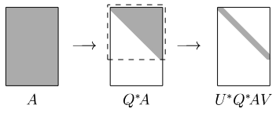

[Álgebra Linear Numérica](index.md)

<!-- wiki:original:inicio -->

# Calculando a SVD

## SVD de A via autovalores de $A^{\ast}A$

Calcular a SVD de $A$ usando que $A^{\ast}A = V\Sigma^{\ast}\Sigma V$ igual a um sagui disléxico não é a melhor ideia. O algoritmo padrão seria:

1.  Calcule $A^{\ast}A$

2.  Calcular $A^{\ast}A = V\Lambda V$

3.  Defina $\Sigma$ como a matriz $m \times n$ não-negativa que é a raíz de $\Lambda$

4.  Resolva $U\Sigma = AV$ para uma $U$ unitária

Só que a gente pode mostrar que esse algoritmo não é ideal é instável. Pelo Exercício 26.3 (b) do livro, temos o seguinte:

**Teorema**

Suponha que $A$ é normal. Para cada autovalor ${\widetilde{\lambda}}_{j}$ de $A + \delta A$, existe um autovalor $\lambda_{j}$ de $A$ tal que $$\vert {\widetilde{\lambda}}_{j} - \lambda_{j}\vert  < \|\delta A\|_{2}$$

Usando esse teorema, fazemos uma perturbação $\delta B$ em $A^{\ast}A$, de forma que: $$\vert \lambda_{k}\left( A^{\ast}A + \delta B \right) - \lambda_{k}\left( A^{\ast}A \right)\vert  \leq \|\delta B\|_{2}$$

Agora vamos supor um algoritmo **backward stable** que calcula os valores singulares de $A$. Esse algoritmo vai retornar valores $\widetilde{\sigma}$ tais que: $${\widetilde{\sigma}}_{k} = \sigma_{k}(A + \delta A),\ \frac{\|\delta A\|}{\| A\|} = O\left( \varepsilon_{\text{machine}} \right)$$

ou seja, temos que $$\vert {\widetilde{\sigma}}_{k} - \sigma_{k}\vert  = O\left( \varepsilon_{\text{machine }} \cdot \| A\| \right)$$

Porém, a gente também pode supor um algoritmo **backward stable** para calcular os autovalores de $A^{\ast}A$, então esse algoritmo nos daria valores $\widetilde{\lambda}$ tais que: $$\vert {\widetilde{\lambda}}_{k} - \lambda_{k}\vert  = O\left( \varepsilon_{\text{machine }} \cdot \| A^{\ast}A\| \right) = O\left( \varepsilon_{\text{machine }} \cdot \| A\|^{2} \right)$$

Então a gente pode tirar a raíz desses valores computados, correto? $$\vert \widetilde{\sigma_{k}} - \sigma_{k}\vert  = O\left( \vert {\widetilde{\lambda}}_{k} - \lambda_{k}\vert /\sqrt{\lambda_{k}} \right) = O\left( \varepsilon_{\text{machine }}\| A\|^{2}/\sigma_{k} \right)$$

E isso é pior do que antes, ou seja, mesmo que utilizemos algoritmos estáveis para calcular os autovalores de $A^{\ast}A$ e tirar sua raíz quadrada, ainda teríamos erros maiores do que algoritmos diretos para calcular os valores singulares.

## Redução para um problema de Autovalores

Por conta disso, reduzimos o problema de SVD a um problema de autovalores, que é sensível à perturbações.

Um algoritmo estável para calcular a SVD de $A$, usa a matriz

$$
H = \begin{pmatrix} 0 & A \\ A^{\ast} & 0 \end{pmatrix}
$$

Se $A = U\Sigma V^{\ast}$ é uma SVD de $A$, então $AV = \Sigma U$ e $A^{\ast}U = \Sigma^{\ast}V = \Sigma V$, portanto $$\begin{pmatrix} 0 & A \\ A^{\ast} & 0 \end{pmatrix} \cdot \begin{pmatrix} V & V \\ U & - U \end{pmatrix} = \begin{pmatrix} V & V \\ U & - U \end{pmatrix} \cdot \begin{pmatrix} \Sigma & 0 \\ 0 & - \Sigma \end{pmatrix}$$

Ou:

$$
H = \begin{pmatrix} 0 & A \\ A^{\ast} & 0 \end{pmatrix} = \begin{pmatrix} V & V \\ U & - U \end{pmatrix} \cdot \begin{pmatrix} \Sigma & 0 \\ 0 & - \Sigma \end{pmatrix} \cdot \begin{pmatrix} V & V \\ U & - U \end{pmatrix}^{- 1}
$$

É uma [decomposição em autovalores](problemas-de-autovalores.md#secao-18) de $H$, e fica claro que os autovalores de $H$ são os valores singulares de $A$, em módulo.

Agora note que ao calcular os autovalores de $H$, pagamos $\kappa(A)$, e não $\kappa^{2}(A)$, Pois

$$
\kappa(H) = \left\| H \right\|_{2} \cdot \left\| H^{- 1} \right\|_{2} = \frac{\sigma_{1}(H)}{\sigma_{m}(H)} = \frac{\sigma_{1}(A)}{\sigma_{m}(A)} = \kappa(A).
$$

## Divisão em duas fases

Porém, nós vimos [algoritmos de autovalores](algoritmos-de-autovalores.md) para matrizes tridiagonais, e $H$ não é tridiagonal, como podemos ver. Então o que fazemos? Nós dividimos o processo de achar a SVD em duas etapas, uma de tridiagonalização (Ou bidiagonalização, como veremos), e uma de diagonalização (Achar os autovalores da matriz bidiagonalizada)

*Figura 20. As fases de um algoritmo de SVD*

## Bidiagonalização de Galub-Kahan

A ideia é aplicar matrizes unitárias distintas na esquerda de $A$ e na sua direita, e advinha que tipo de matrizes usamo? Exatamente: **[Refletores de Householder](triangularizacao-de-householder.md#secao-30)**. A ideia é aplicar refletores a esquerda de $A$ para colocar zeros abaixo da diagonal principal e a direita para aplicar zeros após a diagonal superior de $A$:

*Figura 21. Bidiagonalização de Galub-Kahan exemplificada*

## Métodos de Bidiagonalização mais eficientes

Um método mais rápido que podemos aplicar quando $m > n$ é a *Bidiagonalização de Lawson-Hanson-Chan*, que consiste em aplicar a bidiagonalização de Galub-Kahan em $R$ da [fatoração QR](fatoracao-qr.md) de $A$. Pois assim reduzimos o problema para uma bidiagonalização numa matriz triangular, veja:

*Figura 22. Bidiagonalização LHC exemplificada*

Isso gera uma redução na quantidade de operações gastas para fazer o algoritmo. O problema é que, de acordo com o livro, isso só vale a pena quando $m > \frac{5}{3}n$. O interessante seria generalizar isso para o caso $m > n$. E isso é possível!

A ideia para essa generalização é não fazer a fatoração QR no inicio do algoritmo, mas em pontos adequados do algoritmo. Mas que pontos são esses? Conforme vamos fazendo a bidiagonalização, a proporção de $m$ e $n$ vai alterando a cada passo do algoritmo, como assim? Imagine que estamos aplicando o algoritmo numa matriz $10000 \times 30$, no segundo passo do algoritmo, perceba que vamos aplicar na matriz $9999 \times 29$, se fizermos a proporção de ambos: $$\begin{array}{r} \frac{10000}{30} \approx 333,33 \\ \frac{9999}{29} \approx 344,79 \\ \frac{9998}{28} \approx 357,07 \end{array}$$

Perceba que a proporção só aumenta pois eu estou sempre aplicando em matrizes com $m$ muito grande. O livro fala que o que fazemos é aplicar a fatoração QR no $k$-ésimo passo quando: $$\frac{m - k}{n - k} = 2$$ Veja a ilustração do processo:

*Figura 23. Aplicação da QR em pontos-chave da iteração*

## Fase 2

A fase 2 é aplicar algum algoritmo de autovalores na matriz que encontramos. Os dois principais algoritmos que são utilizados é uma versão modificada do algoritmo QR e o [dividir e conquistar](../projeto-e-analise-de-algoritmos/tecnicas-de-projeto-a2.md#secao-5)

<!-- wiki:original:fim -->

## Percurso de estudo

[Trilha: A2](../../trilhas/algebra-linear-numerica/a2.md) · [Apresentação e contexto da fonte](../../trilhas/algebra-linear-numerica/a2.md#apresentacao-original)

- Anterior: [Outros algoritmos de Autovalores](outros-algoritmos-de-autovalores.md)
