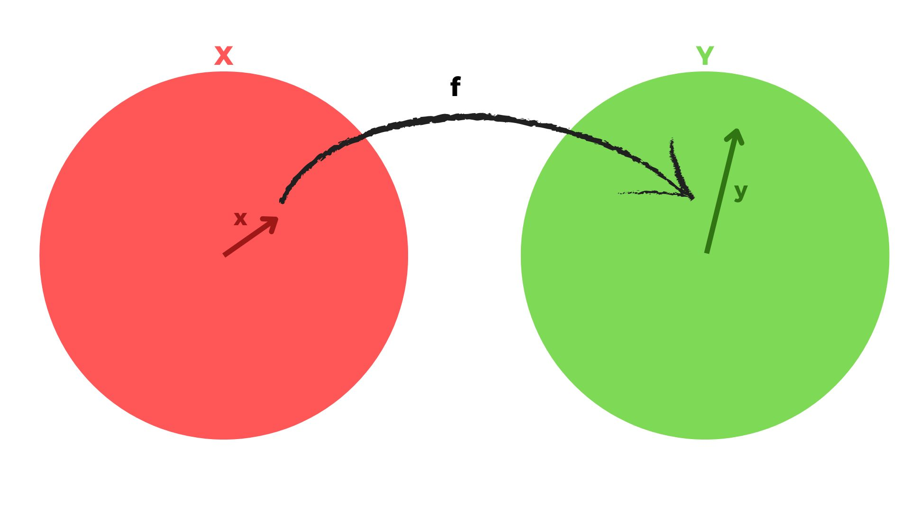
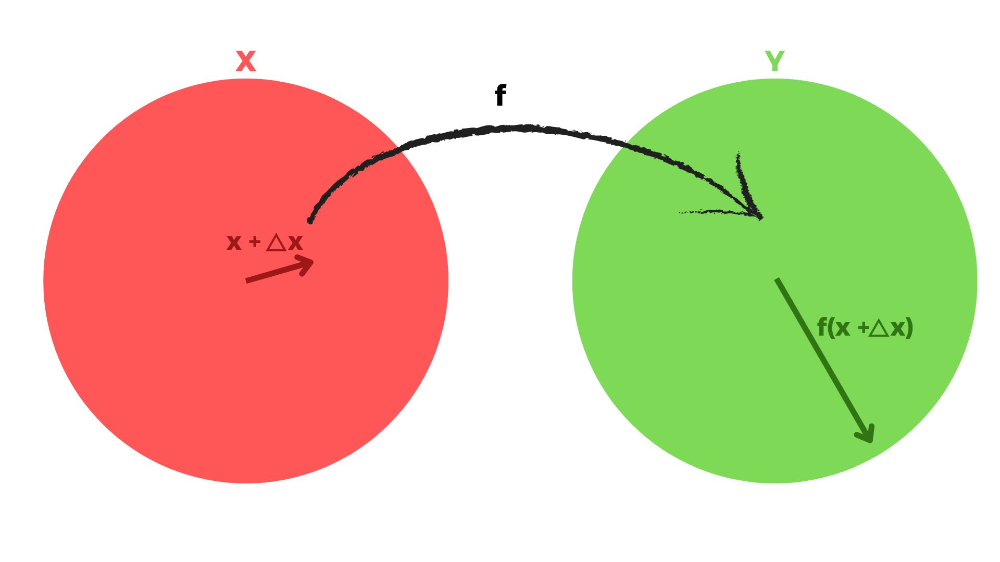

[Álgebra Linear Numérica](index.md)

<!-- wiki:original:inicio -->

# Condicionamento e Números de Condição

## Condicionamento de um Problema

Primeiro, o que é um problema?

**Definição**

Um *problema* $f:X \rightarrow Y$ é uma função de um espaço vetorial normado $X$ de **dados** para um espaço vetorial normado $Y$ de **soluções**

Por que defini um problema assim? Porque, nas próximas aulas, queremos identificar e medir o que acontece quando fornecemos dados ligeiramente diferentes para esse problema. Dado que temos certos dados e os passamos para o problema, e ele nos dá uma solução, a solução difere muito? Apenas um pouco? É a mesma solução?

**Definição**

Um problema **bem-condicionado** é aquele em que todas as pequenas perturbações de $x \in X$ geram pequenas diferenças em $f(x) \in Y$, ou seja, se fizermos perturbações em $x$, as soluções do problema não mudarão muito

**Definição**

Um problema **mal-condicionado** é aquele em que uma pequena perturbação de $x \in X$ gera uma grande diferença nas soluções $f(x) \in Y$, ou seja, alterar os dados, mesmo que ligeiramente, me dará respostas completamente diferentes para o problema

O significado de **pequeno** e **grande** depende do contexto que estou analisando. E como posso medir esse tipo de mudanças? Como quantifico essas mudanças “**pequenas**” e “**grandes**”? Vou defini-lo aqui e mostrar como poderíamos visualizá-lo

**Definição: Número de Condição Absoluto**

Seja $\Delta x$ uma pequena perturbação de $x$ e escreva $\Delta f = f(x + \Delta x) - f(x)$. O **número de condição absoluto** do problema $f$ é definido como $$\widehat{\kappa} = \lim\limits_{\Delta \rightarrow 0}\sup\limits_{\|\Delta x\| < \Delta}\left( \frac{\|\Delta f\|}{\|\Delta x\|} \right)$$

Para melhor entendimento, podemos reescrevê-lo como $\widehat{\kappa} = \sup\limits_{\Delta x}\frac{\|\Delta f\|}{\|\Delta x\|}$, ou seja, o supremo sobre todas as perturbações infinitesimais em $x$ (entendendo que $\Delta x$ e $\Delta f$ são infinitesimais)

Nossa, não entendi NADA! Calma, vamos tentar desenhar aqui:

Primeiro, tenho os espaços normados $X$ e $Y$ e como o problema $f$ aplica uma transformação em $x$. Agora, vamos fazer um pequeno ajuste em $x$, tendo $\Delta x$, esse novo vetor é uma perturbação infinitesimal em $x$, quase a mesma coisa, agora vamos dar uma olhada em como $f$ afeta $\Delta x$:

NOSSA, observe como uma ligeira perturbação em $x$ mudou a solução MUITO? Isso significa que este é um problema *mal-condicionado*, e o **maior** dessas perturbações é o **número de condição absoluto** de $f$

Estamos falando de problemas em espaços **normados**, portanto, em sua essência, poderíamos dizer que os problemas são funções de subespaços de ${\mathbb{C}}^{m}$ para ${\mathbb{C}}^{n}$, o que significa que, se um problema $f$ é *diferenciável* (é uma função, então pode ou não ser diferenciável), ele tem uma *Jacobiana*. Há uma afirmação que diz, *“Se $f:X \rightarrow Y$ é diferenciável, então $f(x + \Delta x) \approx f(x) + J(x)\Delta x$ quando $\Delta x \rightarrow 0$”*, bem, estamos trabalhando com $\Delta x \rightarrow 0$, então o que acontece se substituirmos $f(x + \Delta x)$ por $f(x) + J(x)\Delta x$:

$$
\widehat{\kappa} = \lim\limits_{\Delta \rightarrow 0}\sup\limits_{\|\Delta x\| < \Delta}\left( \frac{\|\Delta f\|}{\|\Delta x\|} \right) = \lim\limits_{\Delta \rightarrow 0}\sup\limits_{\|\Delta x\| < \Delta}\left( \frac{\| f(x + \Delta x) - f(x)\|}{\|\Delta x\|} \right)
$$

$$
= \lim\limits_{\Delta \rightarrow 0}\sup\limits_{\|\Delta x\| < \Delta}\left( \frac{\| f(x) + J(x)\Delta x - f(x)\|}{\|\Delta x\|} \right)
$$

$$
\lim\limits_{\Delta \rightarrow 0}\sup\limits_{\|\Delta x\| < \Delta}\left( \frac{\| J(x)\Delta x\|}{\|\Delta x\|} \right) \leq \lim\limits_{\Delta \rightarrow 0}\sup\limits_{\|\Delta x\| < \Delta}\left( \frac{\| J(x)\|\|\Delta x\|}{\|\Delta x\|} \right) = \| J(x)\|
$$

Isso significa que o valor supremo sobre todas as variações infinitesimais de $x$ será $\| J(x)\|$, ou seja

$$
\widehat{\kappa} = \| J(x)\|
$$

**Definição: Número de Condição Relativo**

Seja $\Delta x$ uma pequena perturbação de $x$ e escreva $\Delta f = f(x + \Delta x) - f(x)$. O **número de condição relativo** do problema $f$ é definido como

$$
\kappa = \lim\limits_{\Delta \rightarrow 0}\sup\limits_{\|\Delta x\| \leq \Delta}\frac{\frac{\|\Delta f(x)\|}{\| f(x)\|}}{\frac{\|\Delta x\|}{\| x\|}}
$$

Por que definimos um número de condição “relativo”? Porque estou tentando medi-lo relativamente.

Nossa! Você só repetiu a mesma coisa… Calma. Imagine que um engenheiro está construindo um foguete de 1000m, e ele mede um erro de 1m, é um pequeno erro, certo? Mas e se o foguete tiver 2m? É um erro COLOSSAL, certo? Esse é o ponto, estamos tentando medir o erro causado por $\Delta x$ com base no tamanho de $x$ e sua solução $f(x)$

Bem, lembre-se que podemos representar o número de condição absoluto como $$\widehat{\kappa} = \| J(x)\|$$

Podemos fazer algo semelhante com $\kappa$, vamos ver:

$$
\kappa = \lim\limits_{\Delta \rightarrow 0}\sup\limits_{\|\Delta x\| \leq \Delta}\frac{\frac{\|\Delta f(x)\|}{\| f(x)\|}}{\frac{\|\Delta x\|}{\| x\|}} = \lim\limits_{\Delta \rightarrow 0}\sup\limits_{\|\Delta x\| \leq \Delta}\frac{\|\Delta f(x)\|}{\| f(x)\|}\frac{\| x\|}{\|\Delta x\|} = \lim\limits_{\Delta \rightarrow 0}\sup\limits_{\|\Delta x\| \leq \Delta}\frac{\|\Delta f(x)\|}{\|\Delta x\|}\frac{\| x\|}{\| f(x)\|} = \| J(x)\frac{\|\left( \| x\| \right)}{\| f(x)\|}
$$

## Condicionamento de Matrizes e Vetores

Agora, um conceito importante para estabilidade e condicionamento é como a multiplicação de vetores e matrizes é condicionada, as multiplicações de vetores são *bem-condicionadas*? *mal-condicionadas*? Como as matrizes são condicionadas? Vamos ver

### Condição da Multiplicação Matriz-Vetor

**Teorema**

Dado $A \in {\mathbb{C}}^{m \times n}$ fixo, o problema de calcular $Ax$ com $x$ no espaço normado de dados, o número de condição do problema da matriz é

$$
\kappa = \| A\|\frac{\| x\|}{\| Ax\|}
$$

Se $A$ é quadrada e inversível:

$$
\kappa \leq \| A\|\| A^{- 1}\|
$$

**Demonstração**

Fixe $A \in {\mathbb{C}}^{m \times n}$ e o problema de calcular $Ax$, com $x$ sendo os dados, ou seja, calcularemos a condição desse problema com base em perturbações de $x$, não de $A$, $A$ será fixo o tempo todo. $$\kappa = \sup\limits_{\Delta x}\left( \frac{\| f(x + \Delta x) - f(x)\|}{\| f(x)\|}\frac{\| x\|}{\|\Delta x\|} \right) = \sup\limits_{\Delta x}\left( \frac{\| A(x + \Delta x) - Ax\|}{\| Ax\|}\frac{\| x\|}{\|\Delta x\|} \right) = \sup\limits_{\Delta x}\left( \frac{\| A\Delta x\|}{\| Ax\|}\frac{\| x\|}{\|\Delta x\|} \right)$$ $$\kappa \leq \sup\limits_{\Delta x}\left( \frac{\| A\|\|\Delta x\|}{\| Ax\|}\frac{\| x\|}{\|\Delta x\|} \right) = \| A\frac{\|\left( \| x\| \right)}{\| Ax\|}$$

Se $A$ é quadrada e inversível, podemos usar o fato de que $\frac{\| x\|}{\| Ax\|} \leq \| A^{- 1}\|$ (prová-lo-emos depois), para expressar $\kappa$ como:

$$
\kappa \leq \| A\|\| A^{- 1}\| \vee \kappa = \alpha\| A\|\| A^{- 1}\|
$$

**Corolário**

Seja $A \in {\mathbb{C}}^{m \times n}$ não singular e considere a equação $Ax = b$. O problema de calcular $b$ dado $x$ tem número de condição $$\kappa = \| A\frac{\|\left( \| x\| \right)}{\| b\|}$$

**Teorema**

$$
\frac{\| x\|}{\| Ax\|} \leq \| A^{- 1}\|
$$

**Demonstração**

Escreva $x$ como $x = A^{- 1}(Ax)$, isso significa $$\| x\| = \| A^{- 1}Ax\| \leq \| A^{- 1}\|\| Ax\| \Leftrightarrow \frac{\| x\|}{\| Ax\|} \leq \| A^{- 1}\|$$

### Número de Condição de uma Matriz

O quê? Por que podemos dar um número de condição a uma matriz? Porque elas são **funções**! Por quê? Lembre-se que podemos representar toda **transformação linear** como uma **multiplicação matricial**? Isso implica que, se uma matriz $A$ está em ${\mathbb{C}}^{m \times n}$, então ela pode ser representada como $A:{\mathbb{C}}^{n} \rightarrow {\mathbb{C}}^{m}$! Agora que entendemos por que elas podem ter um número de condição, vamos defini-lo

**Definição**

Dado $A \in {\mathbb{C}}^{m \times m}$ não singular, o número de condição de $A$, denotado como $\kappa(A)$, é: $$\kappa(A) = \| A\|\| A^{- 1}\|$$ Se $A$ é singular $$\kappa(A) = \infty$$ Se $A$ é retangular $$\kappa(A) = \| A\|\| A^{+}\|,\ \left( A^{+} = \left( A^{\ast}A \right)^{- 1}A \right)$$

### Condição de Sistemas de Equações

**Teorema**

Dado um sistema $Ax = b$, vamos manter $b$ fixo e considerar o problema $A \mapsto x = A^{- 1}b$, o número de condição desse problema é: $$\kappa(A)$$

**Demonstração**

Se perturbarmos $A$ e $x$, fazemos: $$(A + \Delta A)(x + \Delta x) = b$$ $$\Leftrightarrow Ax + A(\Delta x) + (\Delta A)x + (\Delta A)(\Delta x) = b$$ $$\Leftrightarrow b + A(\Delta x) + (\Delta A)x + (\Delta A)(\Delta x) = b$$ $$\Leftrightarrow A(\Delta x) + (\Delta A)x + (\Delta A)(\Delta x) = 0$$

Sabemos que $(\Delta A)(\Delta x)$ é duplamente infinitesimal e ambos estão indo para 0, então podemos descartá-lo, e obtemos

$$A(\Delta x) + (\Delta A)x = 0 \Leftrightarrow \Delta x = - A^{- 1}(\Delta A)x$$ Esta equação implica que $$\|\Delta x\| \leq \| A^{- 1}\|\|\Delta A\|\| x\| \Leftrightarrow \|\Delta x\|\| A\| \leq \| A^{- 1}\|\| A\|\|\Delta A\|\| x\|$$ $$\frac{\|\Delta x\|}{\| x\|}\frac{\| A\|}{\|\Delta A\|} \leq \| A^{- 1}\|\| A\|$$

Se fizermos $\Delta x \rightarrow 0$ e $\Delta A \rightarrow 0$, temos $$\kappa = \| A\|\| A^{- 1}\| = \kappa(A)$$

------------------------------------------------------------------------

<!-- wiki:original:fim -->

## Percurso de estudo

[Trilha: A1](../../trilhas/algebra-linear-numerica/a1.md) · [Apresentação e contexto da fonte](../../trilhas/algebra-linear-numerica/a1.md#apresentacao-original)

- Anterior: [Problemas de Mínimos Quadrados](problemas-de-minimos-quadrados.md)
- Próximo: [Aritmética de Ponto Flutuante](aritmetica-de-ponto-flutuante.md)
